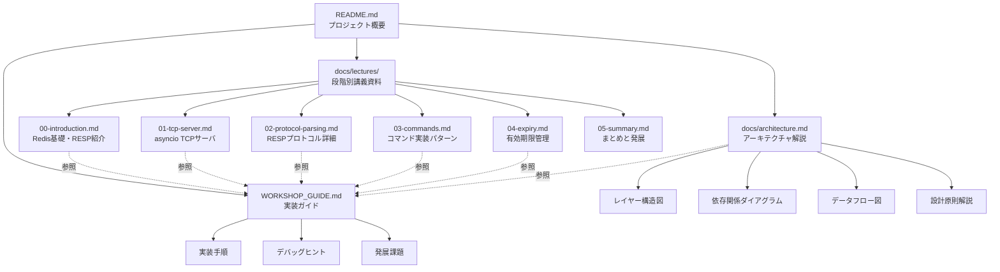
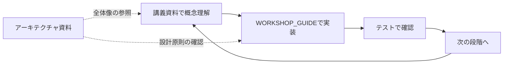
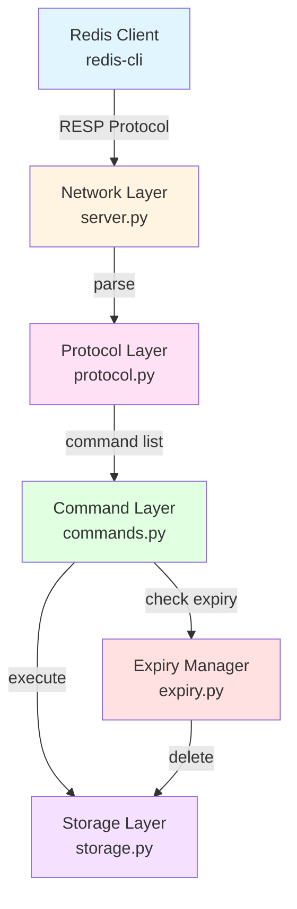
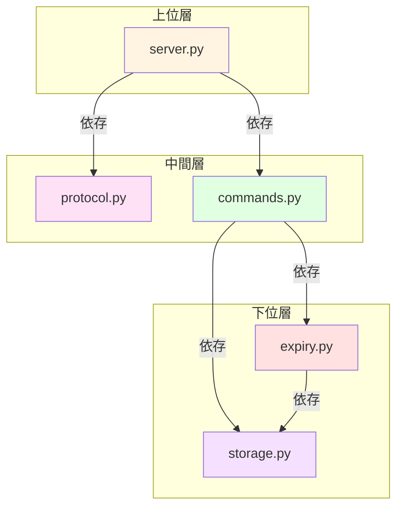
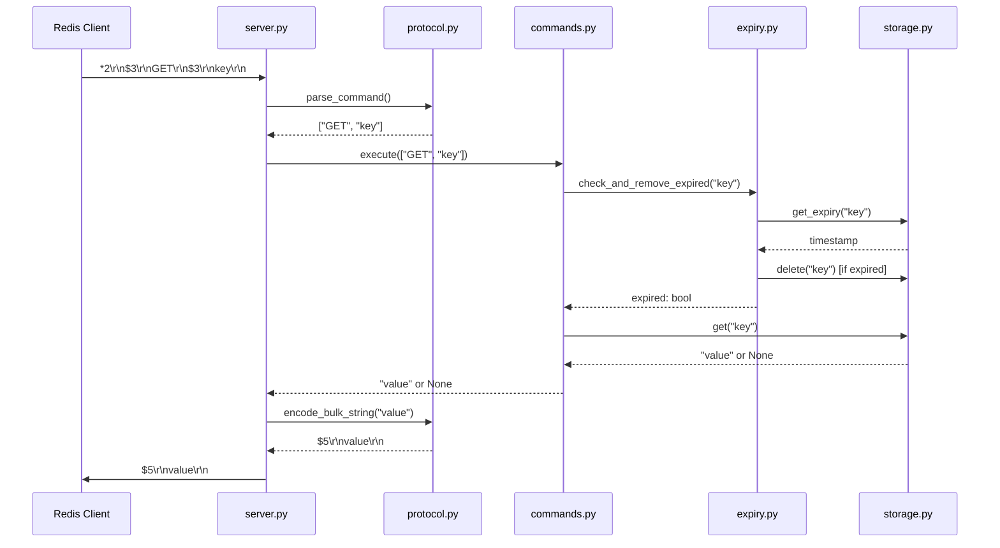

# 技術設計書: 学習資料の拡充

## Overview

**目的**: Mini-Redisワークショップに段階別講義資料とアーキテクチャ解説資料を追加し、学習者が理論と実装の両方を体系的に習得できる学習体験を提供する。

**対象ユーザー**: Pythonの基本構文を理解している学習者で、asyncioによる非同期プログラミングやネットワークプロトコルの実装に興味がある技術者。60〜90分のワークショップ形式で、実践的なスキルを習得したいエンジニア。

**影響範囲**: 既存のREADME.mdとWORKSHOP_GUIDE.mdは維持しつつ、新たに`docs/`ディレクトリを追加し、講義資料とアーキテクチャドキュメントを配置する。既存ガイドからの参照リンクを追加することで、学習者の理解を深める。

### 目標

- ワークショップの各段階で必要な概念を事前に理解できる講義資料の提供
- Mini-Redisの全体設計とモジュール間の関係を視覚的に理解できる資料の提供
- 既存のハンズオンガイドと統合し、理論→実践のスムーズな学習フローの実現

### 非目標

- 既存のWORKSHOP_GUIDE.mdやREADME.mdの大幅な書き換え（既存の構造を維持）
- プロダクションレベルのRedis実装の詳細解説（学習目的に焦点）
- 発展課題（Pub/Sub、永続化等）の詳細ドキュメント（基本機能に集中）

## Architecture

### 既存資料の分析

現在のドキュメント構成:

```
mini-redis-py/
├── README.md              # プロジェクト概要、クイックスタート、基本情報
├── WORKSHOP_GUIDE.md      # 詳細な実装ガイド、デバッグヒント、発展課題
├── solutions/README.md    # 完成版コードの使用方法
└── .kiro/steering/        # プロジェクト構造・技術スタック（開発者向け）
```

**既存資料の強み**:
- WORKSHOP_GUIDE.mdに詳細な実装手順とデバッグ情報が充実
- テストドリブンな学習フロー
- 完成版コードとの比較による学習サポート

**不足している要素**:
- 実装前の概念理解のための講義資料（理論ファースト）
- アーキテクチャの全体像を示す視覚的な資料
- 各段階の学習目標と前提知識の明示

### コンテンツアーキテクチャ

新しいドキュメント構成:



### 学習フローの統合

**理論→実践のサイクル**:



**各段階の構成** (60〜90分の時間配分):

1. **導入** (5分): 講義資料00 → デモ確認
2. **TCPサーバ実装** (15分): 講義資料01 → server.py実装
3. **プロトコル実装** (15分): 講義資料02 → protocol.py実装
4. **コマンド実装** (20分): 講義資料03 → commands.py実装
5. **EXPIRE実装** (20分): 講義資料04 → expiry.py実装
6. **まとめ** (5分): 講義資料05 → 振り返りと発展課題

### アーキテクチャ統合戦略

**既存パターンの維持**:
- ファイル命名規則: `UPPERCASE.md`は重要ドキュメント、`lowercase.md`は通常ドキュメント
- マークダウン形式での統一
- コードブロックとコマンド例の豊富な使用

**新規追加の方針**:
- `docs/`ディレクトリ配下に講義資料とアーキテクチャ資料を配置
- 既存ドキュメントからのリンク追加（侵襲性最小限）
- Mermaidダイアグラムによる視覚的理解の促進

## Content Components and Structure

### 講義資料（Lectures）

#### docs/lectures/00-introduction.md

**責務と範囲**:
- **主な責務**: ワークショップ導入段階で、Redisの基本概念とRESPプロトコルの最小要素を紹介
- **学習目標**: Redis/キー・バリューストアの概念理解、RESPプロトコルの基本構造の把握、デモを通じた完成イメージの共有
- **前提知識**: Pythonの基本構文、コマンドラインの基本操作

**コンテンツ構成**:

1. **Redisとは**: キー・バリューストア、インメモリDB、ユースケース（キャッシュ、セッション管理）
2. **Mini-Redisデモ**: 完成版でPING/GET/SET/INCR/EXPIREを実行、期待される動作の確認
3. **RESPプロトコル基礎**:
   - Arrays形式: `*2\r\n$4\r\nPING\r\n`
   - Bulk Strings: `$5\r\nhello\r\n`
   - CRLF終端とバイナリセーフ
   - Simple Strings/Integers/Errors
4. **視覚的要素**: RESPメッセージの構造図、クライアント・サーバ間のメッセージフロー図

**外部参照**:
- [Redis公式サイト](https://redis.io/)
- [RESP仕様](https://redis.io/docs/reference/protocol-spec/)

#### docs/lectures/01-tcp-server.md

**責務と範囲**:
- **主な責務**: asyncioによるTCPサーバ構築の概念と実装パターンを解説
- **学習目標**: asyncio/await構文の理解、StreamReader/StreamWriterの使い方、非同期I/Oの利点
- **前提知識**: Pythonの基本文法、同期処理の概念

**コンテンツ構成**:

1. **asyncioの基礎**: イベントループ、コルーチン、`async`/`await`構文
2. **TCPサーバパターン**: `asyncio.start_server()`、クライアントハンドラの実装
3. **StreamReader/StreamWriter**: バイトストリームの読み書き、`readuntil()`/`write()`
4. **接続管理**: クライアント接続処理ループ、クリーンアップ（finally句）
5. **実装のポイント**: エラーハンドリング、graceful shutdown
6. **視覚的要素**: イベントループの動作図、クライアント接続フロー図

**コード例**:
```python
async def handle_client(reader: StreamReader, writer: StreamWriter) -> None:
    try:
        while True:
            # クライアントからデータ読み取り
            data = await reader.readuntil(b'\r\n')
            # 処理と応答
            writer.write(b'+PONG\r\n')
            await writer.drain()
    except asyncio.IncompleteReadError:
        pass  # 接続終了
    finally:
        writer.close()
        await writer.wait_closed()
```

**外部参照**:
- [Python asyncio公式ドキュメント](https://docs.python.org/3/library/asyncio.html)
- [Real Python: Async IO in Python](https://realpython.com/async-io-python/)

#### docs/lectures/02-protocol-parsing.md

**責務と範囲**:
- **主な責務**: RESPプロトコルのパース・エンコード実装の詳細解説
- **学習目標**: RESP Arrays/Bulk Stringsのパースアルゴリズム、バイト長計算、エンコード関数の実装
- **前提知識**: バイト列とUTF-8エンコーディング、文字列操作

**コンテンツ構成**:

1. **RESPデータ型の詳細**:
   - Simple Strings: `+OK\r\n`
   - Integers: `:42\r\n`
   - Bulk Strings: `$5\r\nhello\r\n`、Null: `$-1\r\n`
   - Arrays: `*2\r\n$4\r\nPING\r\n`
   - Errors: `-ERR message\r\n`

2. **パースアルゴリズム**:
   - ステップ1: 最初の1バイトで型判定
   - ステップ2: Arrays長の読み取り
   - ステップ3: 各Bulk Stringの長さとデータ読み取り
   - ステップ4: コマンド配列の構築

3. **エンコード実装**:
   - 文字列→Bulk String
   - 整数→Integer
   - None→Null
   - エラー→Error

4. **よくある落とし穴**:
   - CRLF削除忘れ
   - バイト長vs文字数
   - UTF-8エンコーディング

5. **視覚的要素**: パース処理のフローチャート、各データ型の構造図

**コード例**:
```python
async def parse_command(reader: StreamReader) -> list[str]:
    # *2\r\n を読む
    line = await reader.readuntil(b'\r\n')
    line = line[:-2]  # CRLF削除

    if not line.startswith(b'*'):
        raise RESPProtocolError("Expected array")

    count = int(line[1:])  # 要素数

    result = []
    for _ in range(count):
        # $4\r\n を読む
        length_line = await reader.readuntil(b'\r\n')
        length = int(length_line[1:-2])

        # データ + \r\n を読む
        data = await reader.readexactly(length + 2)
        result.append(data[:-2].decode('utf-8'))

    return result
```

#### docs/lectures/03-commands.md

**責務と範囲**:
- **主な責務**: Redisコマンドのルーティング、実装パターン、エラーハンドリングを解説
- **学習目標**: コマンド実行層の設計、各コマンドの仕様と実装、Passive Expiryの統合
- **前提知識**: ストレージ層の基本操作（get/set/delete）

**コンテンツ構成**:

1. **コマンド実行層の役割**: ルーティング、引数検証、ビジネスロジック、応答生成

2. **各コマンドの仕様と実装**:
   - **PING**: 接続確認、引数なし→`PONG`、引数あり→エコー
   - **GET**: キー取得、存在しない→Null、期限切れ→削除してNull
   - **SET**: キー設定、常に`OK`
   - **INCR**: インクリメント、存在しない→1から開始、整数以外→エラー
   - **EXPIRE**: 有効期限設定、キー存在→1、不在→0
   - **TTL**: 残り秒数取得、期限あり→秒数、なし→-1、不在→-2

3. **エラーハンドリング**:
   - `CommandError`: コマンド実行エラー（引数不正、型エラー等）
   - 適切なエラーメッセージの生成（`ERR value is not an integer`等）

4. **Passive Expiryの統合**: GET/INCR/EXPIRE/TTL入口での`check_and_remove_expired()`呼び出し

5. **視覚的要素**: コマンド実行フロー図、エラーハンドリングフローチャート

**redis-cli実行例**:
```bash
> PING
PONG

> SET counter "10"
OK

> INCR counter
(integer) 11

> EXPIRE counter 60
(integer) 1

> TTL counter
(integer) 59
```

#### docs/lectures/04-expiry.md

**責務と範囲**:
- **主な責務**: Redisの有効期限管理メカニズム（Passive + Active Expiry）を解説
- **学習目標**: 2段階期限管理の設計意図、実装アルゴリズム、asyncioバックグラウンドタスク
- **前提知識**: Unixタイムスタンプ、asyncioタスク管理

**コンテンツ構成**:

1. **有効期限管理の必要性**: メモリ効率、データ鮮度、ユースケース（セッション、キャッシュ）

2. **Passive Expiry**:
   - **動作**: コマンド実行時に期限チェック→期限切れなら削除
   - **利点**: シンプル、CPU負荷低
   - **欠点**: アクセスされないキーは残る

3. **Active Expiry**:
   - **動作**: 1秒ごとのバックグラウンドタスクでランダム20キーをサンプリング
   - **削除率チェック**: 25%超なら即座に再実行
   - **利点**: アクセスされないキーも削除
   - **パラメータ**: サンプリング間隔1秒、サンプルサイズ20、閾値25%

4. **asyncioバックグラウンドタスク**:
   - `asyncio.create_task()`でタスク起動
   - `asyncio.sleep()`で定期実行
   - キャンセル処理（`task.cancel()`）

5. **実装のポイント**: 無限ループ、削除率計算、タスクライフサイクル管理

6. **視覚的要素**: Passive/Active Expiryのタイムライン図、Active Expiryアルゴリズムのフローチャート

**アルゴリズム例**:
```python
async def _active_expiry_loop(self) -> None:
    while True:
        await asyncio.sleep(1)  # 1秒待機

        # ランダム20キーをサンプリング
        keys = self._store.get_all_keys()
        sample = random.sample(keys, min(20, len(keys)))

        expired_count = 0
        for key in sample:
            if self.check_and_remove_expired(key):
                expired_count += 1

        # 削除率25%超なら再実行
        if expired_count / len(sample) > 0.25:
            continue  # 即座に次のサンプリング
        break  # 終了
```

#### docs/lectures/05-summary.md

**責務と範囲**:
- **主な責務**: ワークショップのまとめと発展課題の提案
- **学習目標**: 実装した機能の振り返り、習得スキルの確認、次のステップの提示
- **前提知識**: ワークショップ全体の内容

**コンテンツ構成**:

1. **実装した機能の振り返り**:
   - RESPプロトコルのパース・エンコード
   - asyncio TCPサーバ
   - 6つのRedisコマンド
   - 2段階有効期限管理

2. **習得したスキル**:
   - asyncio/awaitによる非同期プログラミング
   - バイナリプロトコルの実装
   - レイヤー分離設計
   - テストドリブン開発

3. **発展課題**:
   - **基本コマンド拡張**: DEL/EXISTS/EXPIRETIME
   - **複雑なデータ構造**: List/Hash/Set/Sorted Set
   - **データ永続化**: RDB/AOFフォーマット
   - **Pub/Sub機能**: PUBLISH/SUBSCRIBE/UNSUBSCRIBE
   - **トランザクション**: MULTI/EXEC/WATCH
   - **メトリクス収集**: コマンド統計、接続数追跡

4. **学習リソース**:
   - Redis公式ドキュメント
   - Python asyncio応用
   - データベース内部実装の書籍

### アーキテクチャドキュメント

#### docs/architecture.md

**責務と範囲**:
- **主な責務**: Mini-Redisの全体設計、レイヤー構造、モジュール間の依存関係、設計原則を解説
- **学習目標**: システムアーキテクチャの理解、設計判断の背景理解、拡張時の指針獲得
- **前提知識**: オブジェクト指向プログラミング、レイヤーアーキテクチャの概念

**コンテンツ構成**:

1. **システム全体像**:



2. **レイヤー構造と責務**:

| レイヤー | モジュール | 責務 | 依存先 |
|---------|-----------|------|--------|
| Network | server.py | TCP接続管理、クライアント処理ループ | Protocol, Commands |
| Protocol | protocol.py | RESPパース・エンコード | なし |
| Command | commands.py | コマンドルーティング、ビジネスロジック | Storage, Expiry |
| Storage | storage.py | キー・バリュー操作 | なし |
| Expiry | expiry.py | 有効期限管理 | Storage |

3. **モジュール間の依存関係**:



**依存関係のルール**:
- 上位層は下位層に依存可能（一方向依存）
- 下位層は上位層に依存しない（逆依存禁止）
- 同一層内での相互依存は最小限に

4. **データフロー**:



5. **設計原則**:

**レイヤー分離**:
- 各レイヤーは明確な責務を持つ
- Protocol層は通信フォーマットのみ、Storage層はデータ操作のみ
- 責務の混在を避けることで、テスト容易性とメンテナンス性を向上

**単一責任の原則**:
```python
# ✅ 良い例: 1つの責務
def encode_simple_string(value: str) -> bytes:
    """Simple Stringをエンコードする"""
    return f"+{value}\r\n".encode('utf-8')

# ❌ 悪い例: 複数の責務
def encode_and_send_string(value: str, writer: StreamWriter) -> None:
    """エンコードして送信する（責務が混在）"""
    data = f"+{value}\r\n".encode('utf-8')
    writer.write(data)  # 送信処理が混在
```

**テスタビリティ**:
- 各コンポーネントは独立してテスト可能
- 依存関係を注入可能な設計（Dependency Injection）
```python
# Protocol層はStorageに依存しない
parser = RESPParser()
result = await parser.parse_command(reader)

# Commands層はStorageとExpiryを注入
commands = Commands(storage, expiry)
```

**明示的なエラーハンドリング**:
```python
try:
    result = await self._commands.execute(command)
except CommandError as e:
    response = encode_error(str(e))  # ビジネスロジックエラー
except RESPProtocolError as e:
    response = encode_error("ERR protocol error")  # プロトコルエラー
except Exception as e:
    logger.exception("Unexpected error")
    response = encode_error("ERR internal server error")
```

6. **発展課題のための設計方針**:

**データ永続化（RDB/AOF）を実装する場合**:
```
mini_redis/
├── persistence/
│   ├── __init__.py
│   ├── rdb.py          # スナップショット形式
│   └── aof.py          # Append-Only File形式
```
- Storage層に永続化レイヤーを追加
- 定期的なスナップショット、コマンドログの追記

**Pub/Sub機能を実装する場合**:
```
mini_redis/
├── pubsub.py           # サブスクリプション管理
```
- Commands層にPUBLISH/SUBSCRIBE/UNSUBSCRIBEコマンド追加
- クライアントハンドラに購読状態管理を追加

### 既存ガイドの強化

#### WORKSHOP_GUIDE.mdへの講義資料リンク追加

各実装ステップの冒頭に、対応する講義資料へのリンクを追加:

```markdown
### ステップ1: RESPプロトコルの理解と実装 (20分)

**📚 事前学習**: [RESPプロトコル詳細（講義資料02）](docs/lectures/02-protocol-parsing.md)を参照

**目標**: RESPプロトコルのパース・エンコード機能を実装
```

#### README.mdへのアーキテクチャ資料リンク追加

プロジェクト構成セクションに、アーキテクチャドキュメントへのリンクを追加:

```markdown
## プロジェクト構成

詳細なアーキテクチャは [`docs/architecture.md`](docs/architecture.md) を参照してください。
```

## Requirements Traceability

| 要件ID | 要件概要 | コンテンツコンポーネント | ファイル |
|--------|---------|----------------------|---------|
| 1.1 | 導入段階講義資料（Redis基礎、デモ、RESP） | 導入講義資料 | docs/lectures/00-introduction.md |
| 1.2 | TCPサーバ段階講義資料（asyncio、StreamReader/Writer） | TCPサーバ講義資料 | docs/lectures/01-tcp-server.md |
| 1.3 | プロトコル段階講義資料（RESP詳細、パース実装） | プロトコル講義資料 | docs/lectures/02-protocol-parsing.md |
| 1.4 | コマンド実装段階講義資料（PING/GET/SET/INCR仕様） | コマンド講義資料 | docs/lectures/03-commands.md |
| 1.5 | EXPIRE段階講義資料（Passive/Active Expiry） | 有効期限講義資料 | docs/lectures/04-expiry.md |
| 1.6 | まとめ段階講義資料（振り返り、発展課題） | まとめ講義資料 | docs/lectures/05-summary.md |
| 1.7 | エラーハンドリング解説 | コマンド講義資料、アーキテクチャ資料 | docs/lectures/03-commands.md, docs/architecture.md |
| 1.8 | 各段階の目標、ポイント、コード例、図解 | 全講義資料 | docs/lectures/*.md |
| 1.9 | redis-cli実行例と期待結果 | コマンド講義資料 | docs/lectures/03-commands.md |
| 2.1 | 推奨実装順序の明示 | 既存WORKSHOP_GUIDE | WORKSHOP_GUIDE.md（既存） |
| 2.2 | 各モジュールの役割、ヒント、エラーパターン | 既存WORKSHOP_GUIDE | WORKSHOP_GUIDE.md（既存） |
| 2.3 | テストコマンドの提供 | 既存WORKSHOP_GUIDE | WORKSHOP_GUIDE.md（既存） |
| 2.4 | 期待出力とトラブルシューティング | 既存WORKSHOP_GUIDE | WORKSHOP_GUIDE.md（既存） |
| 2.5 | 関連ライブラリドキュメントへのリンク | 講義資料の外部参照 | docs/lectures/*.md |
| 2.6 | solutions/使用方法と比較学習 | 既存WORKSHOP_GUIDE | WORKSHOP_GUIDE.md（既存） |
| 3.1 | レイヤー構造図 | アーキテクチャ資料 | docs/architecture.md |
| 3.2 | モジュール依存関係ダイアグラム | アーキテクチャ資料 | docs/architecture.md |
| 3.3 | データフロー図解 | アーキテクチャ資料 | docs/architecture.md |
| 3.4 | 設計原則の解説 | アーキテクチャ資料 | docs/architecture.md |
| 3.5 | 発展課題の設計方針 | アーキテクチャ資料、まとめ講義資料 | docs/architecture.md, docs/lectures/05-summary.md |

## Delivery Strategy

### ファイル配置戦略

```
mini-redis-py/
├── docs/                          # 新規追加
│   ├── lectures/                  # 講義資料ディレクトリ
│   │   ├── 00-introduction.md     # 導入（5分）
│   │   ├── 01-tcp-server.md       # TCPサーバ（理論）
│   │   ├── 02-protocol-parsing.md # プロトコル（理論）
│   │   ├── 03-commands.md         # コマンド（理論）
│   │   ├── 04-expiry.md           # 有効期限（理論）
│   │   └── 05-summary.md          # まとめ（5分）
│   └── architecture.md            # アーキテクチャ解説
├── README.md                      # リンク追加（軽微な変更）
└── WORKSHOP_GUIDE.md              # リンク追加（軽微な変更）
```

### ドキュメント間のリンク戦略

**README.md** → 全体のエントリーポイント
- `docs/lectures/00-introduction.md`: ワークショップの導入
- `docs/architecture.md`: システムアーキテクチャ
- `WORKSHOP_GUIDE.md`: 実装ガイド

**WORKSHOP_GUIDE.md** → 実装ガイド
- 各ステップから対応する講義資料へのリンク（`docs/lectures/*.md`）
- アーキテクチャ参照リンク（`docs/architecture.md`）

**講義資料** → 理論解説
- 関連する実装ステップへのリンク（`WORKSHOP_GUIDE.md#ステップN`）
- 外部リソース（Redis公式、Python公式ドキュメント）

### 視覚的要素の統一

**Mermaidダイアグラム**: アーキテクチャ図、フロー図、シーケンス図
**コードブロック**: シンタックスハイライト（python, bash）
**実行例**: redis-cliのセッション例

## Testing Strategy

### ドキュメント品質検証

**コンテンツレビュー**:
1. **技術的正確性**: RESPプロトコル仕様、asyncio APIの正確性確認
2. **コード例の動作確認**: すべてのコード例をテスト実行
3. **リンク検証**: すべての内部リンク・外部リンクの有効性確認
4. **図解の正確性**: Mermaidダイアグラムの構文・内容確認

**ユーザビリティテスト**:
1. **対象ユーザーによる試行**: Python学習者にワークショップを実施
2. **理解度確認**: 各段階で概念理解を確認（口頭質問、実装確認）
3. **詰まりポイントの記録**: 学習者が詰まった箇所を記録し、ドキュメント改善
4. **所要時間測定**: 各段階の実際の所要時間を測定し、時間配分調整

**ピアレビュー**:
1. **技術レビュー**: 開発者による技術内容のレビュー
2. **教育的観点**: 教育経験者による教材構成のレビュー
3. **文章校正**: 誤字脱字、日本語表現の確認

### 検証チェックリスト

**講義資料（各ファイル）**:
- [ ] 学習目標が明確に定義されている
- [ ] 前提知識が明示されている
- [ ] 実装のポイントが具体的に記載されている
- [ ] コード例が実際に動作する
- [ ] 図解が概念理解を助ける
- [ ] 外部リンクが有効である

**アーキテクチャ資料**:
- [ ] システム全体像の図が正確である
- [ ] レイヤー構造が明確に説明されている
- [ ] 依存関係図が実装と一致している
- [ ] データフロー図がシーケンスを正確に表現している
- [ ] 設計原則の説明が具体例とともに記載されている

**統合性**:
- [ ] README.mdからのリンクが正しい
- [ ] WORKSHOP_GUIDE.mdからのリンクが正しい
- [ ] 講義資料間の参照が一貫している
- [ ] 既存ドキュメントとの矛盾がない
- [ ] 用語の使用が統一されている


## Implementation Notes

### 作成優先順位

**Phase 1: コア講義資料**（重要度: 高）
1. `docs/lectures/00-introduction.md`: ワークショップ導入に必須
2. `docs/lectures/02-protocol-parsing.md`: 最も複雑な部分、詳細解説が必要
3. `docs/lectures/04-expiry.md`: 独自の実装ロジック、理論的背景が重要

**Phase 2: アーキテクチャ資料**（重要度: 高）
4. `docs/architecture.md`: 全体像の理解に必須

**Phase 3: 補完講義資料**（重要度: 中）
5. `docs/lectures/01-tcp-server.md`: asyncio基礎
6. `docs/lectures/03-commands.md`: コマンド仕様
7. `docs/lectures/05-summary.md`: まとめと発展

**Phase 4: 既存ガイド強化**（重要度: 低）
8. README.mdへのリンク追加
9. WORKSHOP_GUIDE.mdへのリンク追加

### 文体とトーンの統一

**日本語スタイル**:
- です・ます調で統一
- 技術用語は英語表記＋日本語説明（例: RESP（REdis Serialization Protocol））
- コード例は最低限に、説明は詳細に
- 明るく、穏やかな口調で

**Mermaidダイアグラム規則**:
- スタイル定義を含めない（基本構文のみ）
- ノードラベルは日本語＋英語（モジュール名）
- 関係性は明確な矢印で表現

**コード例のガイドライン**:
- Pythonコードはruffフォーマット準拠
- コメントは日本語で説明を追加
- 実際に動作するコードスニペット（可能な限り）

### ファイルサイズとメンテナンス性

**1ファイルあたりの目安**:
- 講義資料: 300〜500行（10〜15分の学習時間）
- アーキテクチャ資料: 400〜600行（全体像を1ファイルで把握）

**モジュール性**:
- 各講義資料は独立して理解可能
- 相互参照は必要最小限に
- アーキテクチャ資料は全体像を1箇所に集約

### 既存ドキュメントへの影響最小化

**変更範囲**:
- README.md: 「学習資料」セクションにリンク追加（2〜3行）
- WORKSHOP_GUIDE.md: 各ステップの冒頭にリンク追加（6箇所、各1行）

**後方互換性**:
- 既存のWORKSHOP_GUIDE.mdだけでもワークショップ実施可能
- 新しい講義資料は追加的な学習リソースとして位置づけ
