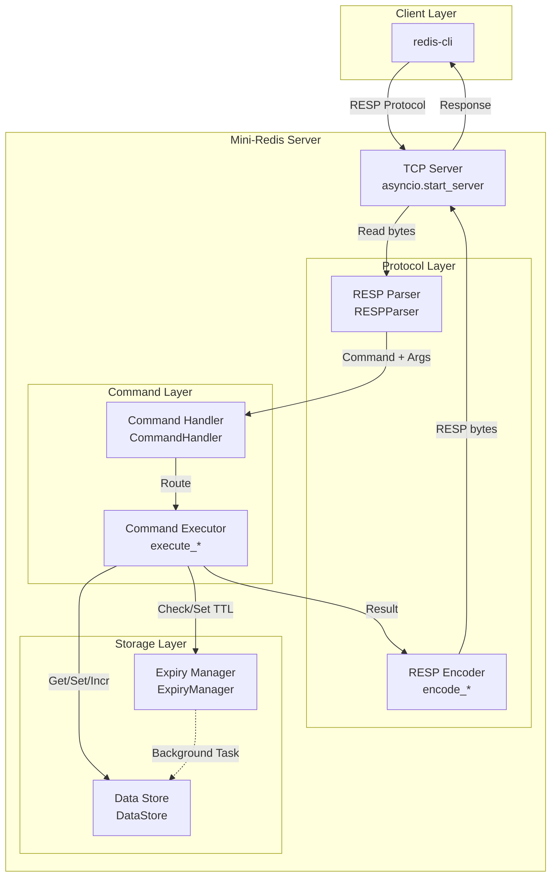
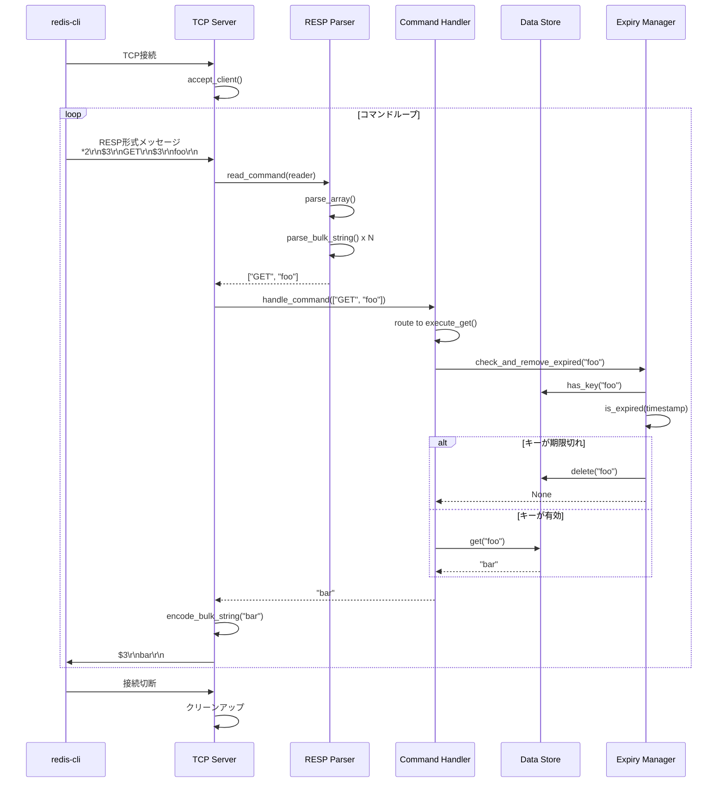
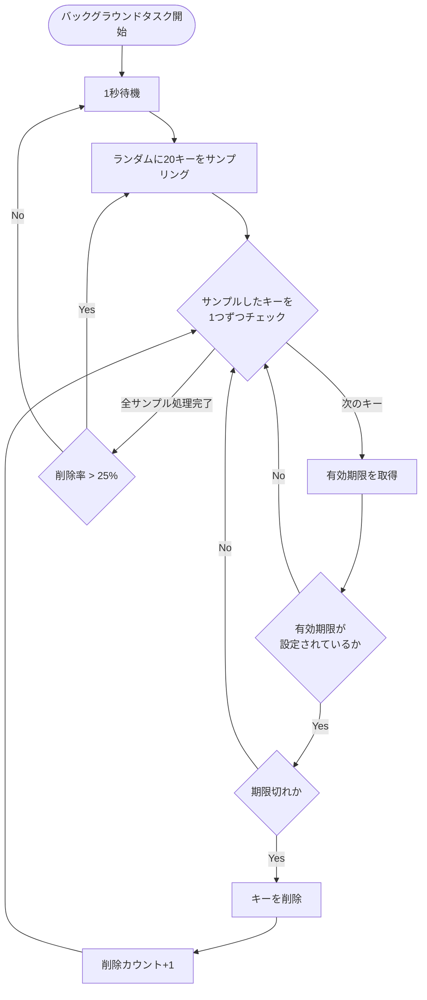
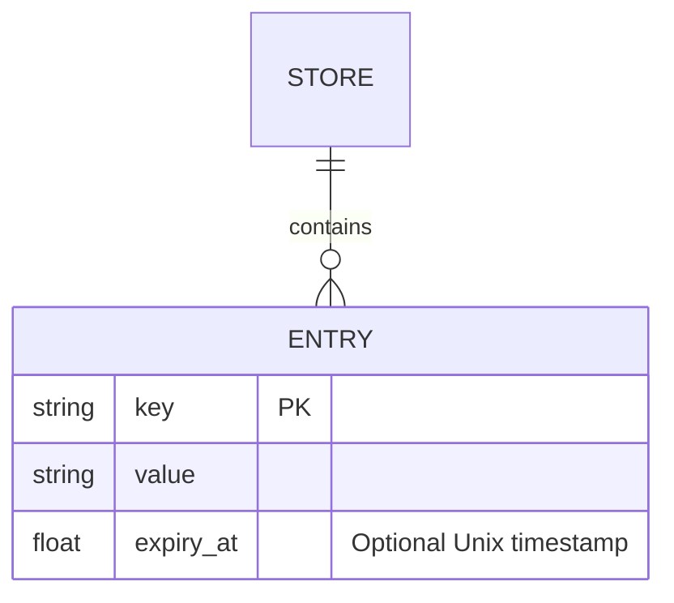
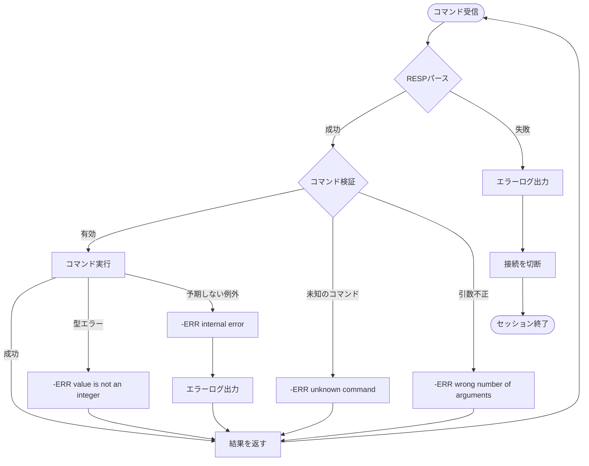
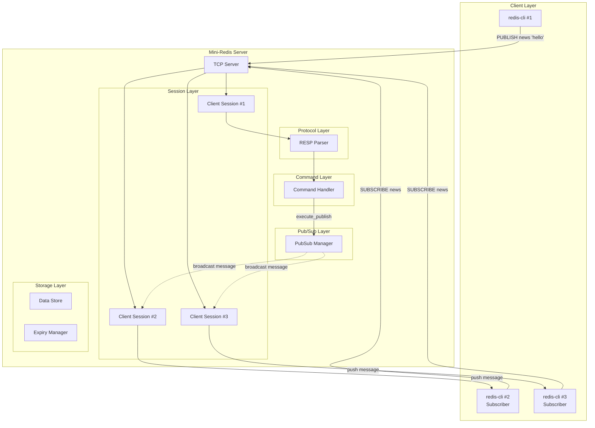

# 技術設計書

## 概要

**目的**: Mini-Redisは、Python学習者がasyncioとRedisプロトコルの基礎を理解するための60〜90分のワークショップ向け教材プロジェクトです。Redisの基本的なキー・バリューストア機能と期限管理機能を実装することで、非同期I/O、プロトコル設計、データ構造の実装原理を学びます。

**利用者**:
- **ワークショップ参加者（学習者）**: Python中級者（基本文法を理解している）で、asyncioやネットワークプログラミングを学びたい開発者
- **ワークショップ主催者**: 実装のヒントと模範解答を必要とする講師

**影響**: 新規プロジェクトのため、既存システムへの影響はありません。

### ゴール

- 学習者がasyncioを使ったTCPサーバの実装パターンを習得する
- RESPプロトコルの仕様を理解し、パーサを実装できるようになる
- 基本的なRedisコマンド（PING/GET/SET/INCR）の動作原理を理解する
- Redisの期限管理メカニズム（passive + active expiration）を実装できる
- redis-cliで実際に接続してテストできる実用的なサーバを構築する

### 非ゴール

- 本番環境で使用可能なRedisクローンの構築（教育目的に限定）
- 複雑なデータ構造（List、Hash、Set、Sorted Set）のサポート
- データ永続化機能（RDB、AOF）
- クラスタリングやレプリケーション
- 認証・セキュリティ機能
- パフォーマンス最適化（メモリ効率、高速化）

## アーキテクチャ

### 高レベルアーキテクチャ



### アーキテクチャの統合戦略

**新規プロジェクトのため既存パターンは存在しませんが、以下の原則に従います**:

- **シンプルなレイヤー構造**: 教育目的のため、責務を明確に分離したレイヤーアーキテクチャを採用
- **Pythonの標準ライブラリ中心**: 外部依存を最小限にし、asyncio標準機能を活用
- **型安全性**: 全モジュールでtype hintsを使用し、mypyでの静的型チェックを可能にする
- **テスト容易性**: 各レイヤーを独立してテスト可能な設計

## 技術スタックと設計判断

### Python環境
- **選定**: Python 3.12.x
- **理由**: asyncio TaskGroupや最新の型ヒント機能を安定版として提供し、主要ディストリビューションやpyenvで容易に入手できる
- **代替案**: Python 3.11（やや古いが互換）、Python 3.13（pre-releaseのためワークショップ配布には不向き）

### 非同期ランタイム
- **選定**: 標準ライブラリ asyncio
- **理由**: Pythonの標準非同期フレームワーク、学習コストが低い、外部依存なし
- **代替案**: trio（よりシンプルなAPI）、curio（軽量だが保守停止気味）

### プロトコル実装
- **選定**: カスタムRESPパーサ（StreamReaderベース）
- **理由**: 学習目的のため、プロトコルを一から実装することで理解を深める
- **代替案**: 既存ライブラリ（hiredis-py等）の使用（学習効果が薄れる）

### データストレージ
- **選定**: インメモリ辞書（dict）
- **理由**: シンプルで理解しやすい、ワークショップの時間内で実装可能
- **代替案**: Redis互換ライブラリ（fakeredis等）の使用、永続化対応（範囲外）

### 開発・テストツール
- **選定**: pytest（テストフレームワーク）、mypy（静的型チェック）、ruff（リンター・フォーマッター）
- **理由**: Python開発のデファクトスタンダード、高速、統合が容易
- **代替案**: unittest（標準だが機能が少ない）、pylint+black（複数ツールで冗長）

#### パッケージ構成（pyproject.toml）
- `[project]`: `name="mini-redis"`, `version="0.1.0"`, `requires-python=">=3.12,<3.13"` を定義し、教育目的でランタイム依存は極力ゼロに保つ
- `[project.optional-dependencies]`: `dev` グループに `pytest`, `mypy`, `ruff`, `types-setuptools` などワークショップで利用する開発ツールをまとめる
- `[tool]` セクション: `pytest.ini_options`, `mypy.ini-options`, `ruff` 設定を`pyproject.toml`に記載してセットアップを単一ファイルで完結させる
- パッケージ配布は想定しないため `build-system` は `setuptools` の最小構成を使用し、雛形に同梱してすぐに `pip install -e ".[dev]"` が実行できる状態にする

### 主要設計判断

#### 判断1: asyncioを使った並行接続処理

- **判断**: asyncio.start_serverとTaskGroupを使用して複数クライアントを並行処理
- **背景**: Redisは多数の同時接続を処理する必要があり、asyncioの非同期I/Oモデルが適している
- **代替案**:
  - マルチスレッド（threading）: GIL制約とスレッド管理の複雑さ
  - マルチプロセス（multiprocessing）: プロセス間通信のオーバーヘッド
  - 同期ソケット処理: 1接続ずつの処理で並行性なし
- **選定アプローチ**: asyncio + TaskGroup
- **理論的根拠**:
  - 非ブロッキングI/Oによる高い並行性
  - 単一プロセスで軽量なタスク切り替え
  - Python標準ライブラリで追加依存なし
  - TaskGroupによる構造化並行性（structured concurrency）でタスクのライフサイクル管理が容易
- **トレードオフ**:
  - **獲得**: 高い並行性、低メモリフットプリント、シンプルな実装
  - **犠牲**: CPU集約的な処理には不向き（今回は該当せず）、async/awaitの学習コスト

#### 判断2: RESP Protocol実装方法

- **判断**: StreamReaderを使った逐次的パーサ実装（状態なし）
- **背景**: RESPプロトコルはテキストベースで構造がシンプルだが、CRLFや長さ指定の処理が必要
- **代替案**:
  - 正規表現ベース: 複雑なパターンには不向き、パフォーマンス低下
  - パーサジェネレータ（PLY等）: オーバースペック、学習曲線が高い
  - 既存ライブラリ（hiredis）: 学習目的には不適
- **選定アプローチ**: StreamReader.readuntil(b'\r\n')を使った手動パース
- **理論的根拠**:
  - RESPはシンプルな構造（Type prefix + Length + Data）
  - StreamReaderはasyncioネイティブで統合が容易
  - 学習者がプロトコルの詳細を理解できる
- **トレードオフ**:
  - **獲得**: プロトコル理解の深化、シンプルな実装、依存なし
  - **犠牲**: 本番品質のエラーハンドリング、パフォーマンス最適化

#### 判断3: Expiry機能の実装方式（Passive + Active）

- **判断**: Passive（アクセス時チェック）+ Active（バックグラウンドタスクでサンプリング削除）の組み合わせ
- **背景**: Redisの実際の実装と同じ方式で、期限切れキーのメモリ削減と即時削除のバランス
- **代替案**:
  - Passiveのみ: アクセスされないキーが残り続けメモリリーク
  - Activeのみ（全キー走査）: 大量のキーがある場合にCPU使用率が高い
  - タイマーベース（各キーごとにタイマー）: メモリオーバーヘッド、スケーラビリティ低い
- **選定アプローチ**: Passive + Active（ランダムサンプリング）
- **理論的根拠**:
  - Passiveでアクセス頻度の高いキーは即座に削除
  - Activeでアクセスされないキーも定期的に削除（メモリリーク防止）
  - ランダムサンプリングで全走査を回避しCPU使用率を抑制
  - Redisの実際の動作を学習できる
- **Passive Expiryの実装箇所**:
  - `CommandHandler`の各コマンドメソッド（`execute_get`、`execute_incr`、`execute_expire`、`execute_ttl`）内で`ExpiryManager.check_and_remove_expired(key)`を呼び出す
  - これによりキーアクセス時に期限チェックが確実に実行される
  - コマンドごとに明示的で、テストとデバッグが容易
- **トレードオフ**:
  - **獲得**: メモリ効率と応答性のバランス、実際のRedisと同じアプローチ、明示的な期限チェック
  - **犠牲**: 完全な即時削除ではない（期限切れ後もしばらく残る可能性）、実装の複雑さ増加

## システムフロー

### クライアント接続とコマンド実行フロー



### Expiry Active削除フロー



## 要件トレーサビリティ

| 要件 | 要件概要 | コンポーネント | インターフェース | フロー |
|------|----------|--------------|----------------|--------|
| 1.1-1.5 | asyncioによるTCPサーバ | TCPServer, ClientHandler | start_server(), handle_client() | クライアント接続フロー |
| 2.1-2.5 | RESPプロトコルパース | RESPParser | parse_command(), encode_*() | RESPパースフロー |
| 3.1-3.8 | 基本コマンド | CommandHandler, DataStore | execute_ping/get/set/incr() | コマンド実行フロー |
| 4.1-4.6 | 学習者向け雛形 | 全モジュール | Skeleton code with TODOs | - |
| 5.1-5.6 | EXPIRE機能 | ExpiryManager, DataStore | set_expiry(), check_and_remove_expired() | Expiry削除フロー |

## コンポーネントとインターフェース

### ネットワーク層

#### TCPServer

**責務と境界**
- **主要責務**: TCP接続の受け入れ、クライアントセッションの管理、サーバのライフサイクル管理
- **ドメイン境界**: ネットワーク層（通信の確立と終了）
- **データ所有権**: アクティブな接続のStreamReader/StreamWriter参照
- **トランザクション境界**: クライアントごとのセッション単位

**依存関係**
- **Inbound**: メインエントリポイント（CLI起動スクリプト）
- **Outbound**: ClientHandler（クライアント接続ごとに起動）
- **External**: asyncio標準ライブラリ

**サービスインターフェース**

```python
from typing import Optional
import asyncio

class TCPServer:
    """Mini-RedisのTCPサーバ"""

    def __init__(self, host: str = "127.0.0.1", port: int = 6379) -> None:
        """サーバを初期化"""
        ...

    async def start(self) -> None:
        """
        サーバを起動し、接続を待ち受ける

        Preconditions:
        - ポートが他のプロセスに使用されていないこと

        Postconditions:
        - サーバが指定ポートで待ち受け状態になる
        - Ctrl+Cで停止されるまで実行し続ける

        Raises:
        - OSError: ポートが既に使用中
        """
        ...

    async def stop(self) -> None:
        """
        サーバを停止し、すべての接続をクローズ

        Postconditions:
        - すべてのクライアント接続がクローズされる
        - サーバソケットがクローズされる
        """
        ...
```

#### ClientHandler

**責務と境界**
- **主要責務**: 個別クライアントとの通信ループ、リクエスト受信→レスポンス送信
- **ドメイン境界**: セッション管理（1クライアント接続のライフサイクル）
- **データ所有権**: なし（ステートレス）
- **トランザクション境界**: 1コマンドのリクエスト・レスポンス

**依存関係**
- **Inbound**: TCPServer
- **Outbound**: RESPParser, CommandHandler
- **External**: asyncio StreamReader/StreamWriter

**サービスインターフェース**

```python
from asyncio import StreamReader, StreamWriter

class ClientHandler:
    """クライアント接続のハンドラ"""

    def __init__(self, parser: RESPParser, handler: CommandHandler) -> None:
        """ハンドラを初期化"""
        ...

    async def handle(self, reader: StreamReader, writer: StreamWriter) -> None:
        """
        クライアント接続を処理するメインループ

        Preconditions:
        - reader/writerが有効な接続であること

        Postconditions:
        - クライアントが切断するまでコマンドを処理し続ける
        - 接続終了時にwriterをクローズする

        Invariants:
        - 各コマンドの処理は独立している（状態を持たない）
        """
        ...
```

### プロトコル層

#### RESPParser

**責務と境界**
- **主要責務**: RESPプロトコルのパース（バイト列→Pythonオブジェクト）とエンコード（Pythonオブジェクト→バイト列）
- **ドメイン境界**: プロトコル変換層
- **データ所有権**: なし（ステートレスパーサ）

**依存関係**
- **Inbound**: ClientHandler
- **Outbound**: なし
- **External**: asyncio StreamReader

**サービスインターフェース**

```python
from typing import Optional, List, Union
from asyncio import StreamReader

RESPValue = Union[str, int, bytes, List[bytes], None]

class RESPParser:
    """RESPプロトコルのパーサ・エンコーダ"""

    async def parse_command(self, reader: StreamReader) -> List[str]:
        """
        StreamReaderからRESPコマンドを読み取りパース

        Returns:
        - コマンド名と引数のリスト（例: ["GET", "foo"]）

        Preconditions:
        - readerに有効なRESP形式のArraysが含まれていること

        Postconditions:
        - readerの読み取り位置が次のコマンドの先頭に進む

        Raises:
        - RESPProtocolError: 不正なRESP形式
        - asyncio.IncompleteReadError: 接続が途中で切断
        """
        ...

    def encode_simple_string(self, value: str) -> bytes:
        """Simple Stringをエンコード（例: +OK\r\n）"""
        ...

    def encode_error(self, message: str) -> bytes:
        """Errorをエンコード（例: -ERR message\r\n）"""
        ...

    def encode_integer(self, value: int) -> bytes:
        """Integerをエンコード（例: :42\r\n）"""
        ...

    def encode_bulk_string(self, value: Optional[str]) -> bytes:
        """
        Bulk Stringをエンコード

        Args:
        - value: エンコードする文字列（Noneの場合はNull Bulk String）

        Returns:
        - RESP Bulk String形式（例: $3\r\nfoo\r\n または $-1\r\n）
        """
        ...
```

### コマンド層

#### CommandHandler

**責務と境界**
- **主要責務**: コマンドのルーティングと実行、ビジネスロジックの調整、Passive expiryの実行
- **ドメイン境界**: コマンド実行層（Redis互換のコマンド処理）
- **データ所有権**: なし（DataStoreに委譲）
- **トランザクション境界**: 1コマンド実行単位

**Passive Expiryの責任**:
- キーにアクセスする各コマンド（GET、INCR、EXPIRE、TTL）の実行時に、`ExpiryManager.check_and_remove_expired(key)`を呼び出して期限切れキーを削除する
- これにより、アプリケーション層でPassive expiry（アクセス時の期限チェック）を実現する

**依存関係**
- **Inbound**: ClientHandler
- **Outbound**: DataStore, ExpiryManager
- **External**: なし

**サービスインターフェース**

```python
from typing import List, Union

CommandResult = Union[str, int, None]

class CommandHandler:
    """Redisコマンドのハンドラ"""

    def __init__(self, store: DataStore, expiry: ExpiryManager) -> None:
        """ハンドラを初期化"""
        ...

    async def execute(self, command: List[str]) -> CommandResult:
        """
        コマンドを実行

        Args:
        - command: コマンド名と引数のリスト

        Returns:
        - コマンドの実行結果

        Preconditions:
        - commandが少なくとも1要素（コマンド名）を含むこと

        Postconditions:
        - コマンドが実行され、結果が返される
        - 不正なコマンドの場合はエラーメッセージを返す

        Raises:
        - CommandError: コマンド実行エラー
        """
        ...

    async def execute_ping(self) -> str:
        """PING: 常に'PONG'を返す"""
        ...

    async def execute_get(self, key: str) -> Optional[str]:
        """
        GET: キーの値を取得

        実装:
        1. self.expiry.check_and_remove_expired(key)を呼び出してPassive expiryを実行
        2. self.store.get(key)でキーの値を取得
        3. 結果を返す

        Returns:
        - キーが存在する場合は値、存在しない場合はNone

        Example:
            # 実装例
            self.expiry.check_and_remove_expired(key)
            return self.store.get(key)
        """
        ...

    async def execute_set(self, key: str, value: str) -> str:
        """
        SET: キーに値を設定

        Returns:
        - 'OK'

        Postconditions:
        - キーに値が設定される
        - キーに設定されていた有効期限はクリアされる
        """
        ...

    async def execute_incr(self, key: str) -> int:
        """
        INCR: キーの値を1増加

        実装:
        1. self.expiry.check_and_remove_expired(key)を呼び出してPassive expiryを実行
        2. self.store.get(key)で現在の値を取得
        3. 値が存在しない場合は1を設定して返す
        4. 値が整数でない場合はエラー
        5. 値を+1してself.store.set(key, new_value)で保存
        6. 新しい値を返す

        Returns:
        - 増加後の値

        Postconditions:
        - キーが存在しない場合は1に設定
        - キーが整数の場合は+1して返す

        Raises:
        - CommandError: 値が整数でない場合
        """
        ...

    async def execute_expire(self, key: str, seconds: int) -> int:
        """
        EXPIRE: キーに有効期限を設定

        実装:
        1. self.expiry.check_and_remove_expired(key)を呼び出してPassive expiryを実行
        2. キーが存在するか確認
        3. 存在しない場合は0を返す
        4. 存在する場合は有効期限を設定して1を返す

        Returns:
        - 1: キーが存在し有効期限を設定
        - 0: キーが存在しない

        Postconditions:
        - キーに現在時刻+seconds秒の有効期限が設定される
        """
        ...

    async def execute_ttl(self, key: str) -> int:
        """
        TTL: キーの残り有効秒数を取得

        実装:
        1. self.expiry.check_and_remove_expired(key)を呼び出してPassive expiryを実行
        2. キーが存在しない場合は-2を返す
        3. 有効期限が設定されていない場合は-1を返す
        4. 有効期限が設定されている場合は残り秒数を計算して返す

        Returns:
        - 残り秒数（正の整数）
        - -1: キーは存在するが有効期限なし
        - -2: キーが存在しない

        Example:
            # 実装例
            self.expiry.check_and_remove_expired(key)
            if not self.store.exists(key):
                return -2
            expiry_at = self.store.get_expiry(key)
            if expiry_at is None:
                return -1
            remaining = int(expiry_at - time.time())
            return max(0, remaining)
        """
        ...
```

### ストレージ層

#### DataStore

**責務と境界**
- **主要責務**: キー・バリューペアの保存・取得・削除、有効期限メタデータの管理
- **ドメイン境界**: データ永続化層（インメモリ）
- **データ所有権**: すべてのキー・バリューデータと有効期限情報
- **トランザクション境界**: 単一キー操作（辞書操作はatomic）

**依存関係**
- **Inbound**: CommandHandler, ExpiryManager
- **Outbound**: なし
- **External**: なし

**状態管理**
- **状態モデル**:
  - キー: 存在しない → 存在する → 削除（存在しない）
  - 有効期限: なし → 設定済み → 削除（なし）
- **永続化**: インメモリ（プロセス終了で消失）
- **並行制御**: asyncioの単一スレッド実行モデルにより、明示的なロックは不要

**サービスインターフェース**

```python
from typing import Optional, Dict, List
from dataclasses import dataclass
import time

@dataclass
class StoreEntry:
    """ストレージのエントリ"""
    value: str
    expiry_at: Optional[float] = None  # Unix timestamp

class DataStore:
    """インメモリのキー・バリューストア"""

    def __init__(self) -> None:
        """ストアを初期化"""
        self._data: Dict[str, StoreEntry] = {}

    def get(self, key: str) -> Optional[str]:
        """
        キーの値を取得

        Returns:
        - 値が存在する場合はその値、存在しない場合はNone

        Invariants:
        - 期限切れチェックは呼び出し側の責任
        """
        ...

    def set(self, key: str, value: str) -> None:
        """
        キーに値を設定

        Postconditions:
        - キーに値が設定される
        - 既存の有効期限はクリアされる
        """
        ...

    def delete(self, key: str) -> bool:
        """
        キーを削除

        Returns:
        - True: キーが存在して削除された
        - False: キーが存在しなかった
        """
        ...

    def exists(self, key: str) -> bool:
        """キーが存在するかチェック"""
        ...

    def set_expiry(self, key: str, expiry_at: float) -> bool:
        """
        キーに有効期限を設定

        Args:
        - expiry_at: 有効期限のUnix timestamp

        Returns:
        - True: キーが存在し有効期限を設定
        - False: キーが存在しない
        """
        ...

    def get_expiry(self, key: str) -> Optional[float]:
        """
        キーの有効期限を取得

        Returns:
        - 有効期限のUnix timestamp（設定されていない場合はNone）
        """
        ...

    def get_all_keys(self) -> List[str]:
        """すべてのキーを取得（Active expiry用）"""
        ...
```

#### ExpiryManager

**責務と境界**
- **主要責務**: 期限切れキーの検出と削除（Passive + Active）
- **ドメイン境界**: 期限管理層
- **データ所有権**: なし（DataStoreに委譲）
- **トランザクション境界**: キー単位のexpiry check、Active処理は独立したバックグラウンドタスク

**依存関係**
- **Inbound**: CommandHandler（Passive）、自己起動バックグラウンドタスク（Active）
- **Outbound**: DataStore
- **External**: asyncio, time, random

**サービスインターフェース**

```python
import time
import random
import asyncio

class ExpiryManager:
    """キーの有効期限管理"""

    def __init__(self, store: DataStore) -> None:
        """マネージャを初期化"""
        self._store = store

    def check_and_remove_expired(self, key: str) -> bool:
        """
        Passive expiry: キーが期限切れかチェックし、期限切れなら削除

        Returns:
        - True: キーが期限切れで削除された
        - False: キーは有効または存在しない

        Postconditions:
        - 期限切れキーは削除される
        """
        ...

    async def start_active_expiry(self) -> None:
        """
        Active expiry: バックグラウンドタスクを開始

        Postconditions:
        - 1秒ごとにランダムサンプリングで期限切れキーを削除するタスクが起動
        - 削除率が25%を超える場合は即座に次のサンプリングを実行

        Invariants:
        - サーバ停止まで実行し続ける
        """
        ...

    async def _active_expiry_cycle(self) -> None:
        """
        1サイクルのActive expiry処理

        - 最大20キーをランダムサンプリング
        - 期限切れキーを削除
        - 削除率が25%を超えたらループ継続、そうでなければ1秒待機
        """
        ...
```

## データモデル

### 論理データモデル

このシステムはシンプルなキー・バリューストアのため、主要なエンティティは以下の通りです。



**エンティティ定義**:

- **STORE**: すべてのキー・バリューペアを管理するコンテナ（Python dictで実装）
- **ENTRY**: 個別のキー・バリューペア
  - `key`: 主キー（文字列、一意）
  - `value`: 保存される値（文字列のみサポート）
  - `expiry_at`: 有効期限（Unix timestamp、Optionalで設定されていない場合はNone）

**整合性ルール**:
- キーは一意である必要がある（dictのキー制約）
- 有効期限が設定されている場合、`expiry_at`は未来のタイムスタンプである必要がある（設定時点）
- INCRコマンドは値が整数文字列の場合のみ実行可能

**一時的側面**:
- 有効期限切れのエントリは削除される（Passive + Active）
- データはプロセスのライフタイムに限定（永続化なし）

### 物理データモデル

**インメモリ辞書**:

```python
# 内部データ構造
_data: Dict[str, StoreEntry] = {}

# StoreEntryの定義
@dataclass
class StoreEntry:
    value: str
    expiry_at: Optional[float] = None
```

**設計判断**:
- **単一辞書構造**: Pythonのdictは高速なハッシュテーブル実装（O(1)アクセス）
- **エントリクラス**: 値と有効期限をまとめて管理、将来の拡張が容易
- **型安全性**: Type hintsとdataclassで明示的な型定義

**パフォーマンス考慮事項**:
- 辞書操作はatomic（GIL保護）のため明示的なロックは不要
- Active expiryのランダムサンプリングで全キー走査を回避
- メモリ使用量は保存キー数に比例（ワークショップ規模では問題なし）

## エラーハンドリング

### エラー戦略

Mini-Redisは学習目的のため、基本的なエラーハンドリングに焦点を当て、複雑なエラーリカバリは実装しません。エラーは以下のカテゴリに分類されます。

### エラーカテゴリとレスポンス

**ユーザーエラー（4xx相当）**:
- **不正なコマンド**: 未知のコマンド → `-ERR unknown command`
- **引数不足/過剰**: コマンド引数が不正 → `-ERR wrong number of arguments`
- **型エラー**: INCRで非整数値 → `-ERR value is not an integer or out of range`

**プロトコルエラー**:
- **RESPフォーマット不正**: パース失敗 → 接続を切断、ログ出力
- **接続切断**: クライアントが予期せず切断 → セッションをクリーンアップ

**システムエラー（5xx相当）**:
- **ポート使用中**: 起動失敗 → エラーメッセージを表示して終了
- **予期しない例外**: 内部エラー → `-ERR internal error`、ログ出力、接続は維持

### エラーフローの例



### モニタリング

**ログ出力**:
- Python標準ライブラリの`logging`モジュールを使用
- ログレベル: INFO（通常動作）、WARNING（非致命的エラー）、ERROR（致命的エラー）
- 出力内容:
  - サーバ起動/停止
  - クライアント接続/切断
  - RESPプロトコルエラー
  - コマンド実行エラー

**ヘルスモニタリング**（ワークショップでは実装しないが、拡張可能性として言及）:
- アクティブ接続数
- 総キー数
- Active expiryで削除されたキー数
- コマンド実行カウント

## テストストラテジー

### ユニットテスト

各コンポーネントを独立してテストし、ロジックの正確性を保証します。

1. **RESPParser**:
   - 正常系: Arrays、Bulk Strings、Simple Stringsの正しいパース
   - 異常系: 不正なフォーマット、CRLFの欠如、長さ不一致
   - エンコード: 各型の正しいエンコード、Null Bulk Stringの処理

2. **DataStore**:
   - CRUD操作: get/set/delete/existsの動作確認
   - Expiry設定: set_expiry/get_expiryの正確性
   - 境界条件: 存在しないキーの操作、上書き動作

3. **ExpiryManager**:
   - Passive expiry: 期限切れキーの削除、有効キーは削除されないこと
   - Active expiry: ランダムサンプリングの動作、削除率に応じた再実行

4. **CommandHandler**:
   - 各コマンドの正常系: PING/GET/SET/INCR/EXPIRE/TTLの正しい実行
   - エラーケース: 引数不足、型エラー、未知のコマンド

### 統合テスト

複数コンポーネント間の協調動作をテストします。

1. **TCPサーバとRESPパーサの統合**:
   - 実際のTCP接続を通じてRESPメッセージを送受信
   - 複数コマンドの連続実行
   - 接続の確立とクローズ

2. **コマンドハンドラとストレージの統合**:
   - SET→GETの一貫性
   - INCR→GETの整合性
   - EXPIRE→GET→TTLの動作確認

3. **Expiry機能の統合**:
   - SET→EXPIRE→待機→GET（passive削除）
   - SET→EXPIRE→Active expiry実行→確認

### E2Eテスト

実際のredis-cliを使用した動作確認（手動テストまたは自動化）。

1. **redis-cliからの接続**:
   - `redis-cli -p 6379 PING` → `PONG`
   - 基本コマンドの実行確認

2. **ワークショップシナリオ**:
   - 学習者が実装した各ステップでの動作確認
   - TODOを埋めながら段階的にテストが通ることを確認

3. **並行接続テスト**:
   - 複数のredis-cliを同時起動
   - 各クライアントが独立して動作することを確認

### パフォーマンステスト（参考）

ワークショップ範囲外ですが、拡張学習として以下をテスト可能です。

1. **並行接続数**:
   - 100接続を同時に処理できるか

2. **コマンドスループット**:
   - 単純なGET/SETの実行速度

3. **Expiry処理のオーバーヘッド**:
   - 大量のキーがある場合のActive expiryの影響

## セキュリティ考慮事項

Mini-Redisは学習目的のプロジェクトであり、本番環境での使用を想定していません。ただし、以下の基本的なセキュリティ原則を考慮します。

### 脅威モデリング

**スコープ外の脅威**（ワークショップでは扱わない）:
- 認証・認可の欠如（誰でも接続可能）
- 通信の暗号化なし（平文通信）
- DoS攻撃への耐性なし

**考慮する脅威**:
- **不正なRESPメッセージ**: パース処理での無限ループやクラッシュ
- **メモリ枯渇**: 大量のキー登録による意図的なメモリ消費

### セキュリティコントロール

1. **入力検証**:
   - RESPメッセージの長さ上限チェック（例: 1MB）
   - コマンド引数の数と型の検証
   - 不正なフォーマットの場合は接続を切断

2. **リソース制限**:
   - 最大キー数の制限（例: 10,000キー）
   - 単一値の最大サイズ制限（例: 512KB）
   - 実装は簡易的（ワークショップの時間制約）

3. **エラーハンドリング**:
   - 予期しない例外でもサーバがクラッシュしないようにtry-exceptで保護
   - エラー詳細をクライアントに返さない（内部情報の漏洩防止）

### 学習者への注意事項

ワークショップ資料に以下を明記します:
- **ローカル環境専用**: 外部ネットワークに公開しないこと
- **認証なし**: 誰でもアクセス可能なため、信頼できるネットワークでのみ使用
- **データ永続化なし**: プロセス終了でデータが消失

## パフォーマンスとスケーラビリティ

### ターゲットメトリクス

ワークショップ目的のため、以下を満たせば十分です:

- **応答時間**: 単純なGET/SET操作で < 10ms（ローカルホスト）
- **並行接続数**: 最低10接続を同時処理可能
- **スループット**: 1,000 ops/sec（ローカル環境、単一クライアント）
- **メモリ使用量**: 10,000キーで < 100MB

### スケーリングアプローチ

**水平スケーリング**:
- ワークショップ範囲外（単一サーバインスタンス）
- 将来的にはRedis ClusterやShardingを学ぶ教材として拡張可能

**垂直スケーリング**:
- Python GILの制約により、単一プロセスではCPUコア1つに制限
- マルチプロセス化（複数ポートで起動）は可能だが範囲外

### キャッシング戦略

- **データキャッシング**: 全データがメモリ内のため不要
- **計算結果のキャッシング**: ワークショップ範囲では不要（単純な操作のみ）

### 最適化技術

**実装済み**:
- asyncioによる非ブロッキングI/O
- Active expiryでのランダムサンプリング（全走査回避）

**将来的な最適化の学習機会**:
- RESPパーサのゼロコピー化
- データ構造の最適化（intはintオブジェクトとして保存）
- メモリプールの使用

## 将来の拡張性

### 設計方針

現在の設計はワークショップの範囲（基本コマンド + EXPIRE機能）に最適化されていますが、将来的な機能拡張を考慮した拡張ポイントを用意しています。

### Pub/Sub機能の実装ガイド

Pub/Sub（PUBLISH/SUBSCRIBE/PSUBSCRIBE/UNSUBSCRIBE）は、Redisの重要な機能の一つです。現在の設計にPub/Sub機能を追加する場合、以下のアプローチを推奨します。

#### 必要な設計変更

**1. ClientSessionコンポーネントの追加**（ネットワーク層）

```python
from typing import Set, Literal
import asyncio

class ClientSession:
    """クライアント接続のセッション状態管理"""

    def __init__(self, client_id: str) -> None:
        self.client_id: str = client_id
        self.mode: Literal["normal", "pubsub"] = "normal"
        self.subscribed_channels: Set[str] = set()
        self.subscribed_patterns: Set[str] = set()
        self.message_queue: asyncio.Queue = asyncio.Queue()
```

**設計判断**:
- 現在の`ClientHandler`はステートレスですが、Pub/Subモードではセッション状態が必要
- `message_queue`を使って非同期メッセージプッシュを実現
- 通常モードとPub/Subモードを明示的に区別

**2. PubSubManagerコンポーネントの追加**（新レイヤー）

```python
from typing import Dict, Set, List
import fnmatch

class PubSubManager:
    """Pub/Subのサブスクリプション管理とメッセージルーティング"""

    def __init__(self) -> None:
        # チャンネル名 -> サブスクライバーのセット
        self._channels: Dict[str, Set[ClientSession]] = {}
        # パターン -> サブスクライバーのセット
        self._patterns: Dict[str, Set[ClientSession]] = {}

    def subscribe(self, session: ClientSession, channel: str) -> int:
        """チャンネルをサブスクライブ"""
        ...

    def psubscribe(self, session: ClientSession, pattern: str) -> int:
        """パターンをサブスクライブ"""
        ...

    def unsubscribe(self, session: ClientSession, channel: str) -> int:
        """チャンネルのサブスクリプションを解除"""
        ...

    async def publish(self, channel: str, message: str) -> int:
        """チャンネルにメッセージを発行し、サブスクライバー数を返す"""
        ...

    def _find_subscribers(self, channel: str) -> Set[ClientSession]:
        """チャンネルとパターンマッチで該当するサブスクライバーを取得"""
        ...
```

**設計判断**:
- 既存のストレージ層とは独立した新しいコンポーネント
- チャンネル管理とメッセージルーティングの責務を持つ
- パターンマッチング（PSUBSCRIBEのための`fnmatch`使用）をサポート

**3. CommandHandlerの拡張**

```python
class CommandHandler:
    def __init__(
        self,
        store: DataStore,
        expiry: ExpiryManager,
        pubsub: PubSubManager  # 追加
    ) -> None:
        ...

    async def execute_subscribe(
        self,
        session: ClientSession,  # 追加
        channels: List[str]
    ) -> None:
        """
        SUBSCRIBE: Pub/Subモードに入り、メッセージを待機

        注意: このコマンドは通常のコマンドと異なり、
        UNSUBSCRIBEされるまでブロッキング動作する
        """
        ...

    async def execute_publish(
        self,
        channel: str,
        message: str
    ) -> int:
        """PUBLISH: チャンネルにメッセージを発行"""
        ...
```

**4. ClientHandlerの改修**

```python
class ClientHandler:
    async def handle(self, reader: StreamReader, writer: StreamWriter) -> None:
        """
        クライアント接続を処理するメインループ

        変更点: セッション管理を追加し、Pub/Subモードをサポート
        """
        session = ClientSession(client_id=generate_client_id())

        # 2つの並行タスクを起動
        async with asyncio.TaskGroup() as tg:
            # タスク1: クライアントからのコマンド受信
            tg.create_task(self._handle_commands(session, reader, writer))
            # タスク2: Pub/Subメッセージのプッシュ
            tg.create_task(self._handle_pubsub_messages(session, writer))
```

#### 更新されたアーキテクチャ図（Pub/Sub拡張後）



#### 実装時の注意点

1. **Pub/Subモードの状態遷移**:
   - 通常モード → SUBSCRIBE → Pub/Subモード
   - Pub/Subモードでは、SUBSCRIBE/PSUBSCRIBE/UNSUBSCRIBE/PUNSUBSCRIBE/PING/QUITのみ受付
   - すべてのチャンネルをUNSUBSCRIBEすると通常モードに戻る

2. **非同期メッセージプッシュ**:
   - `ClientSession.message_queue`を使った非同期キュー
   - `ClientHandler`で2つの並行タスク（コマンド受信とメッセージプッシュ）を管理

3. **パターンマッチング**:
   - `fnmatch`モジュールを使用（`news.*`のようなパターン）
   - Redisとは完全互換ではないが、学習目的には十分

4. **メモリ管理**:
   - クライアント切断時にサブスクリプションを自動解除
   - チャンネルにサブスクライバーがいなくなったら辞書から削除

#### 既存設計の利点

現在の設計は、以下の理由でPub/Sub拡張に適しています:

- ✅ **明確なレイヤー分離**: 新しいPub/Sub層を追加しても既存層に影響が少ない
- ✅ **asyncioベース**: 非同期メッセージプッシュとの親和性が高い
- ✅ **CommandHandlerの柔軟性**: 新しいコマンドタイプを追加しやすい設計
- ✅ **型安全性**: Type hintsにより、拡張時のバグを早期発見可能

#### 実装難易度

- **難易度**: 中（ワークショップの範囲を超えるが、実装は可能）
- **追加実装時間**: 約2〜3時間（テスト込み）
- **追加コード量**: 約300〜400行

### その他の拡張機能

**データ永続化（RDB/AOF）**:
- `DataStore`に永続化インターフェースを追加
- バックグラウンドタスクで定期的にダンプ

**トランザクション（MULTI/EXEC/WATCH）**:
- `ClientSession`にトランザクションバッファを追加
- `CommandHandler`でコマンドキューイングを実装

**複雑なデータ構造（List/Hash/Set）**:
- `DataStore`の値の型を`Union[str, List, Dict, Set]`に拡張
- 各データ型専用のコマンドハンドラを追加

---

## 次のステップ

この設計書をレビューし、以下を確認してください:

1. **アーキテクチャの明確性**: レイヤー構造と各コンポーネントの責務が理解できるか
2. **実装可能性**: 60〜90分のワークショップで実装できる範囲か
3. **学習目標の達成**: asyncio、RESPプロトコル、Redisの動作原理を学べる内容か
4. **拡張性**: 将来的な機能追加（新コマンド、永続化等）が可能な設計か

設計が承認されたら、`/kiro:spec-tasks mini-redis-py -y`を実行して実装タスクを生成してください。
