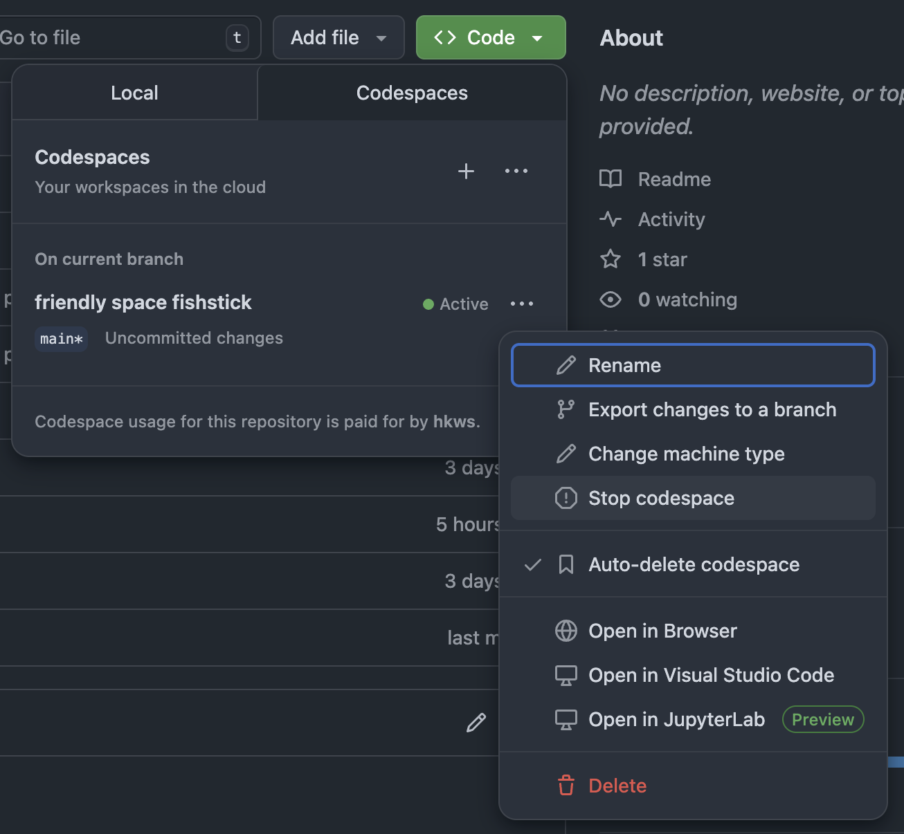

# Mini-Redis

Pythonで作る小さなRedis実装（学習用）

## 概要

本リポジトリは、60〜90分のワークショップでPython/asyncioを使用してRedisの基本機能を実装する学習プロジェクトです。RESPプロトコル、非同期プログラミング、ネットワークサーバの実装を学びます。

## 学習目標

- **asyncioによるTCPサーバ**: 非同期I/Oとイベントループの理解
- **RESPプロトコル**: Redisの通信フォーマットの実装
- **基本コマンド**: PING/GET/SET/INCR/EXPIRE/TTLの動作原理
- **有効期限管理**: Passive + Active Expirationの2段階管理

## 学習資料とワークショップ構成

各講義資料には、理論解説と実装ガイド（ハンズオン）の両方が含まれています。順番に読みながら実装を進めることで、ワークショップが完了します。

- **[00-introduction.md](docs/lectures/00-introduction.md)** - Redis基礎とRESP入門、環境セットアップ（15分）
- **[01-tcp-server.md](docs/lectures/01-tcp-server.md)** - asyncio TCPサーバの理論と実装（20分）
- **[02-protocol-parsing.md](docs/lectures/02-protocol-parsing.md)** - RESPプロトコル詳細と実装（25分）
- **[03-commands.md](docs/lectures/03-commands.md)** - コマンド実装パターンと実装（25分）
- **[04-expiry.md](docs/lectures/04-expiry.md)** - 有効期限管理の理論と実装（時間が余れば）
- **[05-summary.md](docs/lectures/05-summary.md)** - 統合テスト、まとめ、発展課題（5分）
- **[アーキテクチャ](docs/architecture.md)** - システム全体像、レイヤー構造、設計

ワークショップはパートごとに、講師による説明->受講者によるハンズオン->ハンズオンパートの解説の順での進行を基本としますが、必ずしもこの進め方に合わせる必要はありません。分量が多いため、人によっては進行が早いと感じる可能性がありますので、ご自身のペースで取り組んでください。

時間の都合上、講師による説明はおそらく[03-commands.md](docs/lectures/03-commands.md)までになる見込みです。早くここまで終えられた方は、ぜひ[04-expiry.md](docs/lectures/04-expiry.md)にも取り組んでください。

- 入室退室途中休憩自由！
- 進行を気にせずゆっくり進めるのもOK！
- 進行を気にせずどんどん先に進んでもOK！
- 完成版(./solutions/mini_redis)を参考に写経するのもOK！
- 本家Redisのソースコードを読み込むのもOK！（資料の中にいくつか対応する本家実装へのリンクを付与しています）

楽しくやっていきましょう！


## プロジェクト構成

```
mini-redis-py/
├── docs/                    # 学習資料
│   ├── architecture.md      # アーキテクチャ解説
│   └── lectures/            # 段階別講義資料（理論＋実装ガイド）
├── mini_redis/              # 学習者向け実装雛形（TODOコメント付き）
│   ├── protocol.py          # RESPプロトコル
│   ├── storage.py           # データストレージ
│   ├── commands.py          # コマンド実行層
│   ├── expiry.py            # 有効期限管理
│   └── server.py            # TCPサーバ
├── solutions/               # 完成版コード（参考用）
│   └── mini_redis/          # 完全に動作する実装
└── tests/                   # テストスイート
    ├── step01_tcp_server/   # Step 01: TCPサーバのテスト
    ├── step02_protocol/     # Step 02: RESPプロトコルのテスト
    ├── step03_commands/     # Step 03: コマンド実装のテスト
    └── step04_expiry/       # Step 04: 有効期限管理のテスト
```

詳細なアーキテクチャは [docs/architecture.md](docs/architecture.md) を参照してください。

## 事前準備

本ワークショップは、受講者自身の端末で進めていただいても構いませんが、基本的にMacOSでの実施を前提としています。
その他のOSを利用しているユーザーは、Github Codespacesでの実施を推奨します。

### Github Codespacesの無料枠について

個人用アカウントにおけるGithub Codespaces利用は、以下の使用量を超えなければ無料です（2025年11月現在）。

- 1 か月あたりのストレージ: 15 GB/月
- 1 か月あたりの1コアでのコンピューティング時間: 120 時間
    - デフォルトで2コアのマシンが割り当てられるため、Codespacesで立ち上げる環境が本ワークショップの分のみである場合、一ヶ月あたり 60時間/月 利用できます。

本ワークショップの内容のみであれば、上記無料枠を超えることはほとんど考えづらいです。しかし、意図しない課金が発生しないよう、後述するGithubの課金設定を確認しておくことをお勧めします。また、利用を終了したら忘れずに環境を削除しておきましょう。

参考：[個人用アカウントによる無料使用と有料使用](https://docs.github.com/ja/billing/concepts/product-billing/github-codespaces#free-and-billed-use-by-personal-accounts)

### Github Codespacesでの環境作成と終了

1. (Optional) 想定以上に課金が発生することがないよう、Githubの設定をしておきましょう
    - 現在の課金状況: https://github.com/settings/billing
    - 予算やアラートの設定: https://github.com/settings/billing/budgets
        - デフォルトで無料枠を超過したら利用できなくなる設定のはずですが、念の為確認した方が良いでしょう
        - 参考: https://docs.github.com/ja/enterprise-cloud@latest/billing/tutorials/set-up-budgets

1. ブラウザで以下のリンクをクリックしてください
[](https://codespaces.new/hkws/mini-redis-py)

1. ワークショップを終了した場合など、不要になったら `Stop Codespaces` や `Delete` しておきましょう。


## クイックスタート

### 1. セットアップ

```bash
# リポジトリをクローン（Codespacesを利用する場合は不要）
git clone https://github.com/hkws/mini-redis-py.git
cd mini-redis-py

# まだ uv を導入していない場合は pip などでインストール
pip install uv

# プロジェクト用の Python 3.12.11 を取得し、依存関係を同期 (.venv が自動生成されます)
uv self update  # 必要に応じて
uv python install "$(cat .python-version)"
uv sync --extra dev

# 作成された .venv を有効化
source .venv/bin/activate  # Windows の場合は .\.venv\Scripts\Activate.ps1

# バージョン確認（任意）
python --version
```

`uv run` を使用いただくことも可能です。以降の説明および[docs](docs/)内部の資料では、仮想環境をactivateした状態でのコマンド例を示します。

### 2. 学習開始

```bash
# 講義資料を順番に読みながら実装
# 00-introduction.md から始めて、順番に進めていきましょう
cat docs/lectures/00-introduction.md
```

### 3. 実装とテスト

```bash
# TODOコメントを実装
# mini_redis/protocol.py, storage.py, commands.py, expiry.py, server.py

# サーバを起動
python -m mini_redis
```

本プロジェクトでは、実装ステップごとにテストが整理されています。

```bash
# Step 01: TCPサーバとasyncio
pytest tests/step01_tcp_server/ -v

# Step 02: RESPプロトコル
pytest tests/step02_protocol/ -v

# Step 03: コマンド実装
pytest tests/step03_commands/ -v

# Step 04: 有効期限管理
pytest tests/step04_expiry/ -v
```

## ライセンス

MIT
