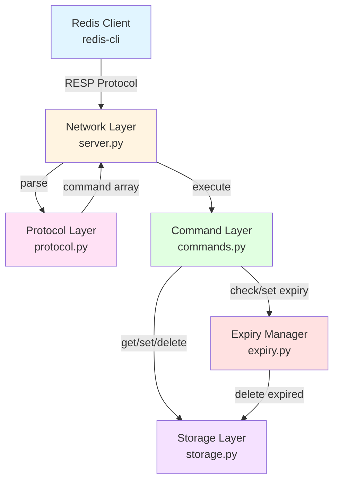
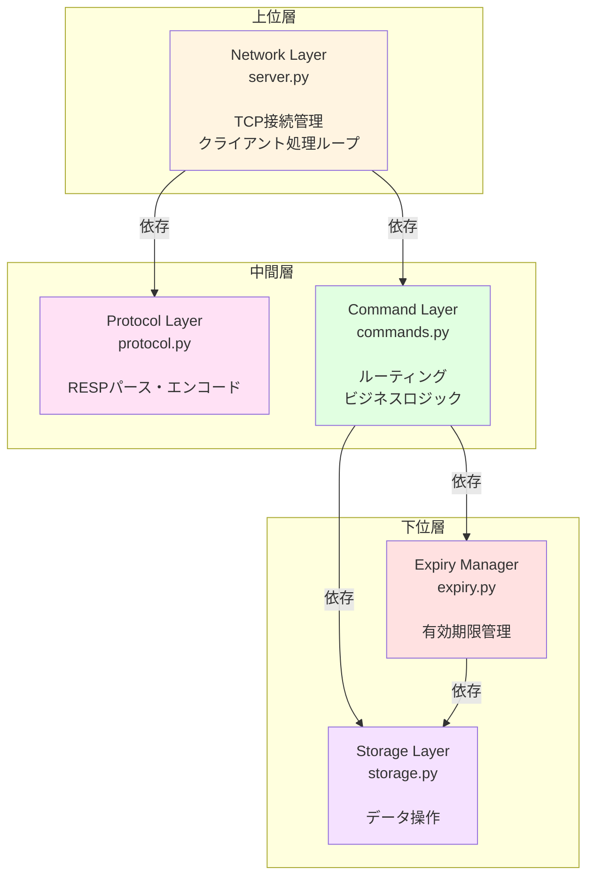
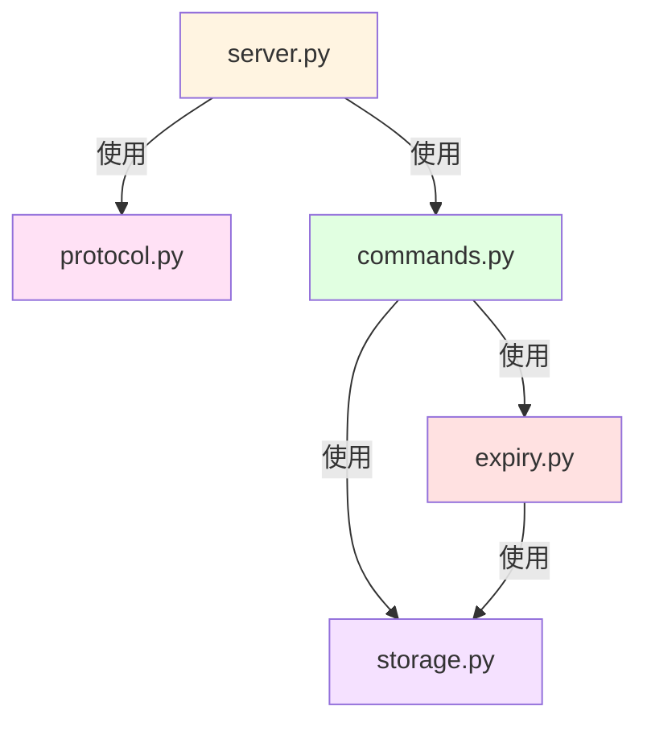
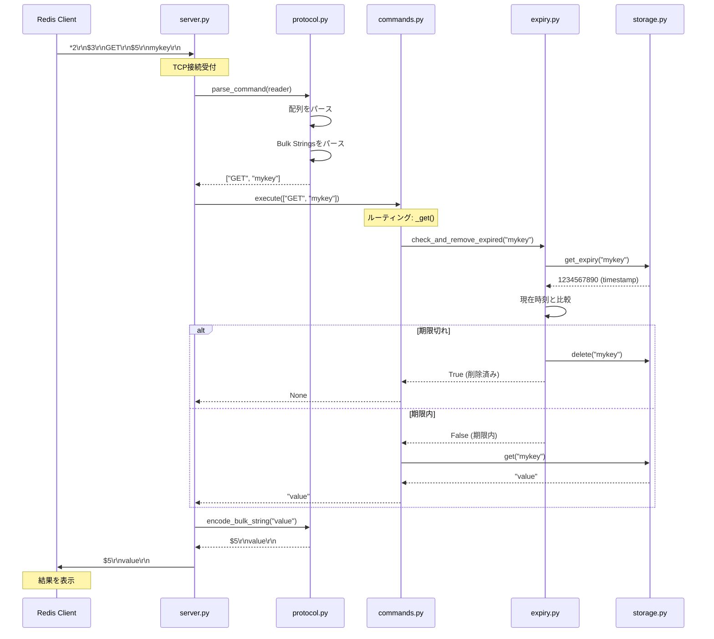
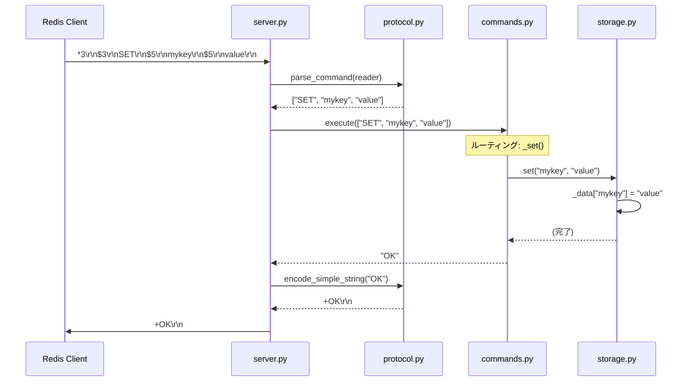
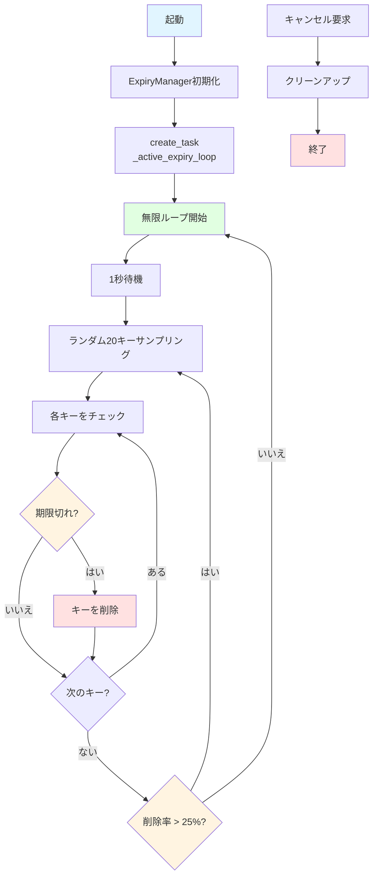

# Mini-Redisアーキテクチャ

## 概要

このドキュメントでは、Mini-Redisのシステムアーキテクチャ、レイヤー構造、モジュール間の依存関係、設計原則について詳しく解説します。

Mini-Redisは、レイヤー分離アーキテクチャを採用し、各レイヤーが明確な責務を持つことで、テスタビリティとメンテナンス性を向上させています。

## システム全体像

以下の図は、Mini-Redisのシステム全体像を示しています：



### 主要コンポーネント

| コンポーネント | ファイル | 責務 |
|--------------|---------|------|
| **Redis Client** | - | RESPプロトコルでコマンドを送信 |
| **Network Layer** | `server.py` | TCP接続管理、クライアント処理ループ |
| **Protocol Layer** | `protocol.py` | RESPメッセージのパース・エンコード |
| **Command Layer** | `commands.py` | コマンドルーティング、ビジネスロジック |
| **Storage Layer** | `storage.py` | キー・バリュー操作、データ保存 |
| **Expiry Manager** | `expiry.py` | 有効期限管理（Passive + Active Expiry） |

## レイヤー構造と責務

Mini-Redisは、5つのレイヤーで構成されています：



### 各レイヤーの詳細

#### 1. Network Layer（`server.py`）

責務:
Network Layerは、TCPサーバの起動と管理、クライアント接続の受付、クライアントごとの処理ループ、エラーハンドリング、そしてGraceful shutdownを担当します。

主要な関数・クラス:

```python
class MiniRedisServer:
    async def start(self, host: str, port: int) -> None:
        """サーバを起動"""

    async def handle_client(
        self, reader: StreamReader, writer: StreamWriter
    ) -> None:
        """クライアント接続を処理"""
```

依存関係:
Protocol Layerに対してコマンドのパース・応答のエンコードを、Command Layerに対してコマンドの実行を依存しています。

責務外:
RESPプロトコルの詳細はProtocol Layerに委譲し、コマンドのビジネスロジックはCommand Layerに委譲しています。

#### 2. Protocol Layer（`protocol.py`）

責務:
Protocol Layerは、RESPメッセージのパース、RESPメッセージのエンコード、そしてプロトコルエラーの検出を担当します。

主要な関数・クラス:

```python
class RESPParser:
    async def parse_command(self, reader: StreamReader) -> list[str]:
        """コマンド配列をパースする"""

def encode_simple_string(value: str) -> bytes:
    """Simple Stringをエンコード"""

def encode_bulk_string(value: str | None) -> bytes:
    """Bulk Stringをエンコード"""

def encode_integer(value: int) -> bytes:
    """Integerをエンコード"""

def encode_error(message: str) -> bytes:
    """エラーをエンコード"""
```

**依存関係**:
- **なし**（完全に独立）

**責務外**:
- コマンドの実行（Command Layerに委譲）
- データの保存（Storage Layerに委譲）

**設計の意図**:
- Protocol Layerを完全に独立させることで、異なる通信プロトコル（HTTP、gRPCなど）への対応が容易

#### 3. Command Layer（`commands.py`）

**責務**:
- コマンド名によるルーティング
- 引数の検証
- ビジネスロジックの実行
- 応答の生成

**主要な関数・クラス**:

```python
class Commands:
    async def execute(self, command: list[str]) -> str | int | None:
        """コマンドを実行"""

    async def _ping(self, args: list[str]) -> str:
        """PINGコマンドを実行"""

    async def _get(self, args: list[str]) -> str | None:
        """GETコマンドを実行"""

    async def _set(self, args: list[str]) -> str:
        """SETコマンドを実行"""

    async def _incr(self, args: list[str]) -> int:
        """INCRコマンドを実行"""

    async def _expire(self, args: list[str]) -> int:
        """EXPIREコマンドを実行"""

    async def _ttl(self, args: list[str]) -> int:
        """TTLコマンドを実行"""
```

**依存関係**:
- Storage Layer: データの読み書き
- Expiry Manager: 有効期限のチェックと設定

**責務外**:
- データの実際の保存方法（Storage Layerに委譲）
- 有効期限の詳細な管理（Expiry Managerに委譲）

**設計の意図**:
- コマンドごとに独立したメソッドを持つことで、新しいコマンドの追加が容易

#### 4. Storage Layer（`storage.py`）

**責務**:
- キー・バリューの保存
- キーの取得
- キーの削除
- 有効期限の保存・取得

**主要な関数・クラス**:

```python
class Storage:
    def get(self, key: str) -> str | None:
        """キーの値を取得"""

    def set(self, key: str, value: str) -> None:
        """キーに値を設定"""

    def delete(self, key: str) -> bool:
        """キーを削除"""

    def get_expiry(self, key: str) -> int | None:
        """キーの有効期限を取得"""

    def set_expiry(self, key: str, expiry_time: int) -> None:
        """キーに有効期限を設定"""

    def get_keys_with_expiry(self) -> list[str]:
        """有効期限が設定されたキー一覧を取得"""
```

**依存関係**:
- **なし**（完全に独立）

**責務外**:
- 有効期限のチェックと削除（Expiry Managerに委譲）
- コマンドのルーティング（Command Layerに委譲）

**設計の意図**:
- Storage Layerを独立させることで、将来的にデータ永続化（RDB/AOF）への拡張が容易

#### 5. Expiry Manager（`expiry.py`）

**責務**:
- Passive Expiry（アクセス時の期限チェック）
- Active Expiry（バックグラウンドでのサンプリング削除）
- 有効期限の設定と取得
- TTL計算

**主要な関数・クラス**:

```python
class ExpiryManager:
    def check_and_remove_expired(self, key: str) -> bool:
        """期限切れキーをチェックし削除"""

    def set_expiry(self, key: str, seconds: int) -> None:
        """有効期限を設定"""

    def get_ttl(self, key: str) -> int | None:
        """残り有効期限を取得"""

    def start_active_expiry(self) -> None:
        """Active Expiryを開始"""

    def stop_active_expiry(self) -> None:
        """Active Expiryを停止"""

    async def _active_expiry_loop(self) -> None:
        """Active Expiryのメインループ"""
```

**依存関係**:
- Storage Layer: キーの削除、有効期限の取得

**責務外**:
- データの実際の保存（Storage Layerに委譲）

**設計の意図**:
- 有効期限管理を独立させることで、アルゴリズムの変更や最適化が容易

## モジュール間の依存関係

### 依存関係図



### 依存関係のルール

Mini-Redisでは、以下の依存関係ルールを厳守しています：

| ルール | 説明 | 例 |
|--------|------|-----|
| **一方向依存** | 上位層は下位層に依存できるが、逆は不可 | ✅ Commands → Storage<br/>❌ Storage → Commands |
| **同層内最小化** | 同じレイヤー内での依存は最小限に | Protocol と Commands は独立 |
| **循環依存禁止** | A → B → A のような循環は禁止 | ❌ Commands → Storage → Commands |

**なぜこのルールが重要か**:
- テスト容易性: 各レイヤーを独立してテスト可能
- 再利用性: 下位層を他のプロジェクトで再利用可能
- 変更容易性: 1つのレイヤーの変更が他に影響しない

### Dependency Injection

Mini-Redisでは、依存関係をコンストラクタで注入します：

```python
# ❌ 悪い例: 内部でインスタンス化（テストが困難）
class Commands:
    def __init__(self):
        self._storage = Storage()  # ハードコーディング

# ✅ 良い例: 依存関係を注入（テストが容易）
class Commands:
    def __init__(self, storage: Storage, expiry: ExpiryManager):
        self._storage = storage
        self._expiry = expiry

# テスト時にモックを注入可能
mock_storage = MockStorage()
commands = Commands(mock_storage, mock_expiry)
```

## データフロー

### GETコマンドのシーケンス図

以下は、`GET mykey`コマンドを実行した際のデータフローです：



### SETコマンドのシーケンス図



### Active Expiryのフロー



## 設計原則

Mini-Redisは、以下の設計原則に基づいて実装されています：

### 1. レイヤー分離（Separation of Concerns）

**原則**:
各レイヤーは明確な責務を持ち、他のレイヤーの実装詳細を知らない。

**利点**:
- **テスト容易性**: 各レイヤーを独立してテスト
- **変更容易性**: 1つのレイヤーの変更が他に影響しない
- **理解容易性**: 各レイヤーの役割が明確

**実装例**:

```python
# Protocol Layerは、Storageの実装を知らない
class RESPParser:
    async def parse_command(self, reader: StreamReader) -> list[str]:
        # RESPパースのみに専念
        pass

# Command LayerはRESPの詳細を知らない
class Commands:
    async def execute(self, command: list[str]) -> str | int | None:
        # コマンド実行のみに専念
        pass
```

### 2. 単一責任の原則（Single Responsibility Principle）

**原則**:
各クラス・関数は1つの責務のみを持つ。

**実装例**:

```python
# ✅ 良い例: 1つの責務
def encode_simple_string(value: str) -> bytes:
    """Simple Stringをエンコードする"""
    return f"+{value}\r\n".encode('utf-8')

# ❌ 悪い例: 複数の責務（エンコード + 送信）
def encode_and_send_string(value: str, writer: StreamWriter) -> None:
    """エンコードして送信する"""
    data = f"+{value}\r\n".encode('utf-8')
    writer.write(data)  # 送信処理が混在
```

### 3. テスタビリティ（Testability）

**原則**:
各コンポーネントは独立してテスト可能。

**実装例**:

```python
# Protocol Layerは、ネットワークなしでテスト可能
parser = RESPParser()
mock_reader = MockStreamReader(b'*2\r\n$3\r\nGET\r\n$5\r\nmykey\r\n')
result = await parser.parse_command(mock_reader)
assert result == ["GET", "mykey"]

# Storage Layerは、完全に独立してテスト可能
storage = Storage()
storage.set("key", "value")
assert storage.get("key") == "value"
```

### 4. 明示的なエラーハンドリング

**原則**:
エラーは適切な層で捕捉し、適切なレスポンスを返す。

**実装例**:

```python
try:
    result = await self._commands.execute(command)
    response = encode_response(result)
except CommandError as e:
    # ビジネスロジックエラー
    response = encode_error(str(e))
except RESPProtocolError as e:
    # プロトコルエラー
    response = encode_error("ERR protocol error")
except Exception as e:
    # 予期しないエラー
    logger.exception("Unexpected error")
    response = encode_error("ERR internal server error")
```

### 5. Don't Repeat Yourself (DRY)

**原則**:
同じロジックを複数箇所に書かず、共通化する。

**実装例**:

```python
# ✅ 良い例: 共通化
def validate_single_arg(cmd_name: str, args: list[str]) -> None:
    """単一引数の検証（共通関数）"""
    if len(args) != 1:
        raise CommandError(
            f"ERR wrong number of arguments for '{cmd_name}' command"
        )

async def _get(self, args: list[str]) -> str | None:
    validate_single_arg("get", args)
    # ...

async def _ttl(self, args: list[str]) -> int:
    validate_single_arg("ttl", args)
    # ...
```

## 発展課題のための設計方針

### データ永続化（RDB/AOF）

**設計方針**:
Storage Layerに永続化レイヤーを追加。

**ディレクトリ構成**:

```
mini_redis/
├── persistence/
│   ├── __init__.py
│   ├── rdb.py          # RDB形式
│   └── aof.py          # AOF形式
```

**実装アプローチ**:

```python
class RDBPersistence:
    def save(self, storage: Storage, filename: str) -> None:
        """スナップショットを保存"""
        data = {
            'keys': storage._data,
            'expiry': storage._expiry
        }
        # pickleまたはカスタム形式で保存

    def load(self, storage: Storage, filename: str) -> None:
        """スナップショットを読み込み"""
        # ファイルから読み込み、Storageに復元
```

**レイヤー構造**:

```
Command Layer
    ↓
Storage Layer
    ↓
Persistence Layer  ← 新規追加
    ↓
ファイルシステム
```

### Pub/Sub機能

**設計方針**:
Command Layerにチャンネル管理機能を追加。

**データ構造**:

```python
class PubSub:
    def __init__(self):
        # チャンネル → サブスクライバー（StreamWriter）のマップ
        self._channels: dict[str, set[StreamWriter]] = {}

    async def subscribe(
        self, channel: str, writer: StreamWriter
    ) -> None:
        """チャンネルを購読"""
        if channel not in self._channels:
            self._channels[channel] = set()
        self._channels[channel].add(writer)

    async def publish(self, channel: str, message: str) -> int:
        """メッセージを配信"""
        if channel not in self._channels:
            return 0

        count = 0
        for writer in self._channels[channel]:
            # 各サブスクライバーにメッセージを送信
            response = encode_array(["message", channel, message])
            writer.write(response)
            await writer.drain()
            count += 1

        return count
```

### トランザクション（MULTI/EXEC）

**設計方針**:
Command Layerにトランザクション状態を管理。

**実装アプローチ**:

```python
class Commands:
    def __init__(self, storage: Storage, expiry: ExpiryManager):
        self._storage = storage
        self._expiry = expiry
        self._transaction_queue: list[list[str]] | None = None

    async def _multi(self, args: list[str]) -> str:
        """トランザクション開始"""
        self._transaction_queue = []
        return "OK"

    async def _exec(self, args: list[str]) -> list[Any]:
        """トランザクション実行"""
        if self._transaction_queue is None:
            raise CommandError("ERR EXEC without MULTI")

        results = []
        for cmd in self._transaction_queue:
            result = await self.execute(cmd)
            results.append(result)

        self._transaction_queue = None
        return results

    async def execute(self, command: list[str]) -> Any:
        """コマンドを実行"""
        if self._transaction_queue is not None:
            # トランザクション中はキューに追加
            self._transaction_queue.append(command)
            return "QUEUED"

        # 通常のコマンド実行
        # ...
```

## まとめ

Mini-Redisのアーキテクチャは、レイヤー分離（各レイヤーが明確な責務を持つ）、一方向依存（上位層は下位層に依存、逆依存なし）、テスタビリティ（各コンポーネントを独立してテスト可能）、拡張性（新機能の追加が容易）、そして保守性（変更の影響範囲が限定的）という特徴を持ちます。

このアーキテクチャにより、Mini-Redisは学習教材として理解しやすく、実際のプロダクション環境でも通用する設計原則を学べます。

## 参考資料

- [Clean Architecture](https://blog.cleancoder.com/uncle-bob/2012/08/13/the-clean-architecture.html): Robert C. Martinによるクリーンアーキテクチャ
- [Hexagonal Architecture](https://alistair.cockburn.us/hexagonal-architecture/): ポート&アダプターパターン
- [SOLID Principles](https://en.wikipedia.org/wiki/SOLID): オブジェクト指向設計の原則
- [Redis Architecture](https://redis.io/docs/reference/internals/): 本家Redisのアーキテクチャ

## 次のステップ

アーキテクチャを理解したら、以下のステップに進みましょう：

1. [ワークショップガイド](../WORKSHOP_GUIDE.md)で実装を開始
2. [講義資料](lectures/)で各段階の詳細を学習
3. テストを実行して実装の正確性を確認
4. 発展課題に挑戦してスキルを深める

Happy Coding! 🚀
