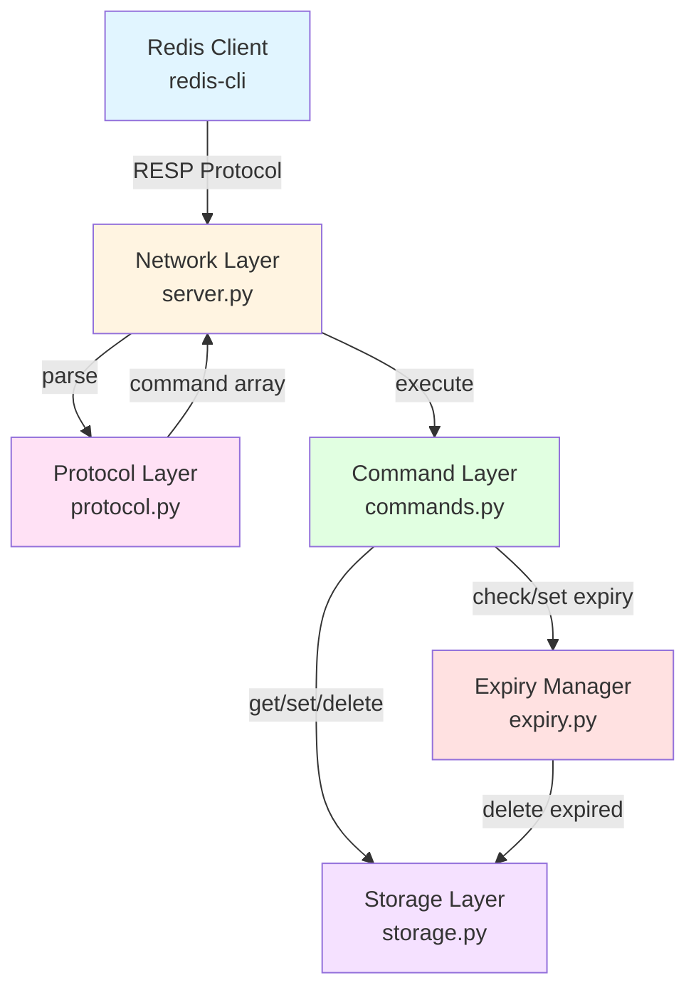
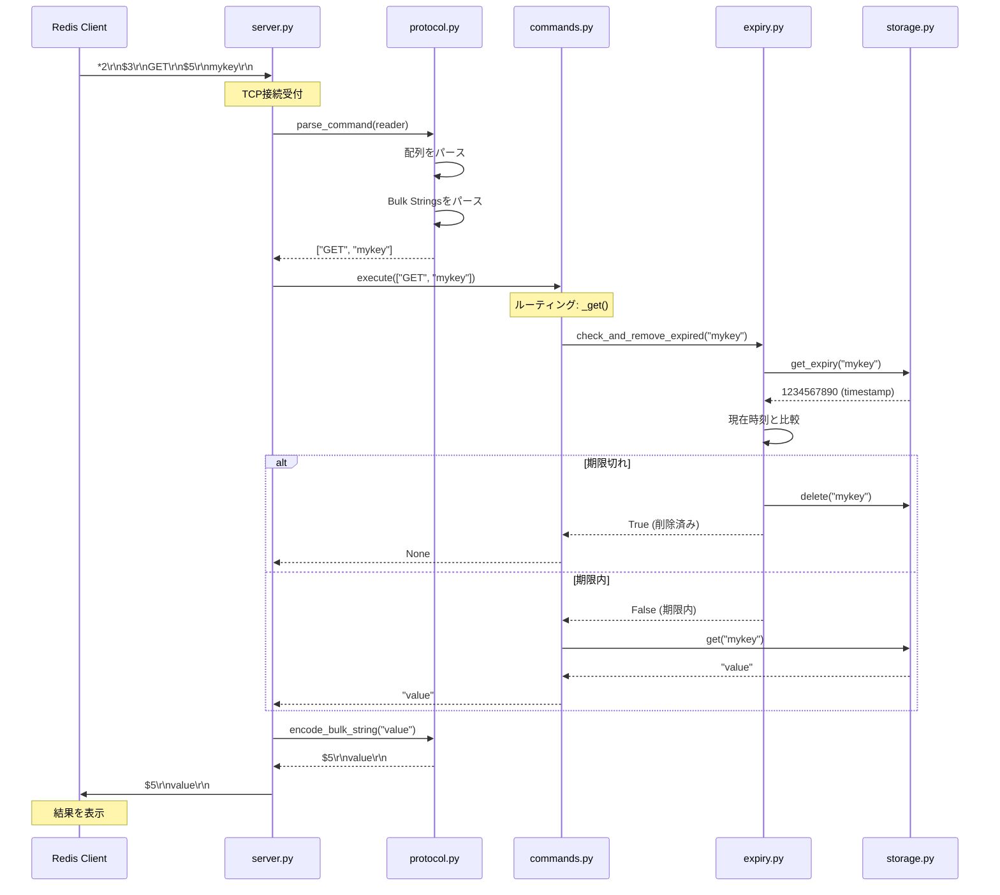
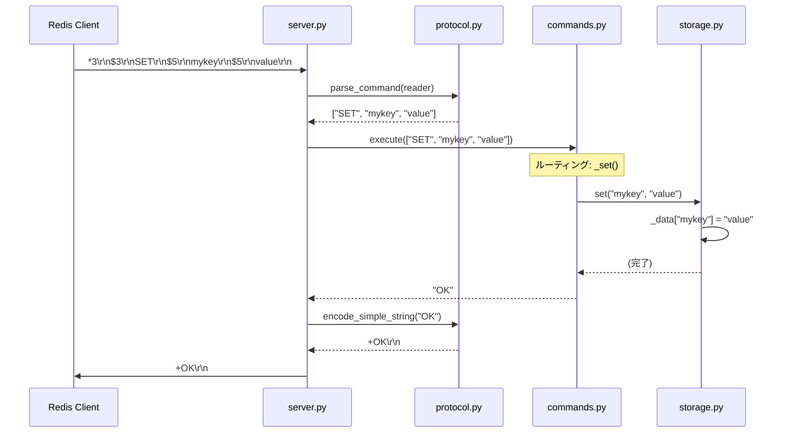
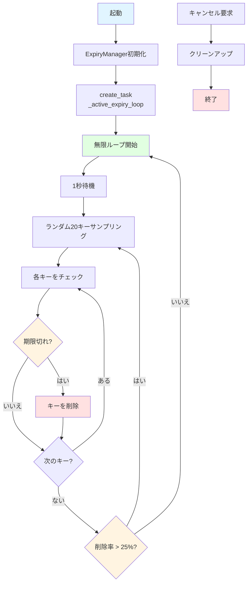

# Mini-Redisアーキテクチャ

## 概要

このドキュメントでは、Mini-Redisのシステムアーキテクチャ、レイヤー構造、モジュール間の依存関係、設計原則について詳しく解説します。

Mini-Redisは、レイヤー分離アーキテクチャを採用し、各レイヤーが明確な責務を持つことで、テスタビリティとメンテナンス性を向上させています。

## システム全体像

以下の図は、Mini-Redisのシステム全体像を示しています：

### 主要コンポーネント

| コンポーネント | ファイル | 責務 |
|--------------|---------|------|
| **Redis Client** | - | RESPプロトコルでコマンドを送信 |
| **Network Layer** | `server.py` | TCP接続管理、クライアント処理ループ |
| **Protocol Layer** | `protocol.py` | RESPメッセージのパース・エンコード |
| **Command Layer** | `commands.py` | コマンドルーティング、コマンド処理 |
| **Storage Layer** | `storage.py` | キー・バリュー操作、データ保存 |
| **Expiry Manager** | `expiry.py` | 有効期限管理（Passive + Active Expiry） |

## データフロー

### GETコマンドのシーケンス図

以下は、`GET mykey`コマンドを実行した際のデータフローです：

### SETコマンドのシーケンス図

### Active Expiryのフロー

