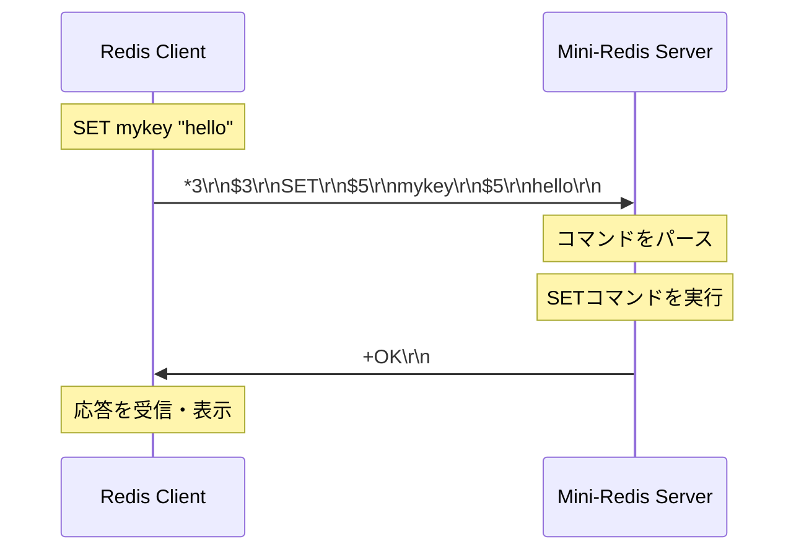

# 導入: RedisとMini-Redis

## 学習目標

このセクションでは、以下の内容を学びます：

- Redisとキー・バリューストアの基本概念
- Mini-Redisプロジェクトの目的と完成イメージ
- RESPプロトコルの基本構造
- クライアント・サーバ間の通信フロー

**所要時間**: 約5分

## 前提知識

- Pythonの基本構文
- コマンドラインの基本操作
- クライアント・サーバモデルの概念

## Redisとは

**Redis**（REmote DIctionary Server）は、オープンソースのインメモリ型キー・バリューストアです。

### キー・バリューストアの基本

キー・バリューストアは、データを「キー」と「値」のペアで保存するシンプルなデータ構造です：

```
キー           値
"user:1000"  → "John Doe"
"counter"    → "42"
"session:a"  → "active"
```

### Redisの特徴

1. **インメモリストレージ**: データをメモリ上に保存し、高速なアクセスを実現
2. **豊富なデータ構造**: String、List、Hash、Set、Sorted Setなど
3. **有効期限設定**: キーに自動削除の期限を設定可能
4. **永続化オプション**: RDB/AOFによるディスク保存（オプション）

### 主なユースケース

- **キャッシュ**: データベースクエリ結果のキャッシュ
- **セッション管理**: ユーザーセッションの保存
- **リアルタイムデータ**: ランキング、カウンター、リーダーボード
- **メッセージキュー**: Pub/Sub機能による非同期処理

## Mini-Redisプロジェクトの概要

**Mini-Redis**は、Redisの基本機能をPython/asyncioで実装する学習プロジェクトです。

### プロジェクトの目的

- asyncioによる非同期プログラミングの実践
- ネットワークプロトコル（RESP）の実装
- レイヤー分離設計の理解
- テストドリブン開発の体験

### 実装する機能

| 機能 | 説明 |
|------|------|
| **RESPプロトコル** | Redisの通信フォーマットのパース・エンコード |
| **TCPサーバ** | asyncioを使った並行処理可能なサーバ |
| **基本コマンド** | PING, GET, SET, INCR, EXPIRE, TTL |
| **有効期限管理** | Passive ExpiryとActive Expiryの2段階管理 |

### 完成版のデモ

完成版のMini-Redisを起動して、動作を確認してみましょう：

```bash
# ターミナル1: 完成版サーバを起動
python -m solutions.mini_redis
```

別のターミナルで`redis-cli`を使って接続します：

```bash
# ターミナル2: redis-cliで接続
redis-cli -p 16379
```

以下のコマンドを試してみましょう：

```bash
# 接続確認
> PING
PONG

# キーに値を設定
> SET mykey "Hello, Redis!"
OK

# キーから値を取得
> GET mykey
"Hello, Redis!"

# カウンターをインクリメント
> SET counter "10"
OK
> INCR counter
(integer) 11
> INCR counter
(integer) 12

# 有効期限を設定（60秒後に自動削除）
> EXPIRE counter 60
(integer) 1

# 残り時間を確認
> TTL counter
(integer) 59
```

このワークショップでは、これらのコマンドがどのように動作するかを理解しながら、実装していきます。

## RESPプロトコルの基礎

**RESP**（REdis Serialization Protocol）は、Redisクライアントとサーバ間の通信に使用される、シンプルなテキストベースのプロトコルです。

### なぜRESPなのか

- **シンプル**: 人間が読みやすいテキストフォーマット
- **高速**: パースが容易で、実装がシンプル
- **バイナリセーフ**: バイナリデータも安全に扱える
- **言語非依存**: あらゆる言語で実装可能

### RESPの基本データ型

RESPには5つの基本データ型があります：

| データ型 | 先頭文字 | 例 | 説明 |
|---------|---------|-----|------|
| **Simple Strings** | `+` | `+OK\r\n` | 単純な文字列応答 |
| **Integers** | `:` | `:42\r\n` | 整数値 |
| **Bulk Strings** | `$` | `$5\r\nhello\r\n` | 長さ指定付き文字列 |
| **Arrays** | `*` | `*2\r\n$4\r\nPING\r\n` | 複数要素の配列 |
| **Errors** | `-` | `-ERR message\r\n` | エラーメッセージ |

**重要**: すべてのメッセージは`\r\n`（CRLF: Carriage Return + Line Feed）で終端します。

### RESP Arraysの構造

クライアントからサーバへのコマンドは、**Arrays形式**で送信されます。

例: `PING`コマンド

```
*1\r\n      ← 配列の要素数（1つ）
$4\r\n      ← 1番目の要素の長さ（4バイト）
PING\r\n    ← 実際のデータ
```

例: `GET mykey`コマンド

```
*2\r\n      ← 配列の要素数（2つ）
$3\r\n      ← 1番目の要素の長さ（3バイト）
GET\r\n     ← 実際のデータ
$5\r\n      ← 2番目の要素の長さ（5バイト）
mykey\r\n   ← 実際のデータ
```

### RESP Bulk Stringsの構造

サーバからクライアントへの文字列応答は、**Bulk Strings形式**で送信されます。

例: `"hello"`という文字列

```
$5\r\n      ← データの長さ（5バイト）
hello\r\n   ← 実際のデータ
```

**Null値**（キーが存在しない場合）:

```
$-1\r\n     ← 長さ-1はNullを示す
```

### バイナリセーフとは

**バイナリセーフ**とは、改行文字やNull文字を含む任意のバイトデータを安全に扱えることを意味します。

従来のテキストプロトコル（改行区切り）の問題：

```
"Hello\nWorld"  # 改行が含まれるとパースできない
```

RESPの解決策（長さ指定）:

```
$11\r\n         ← 長さを事前に指定
Hello\nWorld\r\n  # 改行を含んでも正確に読み取れる
```

### クライアント・サーバ間のメッセージフロー

以下の図は、`SET mykey "hello"`コマンドを実行した際のメッセージフローです：



**ポイント**:
1. クライアントはコマンドを**Arrays形式**で送信
2. サーバはコマンドをパースして実行
3. サーバは結果を適切な形式（Simple String、Integer、Bulk String等）で返信

### RESPメッセージの視覚化

`GET mykey`コマンドとその応答を視覚化すると：

```
クライアント → サーバ（リクエスト）:
┌─────────────────────┐
│ *2\r\n              │ ← 配列（2要素）
│ $3\r\n              │ ← 1番目: 長さ3
│ GET\r\n             │ ← データ: "GET"
│ $5\r\n              │ ← 2番目: 長さ5
│ mykey\r\n           │ ← データ: "mykey"
└─────────────────────┘

サーバ → クライアント（応答）:
┌─────────────────────┐
│ $5\r\n              │ ← Bulk String（長さ5）
│ hello\r\n           │ ← データ: "hello"
└─────────────────────┘
```

## よくある誤解

### バイト長 vs 文字数

**注意**: RESPの長さ指定は**バイト長**です。

```python
# ❌ 間違い: 文字数を使用
"こんにちは"  # 5文字
$5\r\nこんにちは\r\n  # エラー！

# ✅ 正しい: バイト長を使用
"こんにちは".encode('utf-8')  # 15バイト
$15\r\nこんにちは\r\n  # 正しい
```

### CRLF削除の重要性

**注意**: パース時に`\r\n`を削除し忘れると、データに余計な文字が含まれます。

```python
# ❌ 間違い: CRLFを削除していない
line = b'$4\r\n'
length = int(line[1:])  # int(b'4\r\n') → ValueError

# ✅ 正しい: CRLFを削除
line = b'$4\r\n'
length = int(line[1:-2])  # int(b'4') → 4
```

## 次のステップ

導入セクションでは、Redisの基本概念とRESPプロトコルの構造を学びました。

次のセクションでは、以下の内容を実装していきます：

1. **TCPサーバの構築** ([01-tcp-server.md](01-tcp-server.md)): asyncioを使った非同期TCPサーバ
2. **プロトコルのパース** ([02-protocol-parsing.md](02-protocol-parsing.md)): RESPメッセージの解析とエンコード
3. **コマンドの実装** ([03-commands.md](03-commands.md)): PING, GET, SET, INCR, EXPIRE, TTL
4. **有効期限管理** ([04-expiry.md](04-expiry.md)): Passive/Active Expiryの実装

実装を始める前に、[アーキテクチャドキュメント](../architecture.md)で全体像を確認することをおすすめします。

## 参考資料

- [Redis公式サイト](https://redis.io/): Redisの概要とドキュメント
- [RESP仕様](https://redis.io/docs/reference/protocol-spec/): RESPプロトコルの詳細仕様
- [Redis Universityの無料コース](https://university.redis.com/): Redisの学習リソース
- [Python asyncio公式ドキュメント](https://docs.python.org/3/library/asyncio.html): asyncioの公式ガイド

## まとめ

- Redisはインメモリ型のキー・バリューストアで、高速なデータアクセスを実現
- Mini-RedisはRedisの基本機能を実装する学習プロジェクト
- RESPはシンプルで実装が容易なテキストベースのプロトコル
- RESPの主要データ型: Simple Strings, Integers, Bulk Strings, Arrays, Errors
- すべてのRESPメッセージは`\r\n`（CRLF）で終端
- Bulk Stringsは長さ指定により、バイナリセーフな通信を実現

それでは、実装を始めましょう！
