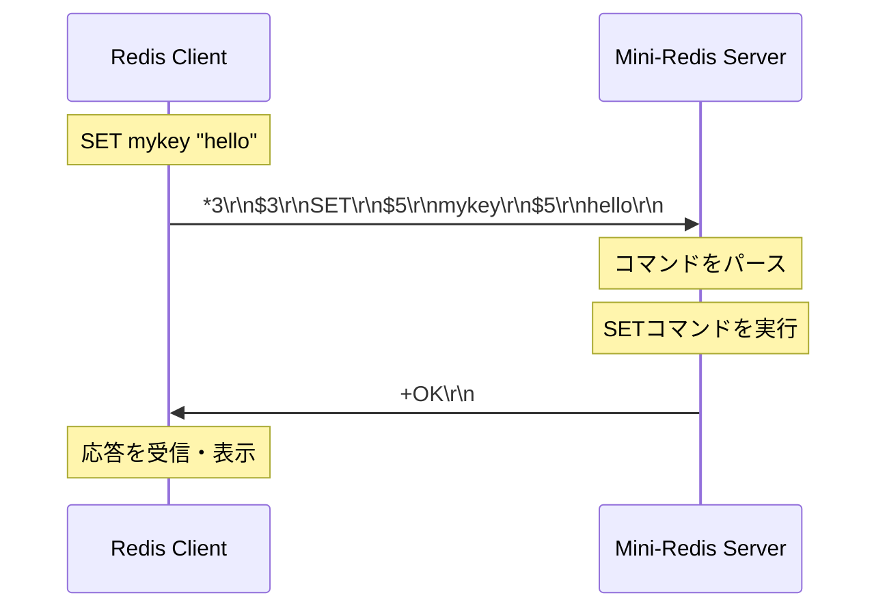

# 導入: RedisとMini-Redis

## 学習目標

このセクションでは、Redisとキー・バリューストアの基本概念、Mini-Redisプロジェクトの目的と完成イメージ、RESPプロトコルの基本構造、そしてクライアント・サーバ間の通信フローについて学びます。

## 前提知識

Pythonの基本構文やコマンドラインの基本操作を理解していることを前提としています。とはいえ、複雑な構文や操作は必要なく、[チュートリアル](https://docs.python.org/3.12/tutorial/index.html)で扱われるような最低限の文法が理解できており、ファイルの移動や編集といった基本的なコマンドがわかっていれば問題ありません。

## Redisとは

Redis（REmote DIctionary Server）は、source-availableなインメモリデータベースです。いわゆるNoSQLに分類されます。キーバリューストア（Key Value Store: KVS）の代表格と言って良いでしょう（[参考](https://www.ipride.co.jp/blog/11950)）。

!!! note
    キーバリューストアは、データを「キー」と「値」のペアで保存するシンプルなデータ構造です：

    ```
    キー           値
    "user:1000"  → "John Doe"
    "counter"    → "42"
    "session:a"  → "active"
    ```


!!! info
    Redisはオープンソースのキーバリューストアと説明されることがありますが、厳密にはこれは不正確です。
    1. 2024年、RedisはBSD 3条項ライセンスから、RSALv2（Redis Source Available License）もしくはSSPLv1（Server Side Public License）のいずれかを選択するデュアルライセンスに移行しました。そのため、OSIが定義する「オープンソースソフトウェア」ではなくなりました（[参考](https://gihyo.jp/article/2024/03/redis-dual-licensing)）。ライセンス変更前のRedisをフォークした[Valkey](https://valkey.io/)というプロジェクトでは、BSDライセンスのもとで開発が続けられています。
    2. キーバリューストアとして利用できることは間違いありませんが、それだけではなくHash, List, Sorted Listなどさまざまなデータ構造を扱うことができます。


### Redisの特徴

Redisはインメモリストレージとして、データをメモリ上に保存することで高速なアクセスを実現しています。StringやList、Hash、Set、Sorted Setなど豊富なデータ構造をサポートしており、用途に応じて最適なデータ型を選択できます。キーに有効期限を設定することで、不要になったデータを自動的に削除することもできます。その他、RDBやAOFによるデータの永続化やPub/Subによるメッセージングなど、さまざまな機能を有しています。


<div style="text-align: right; font-size: 12px">
<a href="https://x.com/sahnlam/status/1718864218597019747/photo/1">引用元: https://x.com/sahnlam/status/1718864218597019747/photo/1</a>
</div>


### 主なユースケース

Redisは、データベースクエリ結果のキャッシュや、ユーザーセッションの保存といった用途で広く使われています。また、ランキングやカウンター、リーダーボードなどのリアルタイムデータの管理においても選択肢となりうるでしょう。今回のワークショップでは扱いませんが、Pub/Sub機能を使った非同期処理のメッセージキューとしても活用できます。


## 本ワークショップ（Mini-Redis）の概要

### 目的

このワークショップでは、asyncioによる非同期プログラミングの実践を通じて、ネットワークプロトコル（RESP）の実装方法を学びます。Redisは聞いたことや使ったことがあるけれど、詳細はあまり知らないという方はぜひ、この機会に中身を学習しましょう。

### 実装する機能

| 機能 | 説明 |
|------|------|
| RESPプロトコル | Redisの通信フォーマットのパース・エンコード |
| TCPサーバ | asyncioを使った並行処理可能なサーバ |
| 基本コマンド | PING, GET, SET, INCR |
| （発展）有効期限管理 | EXPIRE, TTL, Passive ExpiryとActive Expiryの2段階管理 |

## RESPプロトコルの基礎

RESP（REdis Serialization Protocol）は、Redisクライアントとサーバ間の通信に使用される、シンプルなテキストベースのプロトコルです。

RESPは、人間が読みやすい非常にシンプルなフォーマットになっています。パースが容易でシンプルに実装できるため、高速な処理が可能です。また、Redisの文字列型はどんな種類のデータも保持できるバイナリセーフな設計となっており、画像なども保持することができます。


!!! info
    バイナリセーフとは、改行文字やNull文字を含む任意のバイトデータを安全に扱えることを意味します。文字列は特殊な終了文字によって決定されるのではなく、あらかじめ長さを指定することで決定されます。

    例えば、改行で区切るようなテキストプロトコルだと、以下の場合にパースできません：

    ```
    "Hello\nWorld"  # 改行が含まれるとパースできない
    ```

    RESPでは長さを指定することでこの問題を解決しています:

    ```
    $11\r\n         ← 長さを事前に指定
    Hello\nWorld\r\n  # 改行を含んでも正確に読み取れる
    ```


### RESPの基本データ型

RESPには5つの基本データ型があります：

| データ型 | 先頭文字 | 例 | 説明 |
|---------|---------|-----|------|
| Simple Strings | `+` | `+OK\r\n` | 単純な文字列応答 |
| Integers | `:` | `:42\r\n` | 整数値 |
| Bulk Strings | `$` | `$5\r\nhello\r\n` | 長さ指定付き文字列 |
| Arrays | `*` | `*2\r\n$4\r\nPING\r\n` | 複数要素の配列 |
| Errors | `-` | `-ERR message\r\n` | エラーメッセージ |

すべてのメッセージは`\r\n`（CRLF）で終端します。

### RESP Arraysの構造

クライアントからサーバへのコマンドは、Arrays形式で送信されます。（以下に例を示しますが、わかりやすさのために\r\nの後に改行を入れています）

例: `PING`コマンド

```
*1\r\n      ← 配列の要素数（1つ）
$4\r\n      ← 1番目の要素の長さ（4バイト）
PING\r\n    ← 実際のデータ
```

例: `GET mykey`コマンド

```
*2\r\n      ← 配列の要素数（2つ）
$3\r\n      ← 1番目の要素の長さ（3バイト）
GET\r\n     ← 実際のデータ
$5\r\n      ← 2番目の要素の長さ（5バイト）
mykey\r\n   ← 実際のデータ
```

### RESP Bulk Stringsの構造

サーバからクライアントへの文字列応答は、Bulk Strings形式で送信されます。

例: `"hello"`という文字列

```
$5\r\n      ← データの長さ（5バイト）
hello\r\n   ← 実際のデータ
```

Null値（キーが存在しない場合）:

```
$-1\r\n     ← 長さ-1はNullを示す
```


### クライアント・サーバ間のメッセージフロー

以下の図は、`SET mykey "hello"`コマンドを実行した際のメッセージフローです：



クライアントはコマンドをArrays形式で送信し、サーバはそれをパースして実行します。サーバは結果を適切な形式（Simple String、Integer、Bulk String等）で返信します。

### RESPメッセージの視覚化

実際に手元でRedis/Redis CLIを動かしてメッセージを見てみましょう。
実際の`redis-server`と`redis-cli`の通信をそのまま覗きたい場合は、`socat`でプロキシを挟むとRESPメッセージを生の形で確認できます。`redis` が未インストールなら `brew install redis`、`socat`が未インストールなら`brew install socat`などで導入してください。

!!! note redis/redis-cli の準備
    - macOS: `brew install redis socat`（`redis-cli` がインストールされます）
    - Github Codespaces: `sudo apt update && sudo apt install -y redis-server redis-tools socat`

```bash
# ターミナル1: redis-serverを起動（）
redis-server --port 6379

# ターミナル2: socatで6379⇔6380間のプロキシを作る
# TCPで6380番ポートをlistenし、受信したデータを127.0.0.1:6379に送る
# ソケットは再利用可能で(reuseaddr)、接続ごとに新しいプロセスを生成する(fork)
socat -v tcp-listen:6380,reuseaddr,fork,bind=127.0.0.1 tcp:127.0.0.1:6379

# ターミナル3: プロキシ越しにredis-cliで接続
redis-cli -p 6380
```

`redis-cli -p 6380`でコマンドを実行すると、ターミナル2の`socat`出力に実際のRESPメッセージが表示されます。`< `がクライアント→サーバ、`> `がサーバ→クライアントの向きを表します。

```
> 2025/10/15 14:50:10.000078950  length=14 from=0 to=13
*1\r
$4\r
PING\r
< 2025/10/15 14:50:10.000081136  length=7 from=0 to=6
+PONG\r
```


## 実装の準備

ここからは、実際に手を動かしてMini-Redisを実装していきます。まずは環境をセットアップしましょう。

### 事前準備

- **uv のインストール**: 未導入の場合は `pipx install uv` などでセットアップし、`uv --version` で動作を確認してください。
- **`.python-version` に従う Python の取得と仮想環境の作成**: 本リポジトリでは `3.12.11` を指定しています。`uv python install "$(cat .python-version)"` → `uv sync --extra dev` を実行すると、`.venv` が自動生成され依存関係が同期されます。
- リポジトリには `uv.lock` が含まれているので、`uv sync` を用いればロックされたバージョンで環境を再現できます。

### セットアップ

README.mdのクイックスタートと重複があります。適宜読み飛ばしてください。

```bash
# リポジトリをクローン（既にクローン済みの場合はスキップ）
git clone https://github.com/hkws/mini-redis-py.git
cd mini-redis-py

# uv をまだ導入していない場合
pipx install uv

# プロジェクト用の Python ( .python-version に基づき 3.12.11 ) を取得し、依存を同期 (.venv が自動生成されます)
uv self update
uv python install "$(cat .python-version)"
uv sync --extra dev

# 作成された .venv を有効化
source .venv/bin/activate  # Windows の場合は .\.venv\Scripts\Activate.ps1

# バージョン確認（任意）
python --version

# テストが実行できることを確認（最初は全て失敗するのが正常）
pytest
```

最初はすべてのテストが `NotImplementedError` や `ConnectionRefusedError` で失敗します。これは正常です。実装を進めるにつれて、テストが通るようになります。

### 完成イメージを確認

実装を始める前に、完成版のMini-Redisを動かして、どんなものを作るのかイメージを掴みましょう。完成版は solutions/mini_redis に配置してあります。[アーキテクチャドキュメント](../architecture.md)も参考にしてください。

```bash
# ターミナル1: 完成版サーバを起動
python -m solutions.mini_redis
```

別のターミナルで`redis-cli`を使って接続します。

完成版サーバは、接続先ポートが `16379` であることに注意してください。これは、みなさんが実装するサーバとポート番号を重複させないためです。

```bash
# ターミナル2: redis-cliで接続
redis-cli -p 16379
```

以下のコマンドを試してみましょう：

```bash
# 接続確認
> PING
PONG

# キーに値を設定
> SET mykey "Hello, Redis!"
OK

# キーから値を取得
> GET mykey
Hello, Redis!

# カウンターをインクリメント
> SET counter "10"
OK
> INCR counter
(integer) 11
> INCR counter
(integer) 12

# 有効期限を設定（10秒後に自動削除）
> EXPIRE counter 10
(integer) 1

# 残り時間を確認
> TTL counter
(integer) 9

# ...10秒後
> GET counter
(nil)
```

このワークショップでは、これらのコマンドがどのように動作するかを理解しながら、実装していきます。

完成イメージが掴めたら、Ctrl+Cでサーバを停止し、次のセクションに進みましょう。

## 次のステップ

本セクションでは、Redisの基本概念とRESPプロトコルの構造を学び、開発環境をセットアップしました。

以降のセクションでは、以下の内容を実装していきます。

1. TCPサーバの構築 ([01-tcp-server.md](01-tcp-server.md)): asyncioを使った非同期TCPサーバ
2. プロトコルのパース ([02-protocol-parsing.md](02-protocol-parsing.md)): RESPメッセージの解析とエンコード
3. コマンドの実装 ([03-commands.md](03-commands.md)): PING, GET, SET, INCR
4. 有効期限管理 ([04-expiry.md](04-expiry.md)): EXPIRE, TTL, Passive/Active Expiryの実装

実装を始める前に、[アーキテクチャドキュメント](../architecture.md)で全体像を確認することをおすすめします。
