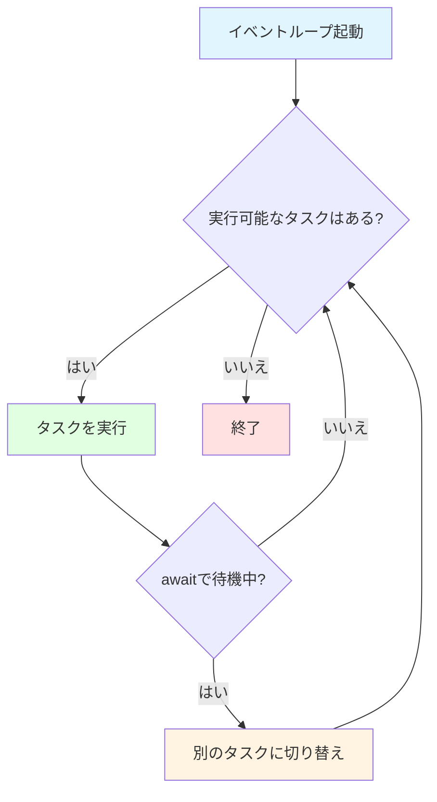

# TCPサーバとasyncio

## 学習目標

このセクションでは、asyncioの基本概念（イベントループ、コルーチン、async/await）について学び、asyncioを使ったTCPサーバの構築方法を習得します。StreamReader/StreamWriterを使ったデータの送受信、接続管理とクリーンアップについても学びます。

所要時間: 約15分（理論5分＋実装10分）

## 前提知識

Pythonの基本文法、関数と例外処理の理解、そして同期処理の概念（通常のPythonコード）を理解していることを前提としています。

## asyncioの基礎

### 同期処理 vs 非同期処理

同期処理（通常のPythonコード）では、Sequentialに処理が実行されます。各処理が完了するまで次に進みません。

```python
def fetch_user(user_id):
    time.sleep(1)  # データベース読み取り（1秒）
    return f"User {user_id}"

result1 = fetch_user(1)  # 1秒待つ
result2 = fetch_user(2)  # さらに1秒待つ
# 合計2秒かかる
```

非同期処理（asyncio）では、待ち時間中に他の処理を実行できます：

```python
async def fetch_user(user_id):
    await asyncio.sleep(1)  # 待つ間、他の処理を実行可能
    return f"User {user_id}"

# 2つのタスクを並行実行
results = await asyncio.gather(
    fetch_user(1),
    fetch_user(2)
)
# 合計1秒で完了（並行実行）
```

この例では「待ち時間」を asyncio.sleep を表現していますが、ネットワークを介したリクエストやファイルの読み取りなどの処理に相当するでしょう。これらのようなI/Oバウンド（特定の処理の完了に要する時間が、主に入出力操作の完了待ちにより決まる）な処理には、待ち時間を有効に使える非同期処理が適しています。

### asyncioの3つの主要概念

#### 1. イベントループ

イベントループは、非同期処理を管理・実行する、asyncioにおいて中心的な役割を担う存在です。非同期に実行すべきジョブをキューに持っています。キューから順にジョブを取り出し、関数のように制御を渡し、そのジョブがI/O待ち等で一時停止したり完了したりすると、イベントループに制御が戻ります。


イベントループの動作:



#### 2. コルーチン

Python公式の用語集では、コルーチンを以下のように説明しています。

> (コルーチン) コルーチンはサブルーチンのより一般的な形式です。 サブルーチンには決められた地点から入り、別の決められた地点から出ます。 コルーチンには多くの様々な地点から入る、出る、再開することができます。 コルーチンは async def 文で実装できます。 PEP 492 を参照してください。

ここで言及されている、 `コルーチンには多くの様々な地点から入る、出る、再開することができ` るという性質を活用しながら、イベントループが実行を管理することで非同期処理が実現されます。

実装においては、`async def` 文で定義される関数であるコルーチン関数を呼び出すと得られる、コルーチンオブジェクトをイベントループに登録することで非同期に処理を行います。言い換えると、**コルーチン関数（async def ...）を呼び出しただけでは、コルーチンは開始されません。**

```python
import types
async def hello():
    print("Hello")
    await asyncio.sleep(1)  # ここで一時中断
    print("World")

coro = hello() # 何もprintされない
isinstance(coro, types.CoroutineType) # -> True
```

コルーチンは、[asyncio.run()](https://docs.python.org/ja/3.13/library/asyncio-runner.html#asyncio.run)のようなコルーチンを実行する関数を使うか、`await`により実行されます。

```python
import asyncio
# <coroutine object>が返る（実行されない）
result = hello()

# 実際に実行される
async def main():
    result = await hello()

if __name__ == "__main__":
    asyncio.run(main())
    print("done!")
```

!!! note
    `asyncio.create_task()`も`asyncio.run()`や`await`と同様にコルーチンの実行をスケジュールしますが、`asyncio.create_task()`はイベントループに制御を移すことに注意してください。
    この性質により、直感と合わない実行順序となる可能性があります。
    ```python
    import asyncio

    async def coro_a():
        print("I am coro_a(). Hi!")
        await asyncio.sleep(1)
        print("complete coro_a")

    async def coro_b():
        print("I am coro_b().")
        await asyncio.sleep(1)
        print("complete coro_b")

    async def main():
        task_b = asyncio.create_task(coro_b())
        await coro_a()

    asyncio.run(main())
    # I am coro_a(). Hi!
    # I am coro_b(). <- coro_bを先にスケジュールしているが、coro_aが先に実行されている
    # complete coro_a
    # complete coro_b
    ```


!!! info
    Python内部でasyncioがどのように実装されているのか気になった方は、以下の発表を確認することをお勧めします。
    
    実装で知るasyncio -イベントループの正体とは- (PyCon JP 2021)
    https://2021.pycon.jp/time-table?id=272959


## asyncioによるTCPサーバの構築

asyncioでは、[start_server](https://docs.python.org/ja/3.12/library/asyncio-stream.html#asyncio.start_server)という関数により、簡単にサーバーを作成することができます。

```python
import asyncio

async def handle_client(reader, writer):
    """各クライアント接続を処理するハンドラ"""
    # ここでクライアントとの通信を処理
    pass

async def main():
    # TCPサーバを起動
    server = await asyncio.start_server(
        handle_client,  # クライアントハンドラ
        '127.0.0.1',    # バインドアドレス
        6379            # ポート番号
    )

    # サーバを起動
    async with server:
        await server.serve_forever()

# イベントループを起動
asyncio.run(main())
```

`asyncio.start_server()`は以下の処理を行います：

1. 新しいコネクションが確立するたびに実行されるコールバック（ここではクライアントハンドラが相当）を準備（[source](https://github.com/python/cpython/blob/6416e6ebe5b88087ada6f4a56972053edb9c2e01/Lib/asyncio/streams.py#L54)）
    - コールバックは StreamReader と StreamWriter クラスのインスタンスのペアを引数として受け取る（詳細は後述）
    - StreamReaderでクライアントから送信されるバイトデータを非同期に読み出し、StreamWriterは逆にクライアントに送られるバイトデータを書き出す
2. 指定されたアドレス・ポートでリッスンするTCPサーバーを立ち上げ（[source](https://github.com/python/cpython/blob/6416e6ebe5b88087ada6f4a56972053edb9c2e01/Lib/asyncio/base_events.py#L1516)）


## StreamReader/StreamWriterによるデータ送受信

### StreamReaderでデータを読む

[StreamReader](https://docs.python.org/ja/3/library/asyncio-stream.html#streamreader)は、非同期にバイトデータを読み取るためのクラスです。

主なメソッド：

| メソッド | 説明 | 用途 |
|---------|------|------|
| `readuntil(separator)` | 指定のセパレータまで読む | RESP行読み取り（`\r\n`まで） |
| `readexactly(n)` | 正確にnバイト読む | Bulk Stringのデータ部読み取り |
| `read(n)` | 最大nバイト読む | 一般的なデータ読み取り |

**使用例**:

```python
async def handle_client(reader, writer):
    # \r\nまで読む（RESP行の読み取り）
    line = await reader.readuntil(b'\r\n')
    print(f"Received: {line}")

    # 正確に10バイト読む
    data = await reader.readexactly(10)
    print(f"Data: {data}")
```

**エラーハンドリング**:

```python
import asyncio

try:
    line = await reader.readuntil(b'\r\n')
except asyncio.IncompleteReadError:
    # クライアントが接続を切断した
    print("Connection closed by client")
except asyncio.LimitOverrunError:
    # セパレータが見つからず、バッファが満杯
    print("Buffer overflow")
```

!!! info
    asyncioにおける例外については、以下の公式ドキュメントを参照してください。
    https://docs.python.org/ja/3.12/library/asyncio-exceptions.html

### StreamWriterでデータを送る

[StreamWriter](https://docs.python.org/ja/3/library/asyncio-stream.html#streamwriter)は、非同期にバイトデータを書き込むためのクラスです。

| メソッド | 説明 |
|---------|------|
| `write(data)` | 背後にあるソケットにデータを即座に書き込む。書き込みに失敗した場合、データは送信可能になるまで内部の書き込みバッファーに格納される |
| `await drain()` | ストリームへの書き込み再開に適切な状態になるまで待つ |
| `close()` | 接続を閉じる |
| `await wait_closed()` | 接続が完全に閉じるのを待つ |

**使用例**:

```python
async def handle_client(reader, writer):
    # 応答を送信
    response = b'+PONG\r\n'
    writer.write(response)     # バッファに書き込む
    await writer.drain()       # 実際に送信

    # 接続を閉じる
    writer.close()
    await writer.wait_closed()
```

`write()`は`drain()`と組み合わせて使うようにしてください。


## クライアント処理ループの実装

### 基本的なパターン

クライアントとの通信は、通常、以下のループで処理します

```python
async def handle_client(reader: StreamReader, writer: StreamWriter) -> None:
    """クライアント接続を処理する"""
    try:
        while True:
            # 1. クライアントからデータを受信
            line = await reader.readuntil(b'\r\n')

            # 2. データを解釈（コマンドのパース）
            command = parse_command(line)

            # 3. コマンドを実行
            result = execute_command(command)

            # 4. 応答を送信
            response = encode_response(result)
            writer.write(response)
            await writer.drain()

    except asyncio.IncompleteReadError:
        # クライアントが接続を切断
        print("Client disconnected")

    finally:
        # クリーンアップ
        writer.close()
        await writer.wait_closed()
```

## エラーハンドリング

### 想定すべきエラー

| エラー | 原因 | 対処 |
|-------|------|------|
| `IncompleteReadError` | クライアントが予期せず切断 | 接続をクリーンアップ |
| `LimitOverrunError` | バッファオーバーフロー | エラーを返してバッファをクリア |
| `ConnectionResetError` | クライアントが強制切断 | 静かに接続を閉じる |
| 一般的な`Exception` | コマンド実行エラー | エラーメッセージを返す |

### エラーハンドリングの実装例

```python
async def handle_client(reader: StreamReader, writer: StreamWriter) -> None:
    try:
        while True:
            try:
                # データ読み取り
                line = await reader.readuntil(b'\r\n')

                # コマンド実行
                response = await process_command(line)

                # 応答送信
                writer.write(response)
                await writer.drain()

            except asyncio.IncompleteReadError:
                # クライアント切断: ループを抜ける
                break

            except asyncio.LimitOverrunError:
                # バッファオーバーフロー: エラーを返す
                writer.write(b'-ERR buffer overflow\r\n')
                await writer.drain()

            except Exception as e:
                # その他のエラー: エラーメッセージを返す
                error_msg = f'-ERR {str(e)}\r\n'.encode('utf-8')
                writer.write(error_msg)
                await writer.drain()

    finally:
        # 必ずクリーンアップ
        writer.close()
        await writer.wait_closed()
```

## デバッグのヒント

### asyncioのデバッグモード有効化

asnycioは、開発を容易にするためにデバッグモードが用意されています。デフォルトでは無効ですが、たとえば以下のようにすることで有効化できます。

```python
import logging
import asyncio

logging.basicConfig(level=logging.DEBUG)

async def debug_me():
    await asyncio.sleep(1)

asyncio.run(debug_me(), debug=True)
```

デバッグモードでは、I/Oの処理やタスクの実行時間が長すぎる場合、それがログに記録されます。
たとえば、以下はあえて時間のかかる同期処理を入れた例です。

```python
import logging
import asyncio
import time

logging.basicConfig(level=logging.DEBUG)

async def debug_me():
    time.sleep(1)

asyncio.run(debug_me(), debug=True)
```

これを実行すると、以下のようなログが表示されます。

```
DEBUG:asyncio:Using selector: KqueueSelector
WARNING:asyncio:Executing <Task finished name='Task-4' coro=<debug_me() done, defined at <stdin>:1> result=None created at /Users/h.kawase/.local/share/uv/python/cpython-3.12.11-macos-aarch64-none/lib/python3.12/asyncio/runners.py:100> took 1.006 seconds
DEBUG:asyncio:Close <_UnixSelectorEventLoop running=False closed=False debug=True>
```

## 実装ガイド（ハンズオン）

ここまで学んだ内容を活かして、シンプルなエコーサーバーを実装していきましょう！（目安時間: 10分）

### 実装のゴール

このセクションでは、受信したデータをそのまま返すエコーサーバーを実装します。コマンドのパース、実行、応答のエンコードは次のセクション以降で実装するため、このステップではTODOコメントとして残しておきます。

### 実装する内容

1. `mini_redis/__main__.py`と`mini_redis/server.py`を開き、実装済みの内容を確認
2. `ClientHandler.handle()` メソッドを実装
   - クライアント情報の取得とログ出力
   - データの読み取り（`readuntil(b'\r\n')`でRESP形式の行を読む）
   - **受信したデータをそのままエコーバック**
   - エラーハンドリング（`IncompleteReadError`、`CancelledError`等）
   - `finally`句でクリーンアップ

なお、`TCPServer.start()`と`stop()`は実装済みです。

### ClientHandler.handle()実装ステップの詳細

#### （任意）ステップ1: クライアント情報を取得してログ出力

1. `writer.get_extra_info("peername")`でクライアントのアドレスを取得
2. `logger.info(f"Client connected: {addr}")`でログ出力

#### ステップ2: try-finally-while

1. [エラーハンドリングのセクション](#エラーハンドリングの実装例)を参考に、`try`, `finally`, `while`ブロックを作成
2. `finally`句内で`writer.close()`と`await writer.wait_closed()`を呼び出し、接続を適切にクリーンアップ

#### ステップ3: データの読み取り

1. 内側の`try`ブロック内で`await reader.readuntil(b'\r\n')`を呼び出す
2. 結果を`data`変数に格納
3. `logger.debug(f"Received: {data}")`でログ出力

#### ステップ4: データをそのままエコーバック

1. `writer.write(data)`でデータをそのまま送信
2. `await writer.drain()`で送信完了を待つ

#### ステップ5: エラーハンドリング

1. **asyncio.IncompleteReadError例外をキャッチ**:
   - `logger.info("Client disconnected")`でログ出力
   - `break`でループを抜ける

2. **asyncio.CancelledError例外をキャッチ**:
   - `logger.info("Server shutting down")`でログ出力
   - `raise`で例外を再送出（main関数内でcatchし、TCPServer.stop()を実行する）

3. **Exception例外をキャッチ（予期しないエラー）**:
   - `logger.error(f"Unexpected error: {e}", exc_info=True)`でログ出力
   - `break`でループを抜ける

#### （任意）ステップ6: TODO コメントを追加

将来の実装のために、以下のTODOコメントを追加しておきましょう。

```python
# TODO: 02以降のセクションで実装
# 1. コマンドのパース (self._parser.parse_command())
# 2. コマンドの実行 (self._handler.execute())
# 3. 結果の型判定とエンコード (encode_simple_string/encode_integer/encode_bulk_string)
```

### 実装例

例えば、以下のような実装があり得るでしょう。

```python
async def handle(self, reader: StreamReader, writer: StreamWriter) -> None:
    """クライアント接続を処理する（エコーサーバー）"""
    addr = writer.get_extra_info("peername")
    logger.info(f"Client connected: {addr}")

    try:
        while True:
            try:
                # データを読み取る（\r\nまで）
                data = await reader.readuntil(b'\r\n')
                logger.debug(f"Received: {data}")

                # TODO: 次のセクションで実装
                # 1. コマンドのパース (self._parser.parse_command())
                # 2. コマンドの実行 (self._handler.execute())
                # 3. 結果の型判定とエンコード (encode_simple_string/encode_integer/encode_bulk_string)

                # データをそのままエコーバック
                writer.write(data)
                await writer.drain()

            except asyncio.IncompleteReadError:
                # クライアントが切断
                logger.info("Client disconnected")
                break

            except ConnectionResetError:
                # 接続がリセットされた
                logger.info(f"Connection reset: {addr}")
                break

            except asyncio.CancelledError:
                # サーバシャットダウン
                logger.info("Server shutting down")
                raise

            except Exception as e:
                # 予期しないエラー
                logger.error(f"Unexpected error: {e}", exc_info=True)
                break

    finally:
        # 必ずクリーンアップ
        writer.close()
        await writer.wait_closed()
        logger.info(f"Connection closed: {addr}")
```

### テストで確認

```bash
pytest tests/step01_tcp_server/ -v
```

エコーサーバーとして正しく動作すれば、すべてのテストがパスするはずです。

### 動作確認

実際にサーバを動かして、ncコマンドで接続してみましょう。

```bash
# ターミナル1: サーバを起動
python -m mini_redis

# ターミナル2: ncで接続
nc localhost 6379
```

試しに何か入力して `Ctrl+V を押してから Ctrl+M を押し`、Enterキーを押すと、RESP形式のデータ（`\r\n`で終わる行）がそのままエコーバックされることが確認できます。

!!! note
    `Ctrl+V`は、次の文字をそのまま入力するエスケープシーケンスです。`Ctrl+M`はキャリッジリターン（`\r`）を表します。つまり、`Ctrl+V`を押してから`Ctrl+M`を押すことで、改行コードの一部である`\r`を正しく送信できます。
    Enterキーは `\n`を送信するため、結果的に`\r\n`を送信することになります。

また、以下のコマンドでも動作確認ができます。

**例**:
```bash
% echo -ne 'hello\r\n' | nc localhost 6379
hello
```

!!! note
    `echo` コマンドにおいて、`-n` オプションは改行を抑制し、`-e` オプションはエスケープシーケンスを有効にします。これにより、`\r\n` を正しく送信できます。

この段階では、まだRESPプロトコルのパーサやコマンド実行が未実装なので、受信したデータをそのまま返すだけです。次のセクションでプロトコルパーサを実装します。

## 次のステップ

asyncioの基礎を学び、エコーサーバーを実装しました。次は、RESPプロトコルのパース・エンコードを実装します。

次のセクション: [02-protocol-parsing.md](02-protocol-parsing.md)

