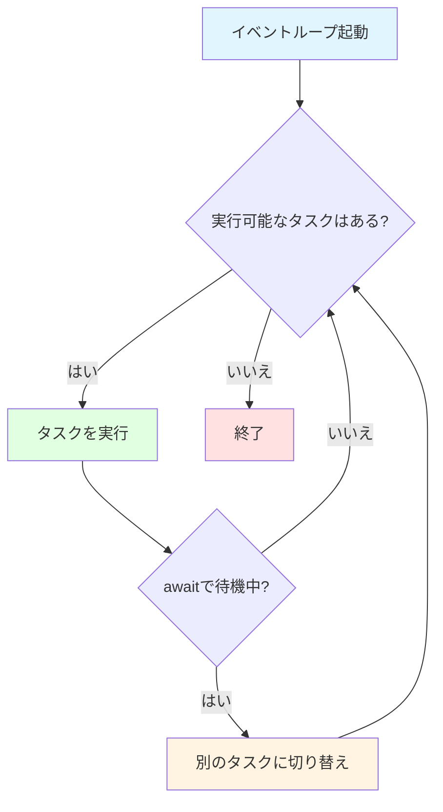
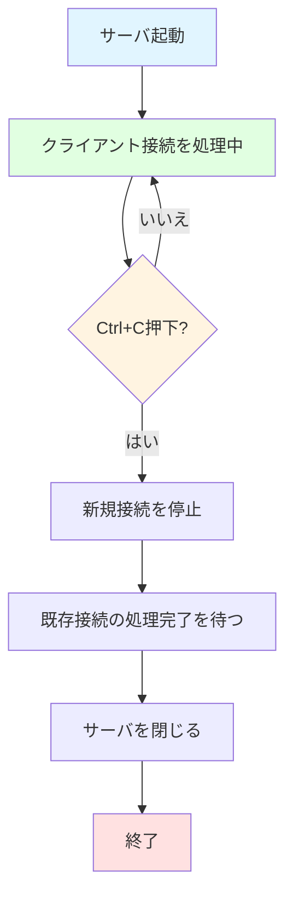

# TCPサーバとasyncio

## 学習目標

このセクションでは、以下の内容を学びます：

- asyncioの基本概念（イベントループ、コルーチン、async/await）
- asyncioを使ったTCPサーバの構築方法
- StreamReader/StreamWriterを使ったデータの送受信
- 接続管理とクリーンアップのベストプラクティス
- エラーハンドリングとgraceful shutdownの実装

**所要時間**: 約15分（理論5分＋実装10分）

## 前提知識

- Pythonの基本文法
- 関数と例外処理の理解
- 同期処理の概念（通常のPythonコード）

## asyncioの基礎

### 同期処理 vs 非同期処理

**同期処理**（通常のPythonコード）:

```python
# ❌ 同期処理: 各処理が完了するまで次に進まない
def fetch_user(user_id):
    time.sleep(1)  # データベース読み取り（1秒）
    return f"User {user_id}"

result1 = fetch_user(1)  # 1秒待つ
result2 = fetch_user(2)  # さらに1秒待つ
# 合計2秒かかる
```

**非同期処理**（asyncio）:

```python
# ✅ 非同期処理: 待ち時間中に他の処理を実行
async def fetch_user(user_id):
    await asyncio.sleep(1)  # 待つ間、他の処理を実行可能
    return f"User {user_id}"

# 2つのタスクを並行実行
results = await asyncio.gather(
    fetch_user(1),
    fetch_user(2)
)
# 合計1秒で完了（並行実行）
```

### asyncioの3つの主要概念

#### 1. イベントループ

**イベントループ**は、非同期タスクを管理・実行するコアエンジンです。

```python
import asyncio

async def main():
    print("Hello, asyncio!")

# イベントループを起動してmain()を実行
asyncio.run(main())
```

**イベントループの動作**:



#### 2. コルーチン

**コルーチン**は、`async def`で定義される、途中で実行を中断・再開できる関数です。

```python
async def hello():
    print("Hello")
    await asyncio.sleep(1)  # ここで一時中断
    print("World")

# コルーチンを実行
asyncio.run(hello())
```

**重要**: コルーチンは`await`で呼び出す必要があります。

```python
# ❌ 間違い: コルーチンを直接呼ぶ
result = hello()  # <coroutine object>が返る（実行されない）

# ✅ 正しい: awaitで呼ぶ
async def main():
    result = await hello()  # 実際に実行される
```

#### 3. async/await構文

**async**: コルーチンを定義する

```python
async def my_coroutine():
    return "result"
```

**await**: コルーチンの完了を待つ（その間、他のタスクが実行可能）

```python
async def main():
    result = await my_coroutine()  # 完了を待つ
    print(result)
```

**await可能な主なもの**:
- コルーチン: `await other_coroutine()`
- asyncioタスク: `await asyncio.create_task(coro())`
- asyncio関数: `await asyncio.sleep(1)`

## asyncioによるTCPサーバの構築

### TCPサーバの基本パターン

asyncioでTCPサーバを構築する基本的な手順：

```python
import asyncio

async def handle_client(reader, writer):
    """各クライアント接続を処理するハンドラ"""
    # ここでクライアントとの通信を処理
    pass

async def main():
    # TCPサーバを起動
    server = await asyncio.start_server(
        handle_client,  # クライアントハンドラ
        '127.0.0.1',    # バインドアドレス
        6379            # ポート番号
    )

    # サーバを起動
    async with server:
        await server.serve_forever()

# イベントループを起動
asyncio.run(main())
```

### asyncio.start_server()の仕組み

`asyncio.start_server()`は以下の処理を行います：

1. 指定されたアドレス・ポートでリッスン開始
2. クライアント接続ごとに`handle_client`を新しいタスクとして起動
3. 複数のクライアントを並行処理

**クライアント接続フロー**:

```mermaid
sequenceDiagram
    participant Server as TCPサーバ
    participant Loop as イベントループ
    participant Client1 as クライアント1
    participant Client2 as クライアント2

    Server->>Loop: start_server()で起動
    Note over Server: ポート6379でリッスン中

    Client1->>Server: 接続リクエスト
    Server->>Loop: handle_client(reader1, writer1)を起動
    Note over Loop: タスク1を実行中

    Client2->>Server: 接続リクエスト
    Server->>Loop: handle_client(reader2, writer2)を起動
    Note over Loop: タスク1とタスク2を並行実行

    Note over Loop: 各タスクは独立して動作
```

## StreamReader/StreamWriterによるデータ送受信

### StreamReaderでデータを読む

**StreamReader**は、非同期にバイトデータを読み取るためのクラスです。

主なメソッド：

| メソッド | 説明 | 用途 |
|---------|------|------|
| `readuntil(separator)` | 指定のセパレータまで読む | RESP行読み取り（`\r\n`まで） |
| `readexactly(n)` | 正確にnバイト読む | Bulk Stringのデータ部読み取り |
| `read(n)` | 最大nバイト読む | 一般的なデータ読み取り |

**使用例**:

```python
async def handle_client(reader, writer):
    # \r\nまで読む（RESP行の読み取り）
    line = await reader.readuntil(b'\r\n')
    print(f"Received: {line}")

    # 正確に10バイト読む
    data = await reader.readexactly(10)
    print(f"Data: {data}")
```

**エラーハンドリング**:

```python
import asyncio

try:
    line = await reader.readuntil(b'\r\n')
except asyncio.IncompleteReadError:
    # クライアントが接続を切断した
    print("Connection closed by client")
except asyncio.LimitOverrunError:
    # セパレータが見つからず、バッファが満杯
    print("Buffer overflow")
```

### StreamWriterでデータを送る

**StreamWriter**は、非同期にバイトデータを書き込むためのクラスです。

主なメソッド：

| メソッド | 説明 |
|---------|------|
| `write(data)` | データを書き込みバッファに追加（即座に送信されない） |
| `await drain()` | バッファの内容を実際に送信し、完了を待つ |
| `close()` | 接続を閉じる |
| `await wait_closed()` | 接続が完全に閉じるのを待つ |

**使用例**:

```python
async def handle_client(reader, writer):
    # 応答を送信
    response = b'+PONG\r\n'
    writer.write(response)     # バッファに書き込む
    await writer.drain()       # 実際に送信

    # 接続を閉じる
    writer.close()
    await writer.wait_closed()
```

**重要**: `write()`だけでは送信されません。`await drain()`で実際に送信します。

```python
# ❌ 間違い: drain()を忘れる
writer.write(b'+PONG\r\n')
writer.close()  # データが送信されない可能性

# ✅ 正しい: drain()で送信を待つ
writer.write(b'+PONG\r\n')
await writer.drain()  # 送信完了を待つ
writer.close()
```

## クライアント処理ループの実装

### 基本的なパターン

クライアントとの通信は、通常、以下のループで処理します：

```python
async def handle_client(reader: StreamReader, writer: StreamWriter) -> None:
    """クライアント接続を処理する"""
    try:
        while True:
            # 1. クライアントからデータを受信
            line = await reader.readuntil(b'\r\n')

            # 2. データを解釈（コマンドのパース）
            command = parse_command(line)

            # 3. コマンドを実行
            result = execute_command(command)

            # 4. 応答を送信
            response = encode_response(result)
            writer.write(response)
            await writer.drain()

    except asyncio.IncompleteReadError:
        # クライアントが接続を切断
        print("Client disconnected")

    finally:
        # クリーンアップ: 必ず接続を閉じる
        writer.close()
        await writer.wait_closed()
```

### クリーンアップのベストプラクティス

**finallyブロック**を使い、エラーが発生しても必ずリソースを解放します：

```python
async def handle_client(reader: StreamReader, writer: StreamWriter) -> None:
    try:
        # メイン処理
        while True:
            data = await reader.readuntil(b'\r\n')
            # 処理...
    except Exception as e:
        print(f"Error: {e}")
    finally:
        # ✅ 必ず実行される（エラー時も正常時も）
        writer.close()
        await writer.wait_closed()
        print("Connection closed")
```

**なぜfinallyが重要か**:
- メモリリークの防止
- ファイルディスクリプタの解放
- クライアントへの適切な切断通知

## エラーハンドリング

### 想定すべきエラー

| エラー | 原因 | 対処 |
|-------|------|------|
| `IncompleteReadError` | クライアントが予期せず切断 | 接続をクリーンアップ |
| `LimitOverrunError` | バッファオーバーフロー | エラーを返してバッファをクリア |
| `ConnectionResetError` | クライアントが強制切断 | 静かに接続を閉じる |
| 一般的な`Exception` | コマンド実行エラー | エラーメッセージを返す |

### エラーハンドリングの実装例

```python
async def handle_client(reader: StreamReader, writer: StreamWriter) -> None:
    try:
        while True:
            try:
                # データ読み取り
                line = await reader.readuntil(b'\r\n')

                # コマンド実行
                response = await process_command(line)

                # 応答送信
                writer.write(response)
                await writer.drain()

            except asyncio.IncompleteReadError:
                # クライアント切断: ループを抜ける
                break

            except asyncio.LimitOverrunError:
                # バッファオーバーフロー: エラーを返す
                writer.write(b'-ERR buffer overflow\r\n')
                await writer.drain()

            except Exception as e:
                # その他のエラー: エラーメッセージを返す
                error_msg = f'-ERR {str(e)}\r\n'.encode('utf-8')
                writer.write(error_msg)
                await writer.drain()

    finally:
        # 必ずクリーンアップ
        writer.close()
        await writer.wait_closed()
```

## Graceful Shutdownの実装

### シグナルハンドリング

サーバを適切に停止するには、`Ctrl+C`（SIGINT）を処理します：

```python
import asyncio
import signal

async def main():
    # サーバを起動
    server = await asyncio.start_server(
        handle_client, '127.0.0.1', 6379
    )

    # Graceful shutdown用のイベント
    shutdown_event = asyncio.Event()

    # シグナルハンドラ
    def signal_handler():
        print("\nShutdown signal received")
        shutdown_event.set()

    # SIGINT（Ctrl+C）をハンドリング
    loop = asyncio.get_running_loop()
    loop.add_signal_handler(signal.SIGINT, signal_handler)

    async with server:
        print("Server started on 127.0.0.1:6379")

        # shutdownシグナルを待つ
        await shutdown_event.wait()

        print("Shutting down...")
        server.close()
        await server.wait_closed()

asyncio.run(main())
```

### Graceful Shutdownのフロー



## 完全な実装例

以下は、基本的なEchoサーバの完全な実装例です：

```python
import asyncio
from asyncio import StreamReader, StreamWriter

async def handle_client(reader: StreamReader, writer: StreamWriter) -> None:
    """クライアント接続を処理するハンドラ"""
    addr = writer.get_extra_info('peername')
    print(f"New connection from {addr}")

    try:
        while True:
            # クライアントからデータを受信
            data = await reader.readuntil(b'\r\n')
            message = data.decode('utf-8').strip()
            print(f"Received: {message}")

            # エコーバック
            response = f"Echo: {message}\r\n".encode('utf-8')
            writer.write(response)
            await writer.drain()

    except asyncio.IncompleteReadError:
        print(f"Client {addr} disconnected")

    finally:
        writer.close()
        await writer.wait_closed()
        print(f"Connection from {addr} closed")


async def main():
    """サーバのメイン関数"""
    server = await asyncio.start_server(
        handle_client, '127.0.0.1', 8888
    )

    addr = server.sockets[0].getsockname()
    print(f"Serving on {addr}")

    async with server:
        await server.serve_forever()


if __name__ == "__main__":
    try:
        asyncio.run(main())
    except KeyboardInterrupt:
        print("\nShutdown by user")
```

**動作確認**:

```bash
# サーバを起動
python echo_server.py

# 別のターミナルでnetcatで接続
nc 127.0.0.1 8888

# メッセージを送信
hello
# 応答: Echo: hello
```

## デバッグのヒント

### asyncioデバッグモード

```python
# デバッグモードを有効化
asyncio.run(main(), debug=True)
```

デバッグモードでは：
- 実行に時間がかかるタスクを警告
- 適切にクリーンアップされなかったリソースを検出
- 詳細なトレースバックを表示

### ログ出力

```python
import logging

logging.basicConfig(
    level=logging.DEBUG,
    format='%(asctime)s - %(name)s - %(levelname)s - %(message)s'
)

logger = logging.getLogger(__name__)

async def handle_client(reader, writer):
    logger.debug("Client connected")
    try:
        # 処理...
        logger.info(f"Command received: {command}")
    except Exception as e:
        logger.error(f"Error: {e}", exc_info=True)
```

## 次のステップ

TCPサーバの基礎を学びました。次は、RESPプロトコルのパース・エンコードを実装します。

👉 次のセクション: [02-protocol-parsing.md](02-protocol-parsing.md)

**実装に進む前に**:
- [WORKSHOP_GUIDE.md](../../WORKSHOP_GUIDE.md)で実装手順を確認
- [アーキテクチャドキュメント](../architecture.md)で全体像を把握

## 参考資料

- [Python asyncio公式ドキュメント](https://docs.python.org/3/library/asyncio.html): asyncioの完全なリファレンス
- [asyncio Streams](https://docs.python.org/3/library/asyncio-stream.html): StreamReader/StreamWriterの詳細
- [Real Python: Async IO in Python](https://realpython.com/async-io-python/): asyncioの詳しいチュートリアル
- [Understanding Python's asyncio](https://lucumr.pocoo.org/2016/10/30/i-dont-understand-asyncio/): asyncioの内部動作

## まとめ

- asyncioはイベントループベースの非同期I/Oフレームワーク
- コルーチン（`async def`）と`await`で非同期処理を実現
- `asyncio.start_server()`でTCPサーバを簡単に構築
- StreamReader/StreamWriterでデータの送受信を行う
- finallyブロックで必ずリソースをクリーンアップ
- エラーハンドリングで堅牢なサーバを実現
- Graceful shutdownで適切にサーバを停止

これらの知識を使って、Mini-RedisのTCPサーバを実装しましょう！
