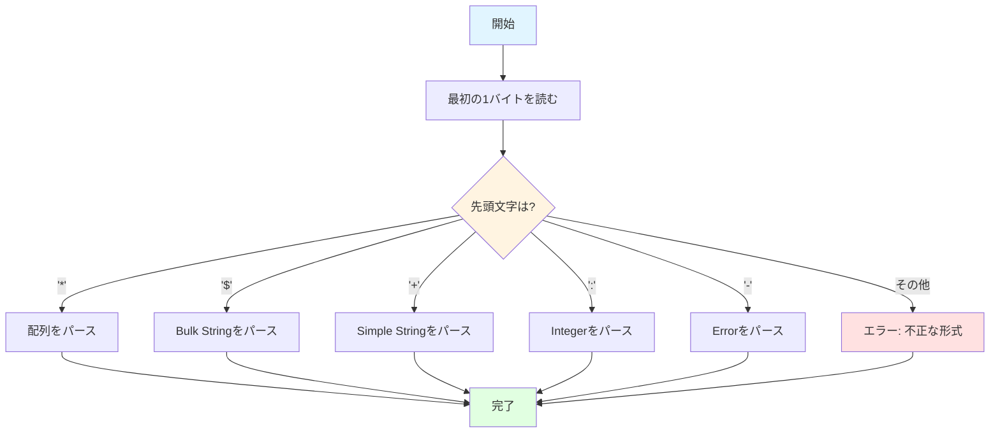

# RESPプロトコルのパースとエンコード

## 学習目標

このセクションでは、以下の内容を学びます：

- RESPの全データ型の詳細仕様
- RESPメッセージをパースするアルゴリズム
- Pythonでのエンコード実装パターン
- よくある落とし穴とその回避方法
- バイナリセーフな通信の実現方法

**所要時間**: 約15分（理論5分＋実装10分）

## 前提知識

- バイト列とUTF-8エンコーディングの基礎
- Pythonの文字列操作
- StreamReader/StreamWriterの使い方（前セクション）

## RESPデータ型の詳細

RESPには5つの基本データ型があります。各データ型は、先頭1バイトで識別されます。

### 1. Simple Strings（単純な文字列）

**形式**: `+{文字列}\r\n`

**用途**: 短い成功メッセージ（OK、PONGなど）

**例**:

```
+OK\r\n
+PONG\r\n
```

**特徴**:
- 改行文字を含めない
- 短いメッセージに最適
- パースが高速

**Pythonでの表現**:

```python
# バイト列
b'+OK\r\n'

# パース結果
"OK"
```

### 2. Errors（エラー）

**形式**: `-{エラーメッセージ}\r\n`

**用途**: エラー通知

**例**:

```
-ERR unknown command\r\n
-WRONGTYPE value is not an integer\r\n
```

**特徴**:
- Simple Stringsと同じ形式だが、先頭が`-`
- クライアントはエラーとして扱う

**Pythonでの表現**:

```python
# バイト列
b'-ERR unknown command\r\n'

# パース結果（エラーとして扱う）
raise CommandError("ERR unknown command")
```

### 3. Integers（整数）

**形式**: `:{整数}\r\n`

**用途**: 数値の応答（INCR、TTL、EXPIREなど）

**例**:

```
:0\r\n        # 0
:42\r\n       # 42
:-1\r\n       # -1（TTLでキーが存在しない場合）
:1000\r\n     # 1000
```

**Pythonでの表現**:

```python
# バイト列
b':42\r\n'

# パース結果
42  # int型
```

### 4. Bulk Strings（長さ指定付き文字列）

**形式**: `${長さ}\r\n{データ}\r\n`

**用途**: 任意の文字列データ、バイナリデータ

**例**:

```
$5\r\n         ← データの長さ（5バイト）
hello\r\n      ← データ

$11\r\n        ← データの長さ（11バイト）
Hello\nWorld\r\n  ← 改行を含むデータ
```

**Null値**:

```
$-1\r\n        ← 長さ-1はNullを示す
```

**空文字列**:

```
$0\r\n         ← 長さ0
\r\n           ← 空データ
```

**特徴**:
- 長さを事前に指定することで、バイナリセーフを実現
- 改行文字やNull文字を含むデータも安全に扱える
- Nullの表現が可能（`$-1\r\n`）

**Pythonでの表現**:

```python
# 通常の文字列
b'$5\r\nhello\r\n'  # → "hello"

# Null
b'$-1\r\n'  # → None

# 空文字列
b'$0\r\n\r\n'  # → ""
```

### 5. Arrays（配列）

**形式**: `*{要素数}\r\n{要素1}{要素2}...`

**用途**: コマンドの送信、複数値の応答

**例1**: `PING`コマンド

```
*1\r\n         ← 要素数1
$4\r\n         ← 1番目の要素の長さ
PING\r\n       ← データ
```

**例2**: `GET mykey`コマンド

```
*2\r\n         ← 要素数2
$3\r\n         ← 1番目の要素の長さ
GET\r\n        ← データ
$5\r\n         ← 2番目の要素の長さ
mykey\r\n      ← データ
```

**例3**: `SET key value`コマンド

```
*3\r\n         ← 要素数3
$3\r\n
SET\r\n
$3\r\n
key\r\n
$5\r\n
value\r\n
```

**空配列**:

```
*0\r\n         ← 要素数0
```

**Null配列**:

```
*-1\r\n        ← Null
```

**Pythonでの表現**:

```python
# GET mykey
b'*2\r\n$3\r\nGET\r\n$5\r\nmykey\r\n'  # → ["GET", "mykey"]

# 空配列
b'*0\r\n'  # → []

# Null
b'*-1\r\n'  # → None
```

## RESPパースアルゴリズム

### パースの全体フロー



### コマンドパースのステップバイステップ

`GET mykey`コマンドをパースする手順を詳しく見ていきます。

**入力データ**:

```
*2\r\n$3\r\nGET\r\n$5\r\nmykey\r\n
```

**ステップ1**: 最初の行を読む

```python
line = await reader.readuntil(b'\r\n')  # b'*2\r\n'
line = line[:-2]  # CRLF削除 → b'*2'
```

**ステップ2**: 先頭文字で型を判定

```python
if line[0:1] == b'*':
    # 配列型
    count = int(line[1:])  # 2
```

**ステップ3**: 各要素をループで読む

```python
result = []
for i in range(count):  # 2回繰り返す
    # 各要素を読む
    element = await parse_bulk_string(reader)
    result.append(element)
```

**ステップ4**: Bulk Stringをパース（1番目: "GET"）

```python
# $3\r\n を読む
length_line = await reader.readuntil(b'\r\n')  # b'$3\r\n'
length_line = length_line[:-2]  # → b'$3'
length = int(length_line[1:])  # → 3

# データ + \r\n を読む（3バイト + 2バイト = 5バイト）
data = await reader.readexactly(length + 2)  # b'GET\r\n'
data = data[:-2]  # CRLF削除 → b'GET'

# UTF-8でデコード
element = data.decode('utf-8')  # "GET"
```

**ステップ5**: Bulk Stringをパース（2番目: "mykey"）

```python
# $5\r\n を読む
length_line = await reader.readuntil(b'\r\n')  # b'$5\r\n'
length = int(length_line[1:-2])  # → 5

# データ + \r\n を読む
data = await reader.readexactly(5 + 2)  # b'mykey\r\n'
element = data[:-2].decode('utf-8')  # "mykey"
```

**ステップ6**: 結果を返す

```python
result = ["GET", "mykey"]
```

### 完全なパース実装

```python
import asyncio
from asyncio import StreamReader

class RESPProtocolError(Exception):
    """RESPプロトコルエラー"""
    pass

class RESPParser:
    """RESPプロトコルのパーサー"""

    async def parse_command(self, reader: StreamReader) -> list[str]:
        """コマンド（配列）をパースする"""
        # 最初の行を読む: *N\r\n
        line = await reader.readuntil(b'\r\n')
        line = line[:-2]  # CRLF削除

        # 配列かチェック
        if not line.startswith(b'*'):
            raise RESPProtocolError("Expected array")

        # 要素数を取得
        try:
            count = int(line[1:])
        except ValueError:
            raise RESPProtocolError("Invalid array length")

        # 各要素を読む
        result = []
        for _ in range(count):
            element = await self._parse_bulk_string(reader)
            result.append(element)

        return result

    async def _parse_bulk_string(self, reader: StreamReader) -> str:
        """Bulk Stringをパースする"""
        # 長さ行を読む: $N\r\n
        length_line = await reader.readuntil(b'\r\n')
        length_line = length_line[:-2]  # CRLF削除

        # Bulk Stringかチェック
        if not length_line.startswith(b'$'):
            raise RESPProtocolError("Expected bulk string")

        # 長さを取得
        try:
            length = int(length_line[1:])
        except ValueError:
            raise RESPProtocolError("Invalid bulk string length")

        # Null値のチェック
        if length == -1:
            raise RESPProtocolError("Unexpected null value")

        # データを読む（データ + \r\n）
        data = await reader.readexactly(length + 2)

        # 末尾が\r\nかチェック
        if data[-2:] != b'\r\n':
            raise RESPProtocolError("Expected CRLF after bulk string")

        # CRLF削除してUTF-8デコード
        return data[:-2].decode('utf-8')
```

## RESPエンコード実装

### エンコードのパターン

サーバからクライアントへの応答をエンコードする関数群を実装します。

#### 1. Simple Stringのエンコード

```python
def encode_simple_string(value: str) -> bytes:
    """Simple Stringをエンコードする"""
    return f"+{value}\r\n".encode('utf-8')

# 例
encode_simple_string("OK")      # → b'+OK\r\n'
encode_simple_string("PONG")    # → b'+PONG\r\n'
```

#### 2. Errorのエンコード

```python
def encode_error(message: str) -> bytes:
    """エラーメッセージをエンコードする"""
    return f"-{message}\r\n".encode('utf-8')

# 例
encode_error("ERR unknown command")
# → b'-ERR unknown command\r\n'
```

#### 3. Integerのエンコード

```python
def encode_integer(value: int) -> bytes:
    """整数をエンコードする"""
    return f":{value}\r\n".encode('utf-8')

# 例
encode_integer(42)     # → b':42\r\n'
encode_integer(-1)     # → b':-1\r\n'
encode_integer(0)      # → b':0\r\n'
```

#### 4. Bulk Stringのエンコード

```python
def encode_bulk_string(value: str | None) -> bytes:
    """Bulk Stringをエンコードする"""
    if value is None:
        # Null値
        return b'$-1\r\n'

    # バイト列に変換
    data = value.encode('utf-8')
    length = len(data)  # バイト長を取得

    # $<length>\r\n<data>\r\n
    return f"${length}\r\n".encode('utf-8') + data + b'\r\n'

# 例
encode_bulk_string("hello")
# → b'$5\r\nhello\r\n'

encode_bulk_string(None)
# → b'$-1\r\n'

encode_bulk_string("")
# → b'$0\r\n\r\n'

encode_bulk_string("こんにちは")  # 日本語（15バイト）
# → b'$15\r\n\xe3\x81\x93\xe3\x82\x93\xe3\x81\xab\xe3\x81\xa1\xe3\x81\xaf\r\n'
```

#### 5. 応答のエンコード（統合）

複数の型を自動判別してエンコードする関数：

```python
def encode_response(value: str | int | None) -> bytes:
    """応答を適切な形式でエンコードする"""
    if value is None:
        # Null Bulk String
        return encode_bulk_string(None)
    elif isinstance(value, int):
        # Integer
        return encode_integer(value)
    elif isinstance(value, str):
        # Bulk String
        return encode_bulk_string(value)
    else:
        raise ValueError(f"Unsupported type: {type(value)}")

# 例
encode_response("hello")   # → b'$5\r\nhello\r\n'
encode_response(42)        # → b':42\r\n'
encode_response(None)      # → b'$-1\r\n'
```

## よくある落とし穴と回避方法

### 1. CRLF削除忘れ

**問題**:

```python
# ❌ 間違い: CRLFを削除していない
line = await reader.readuntil(b'\r\n')  # b'*2\r\n'
count = int(line[1:])  # int(b'2\r\n') → ValueError!
```

**解決策**:

```python
# ✅ 正しい: CRLFを削除
line = await reader.readuntil(b'\r\n')
line = line[:-2]  # 末尾2バイトを削除
count = int(line[1:])  # int(b'2') → 2
```

### 2. バイト長 vs 文字数

**問題**:

```python
# ❌ 間違い: 文字数を使用
text = "こんにちは"  # 5文字
length = len(text)  # 5
result = f"${length}\r\n{text}\r\n"  # エラー！
```

**解決策**:

```python
# ✅ 正しい: バイト長を使用
text = "こんにちは"
data = text.encode('utf-8')  # バイト列に変換
length = len(data)  # 15（UTF-8で3バイト×5文字）
result = f"${length}\r\n".encode('utf-8') + data + b'\r\n'
```

### 3. readexactly()の使い忘れ

**問題**:

```python
# ❌ 間違い: read()を使う
data = await reader.read(length)  # 指定バイト未満が返る可能性
```

**解決策**:

```python
# ✅ 正しい: readexactly()を使う
data = await reader.readexactly(length + 2)  # 正確にlength+2バイト読む
```

**readexactly()の利点**:
- 指定バイト数が揃うまで待つ
- データが不足する場合は`IncompleteReadError`を発生

### 4. UTF-8デコードエラー

**問題**:

```python
# ❌ 間違い: エラーハンドリングなし
data = data.decode('utf-8')  # 不正なUTF-8でUnicodeDecodeError
```

**解決策**:

```python
# ✅ 正しい: エラーハンドリング
try:
    text = data.decode('utf-8')
except UnicodeDecodeError:
    raise RESPProtocolError("Invalid UTF-8 data")
```

### 5. Null値の処理忘れ

**問題**:

```python
# ❌ 間違い: Null値を考慮していない
length = int(length_line[1:])
data = await reader.readexactly(length + 2)  # length=-1の場合エラー
```

**解決策**:

```python
# ✅ 正しい: Null値を先にチェック
length = int(length_line[1:])
if length == -1:
    return None  # Null値
data = await reader.readexactly(length + 2)
```

## バイナリセーフな通信の実現

### なぜバイナリセーフが必要か

従来のテキストプロトコル（改行区切り）の問題：

```python
# データに改行が含まれる場合
data = "line1\nline2\nline3"

# 改行区切りでは正しく読めない
line = await reader.readuntil(b'\n')  # "line1"しか読めない
```

### RESPの解決策

**長さ指定**により、データに含まれる文字に関係なく正確に読み取れます：

```python
# データに改行が含まれる場合
data = "line1\nline2\nline3"

# Bulk Stringでエンコード
encoded = encode_bulk_string(data)
# → b'$17\r\nline1\nline2\nline3\r\n'

# パース時
length = 17  # 事前に長さが分かる
data = await reader.readexactly(17 + 2)  # 正確に19バイト読む
# → b'line1\nline2\nline3\r\n'

result = data[:-2].decode('utf-8')  # "line1\nline2\nline3"
```

### バイナリデータの例

```python
# バイナリデータ（画像など）
binary_data = b'\x00\x01\x02\xff\xfe'

# Bulk Stringでエンコード
length = len(binary_data)  # 5
encoded = f"${length}\r\n".encode('utf-8') + binary_data + b'\r\n'

# パース時
length = 5
data = await reader.readexactly(5 + 2)
binary_result = data[:-2]  # b'\x00\x01\x02\xff\xfe'
```

## デバッグのヒント

### バイト列の可視化

```python
# repr()で可視化
line = b'*2\r\n'
print(f"Received: {line!r}")  # Received: b'*2\r\n'

# 16進数表示
print(line.hex())  # 2a320d0a
```

### ステップバイステップのログ

```python
async def parse_command(self, reader: StreamReader) -> list[str]:
    line = await reader.readuntil(b'\r\n')
    print(f"[1] Read line: {line!r}")

    line = line[:-2]
    print(f"[2] After CRLF removal: {line!r}")

    count = int(line[1:])
    print(f"[3] Array count: {count}")

    # ...
```

### テスト用のモックデータ

```python
import io

# モックStreamReaderを作成
data = b'*2\r\n$3\r\nGET\r\n$5\r\nmykey\r\n'
mock_reader = asyncio.StreamReader()
mock_reader.feed_data(data)
mock_reader.feed_eof()

# パースをテスト
parser = RESPParser()
result = await parser.parse_command(mock_reader)
print(result)  # ['GET', 'mykey']
```

## 実装の練習問題

### 練習1: Simple Stringのパース

以下のバイト列をパースして、文字列を返す関数を実装してください：

```python
async def parse_simple_string(reader: StreamReader) -> str:
    # TODO: 実装してください
    pass

# テストケース
# 入力: b'+OK\r\n'
# 期待出力: "OK"
```

### 練習2: Integerのパース

以下のバイト列をパースして、整数を返す関数を実装してください：

```python
async def parse_integer(reader: StreamReader) -> int:
    # TODO: 実装してください
    pass

# テストケース
# 入力: b':42\r\n'
# 期待出力: 42

# 入力: b':-1\r\n'
# 期待出力: -1
```

### 練習3: 空配列のパース

空配列（`*0\r\n`）をパースして、空リストを返すように実装を拡張してください。

## 次のステップ

RESPプロトコルのパース・エンコードを学びました。次は、これらを使ってRedisコマンドを実装します。

👉 次のセクション: [03-commands.md](03-commands.md)

**実装に進む前に**:
- `mini_redis/protocol.py`のTODOコメントを確認
- `tests/test_protocol.py`でテストを実行し、実装の正確性を確認

**テスト実行例**:

```bash
# プロトコルのテストのみ実行
pytest tests/test_protocol.py -v

# 特定のテストクラスのみ
pytest tests/test_protocol.py::TestRESPParser -v
```

## 参考資料

- [RESP仕様（公式）](https://redis.io/docs/reference/protocol-spec/): RESPプロトコルの完全な仕様
- [Python bytes/bytearrayドキュメント](https://docs.python.org/3/library/stdtypes.html#bytes): バイト列操作のリファレンス
- [UTF-8エンコーディング](https://docs.python.org/3/howto/unicode.html): Unicodeとエンコーディングの詳細

## まとめ

- RESPには5つの基本データ型がある（Simple Strings, Errors, Integers, Bulk Strings, Arrays）
- 各データ型は先頭1バイト（+, -, :, $, *）で識別
- パースは「行を読む→型判定→データ読む」の順序
- Bulk Stringsは長さ指定により、バイナリセーフを実現
- エンコードは型に応じた関数を使い分ける
- CRLF削除とバイト長計算に注意
- `readuntil()`と`readexactly()`を使い分ける

これらの知識を使って、Mini-RedisのRESPパーサーを実装しましょう！
