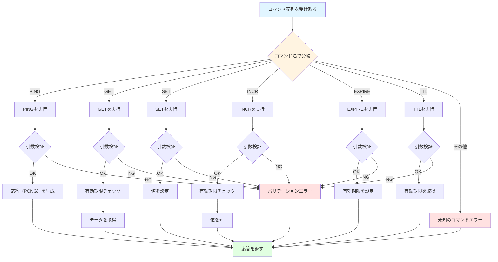

# Redisコマンドの実装

## 学習目標

このセクションでは、コマンド実行部の役割と設計、6つの基本コマンドの仕様と実装（PING, GET, SET, INCR, EXPIRE, TTL）、エラーハンドリングのパターンとエラーメッセージの形式について学びます。

所要時間: 約20分（理論5分＋実装15分）

## 前提知識

RESPプロトコルのエンコード方法、そしてPythonの例外処理を理解していることを前提としています。

## ストレージ操作

コマンドの実装は`DataStore`（`mini_redis/storage.py`）に依存します。`DataStore`は値の保存と取得、削除といった最小限の責務だけを持ち、期限の判定や破棄は呼び出し側（`ExpiryManager`やコマンド実装）が担当するよう実装します。

### DataStore全体の骨格

`DataStore`は内部に`dict[str, StoreEntry]`を持ち、初期化時に空の辞書を生成するだけです。コマンド側からは非同期処理の中で呼び出されますが、ストレージ内では同期処理として完結しているため追加のロックやawaitは不要です。

```python
class DataStore:
    def __init__(self) -> None:
        self._data: dict[str, StoreEntry] = {}

    def get(self, key: str) -> str | None:
        # ...

    def set(self, key: str, value: str) -> None:
        # ...

    def delete(self, key: str) -> bool:
        # ...
```

この3メソッドが揃えば、GET/SET/DELETE（およびEXPIRE処理の一部）に必要な最小のストレージAPIが完成します。以降のコマンド実装は、（必要な場合は）期限チェック→`DataStore`操作→RESP変換という流れで組み立てていきます。

### get: 値を読み出す
- 目的: キーに紐づく値を取得する  
- 仕様: キーが存在すれば`str`、存在しなければ`None`を返す  
- 実装ポイント: `dict.get()` を利用し、存在しない場合に例外を投げないようにする。エントリが存在する場合だけ`StoreEntry.value`を返す。

```python
def get(self, key: str) -> str | None:
    entry = self._data.get(key)
    return entry.value if entry else None
```

### set: 値を保存する
- 目的: キーに値を設定し、既存の有効期限をリセットする  
- 仕様: 常に新しい`StoreEntry`を作成して保存する  
- 実装ポイント: `StoreEntry`の`expiry_at`はデフォルト`None`。再設定時には古いエントリを丸ごと置き換えることで期限をクリアする。

```python
def set(self, key: str, value: str) -> None:
    self._data[key] = StoreEntry(value=value)
```

### delete: 値を取り除く
- 目的: 指定したキーを削除し、削除できたかどうかを返す  
- 仕様: 削除できれば`True`、キーがなければ`False`  
- 実装ポイント: `dict.pop()`を例外処理付きで使うと戻り値の制御が簡単。Passive Expiryで期限切れを検出した際にもこのメソッドを呼び出してキーを掃除する。

```python
def delete(self, key: str) -> bool:
    try:
        self._data.pop(key)
        return True
    except KeyError:
        return False
```


## コマンド実行

`commands.py` は、パースされたコマンドを受け取り、引数の数や型といった必要ば検証を行った後、そのコマンドに対応する処理を実行します。実行結果に応じて、適切なRESPデータ型で返却します。

### コマンド実行のフロー



### 実装例

```python
class Commands:
    def __init__(self, storage: Storage, expiry: ExpiryManager):
        self._storage = storage
        self._expiry = expiry

    async def execute(self, command: list[str]) -> str | int | None:
        """コマンドを実行する"""
        if not command:
            raise CommandError("ERR empty command")

        # コマンド名を大文字に正規化
        cmd_name = command[0].upper()

        # ルーティング
        if cmd_name == "PING":
            return await self._ping(command[1:])
        elif cmd_name == "GET":
            return await self._get(command[1:])
        elif cmd_name == "SET":
            return await self._set(command[1:])
        elif cmd_name == "INCR":
            return await self._incr(command[1:])
        elif cmd_name == "EXPIRE":
            return await self._expire(command[1:])
        elif cmd_name == "TTL":
            return await self._ttl(command[1:])
        else:
            raise CommandError(f"ERR unknown command '{cmd_name}'")

    async def _ping(self, args: list[str]) -> str:
        """PINGコマンドを実行"""
        # 実装...
        pass
```

## 各コマンドの仕様と実装

### 1. PINGコマンド

用途: 接続確認、サーバの応答性テスト

構文:
`PING`は引数なし、または`PING message`でメッセージをエコーバックします。

応答:
引数がない場合は`"PONG"`（Simple String）を返し、引数がある場合は`message`をそのまま返します（Bulk String）。

実装例:

```python
async def _ping(self, args: list[str]) -> str:
    """PINGコマンドを実行"""
    if len(args) == 0:
        # 引数なし: PONGを返す
        return "PONG"
    elif len(args) == 1:
        # 引数あり: メッセージをエコーバック
        return args[0]
    else:
        # 引数が多すぎる
        raise CommandError("ERR wrong number of arguments for 'ping' command")
```

redis-cliでの実行例:

```bash
> PING
PONG

> PING "hello"
"hello"

> PING "Hello, Redis!"
"Hello, Redis!"
```

[ドキュメント](https://redis.io/docs/latest/commands/ping/)


### 2. GETコマンド

用途: キーの値を取得

構文: `GET key`

応答:
- キーが存在: 値を返す（Bulk String）
- キーが存在しない: `None`（Null Bulk String）
- キーが期限切れ: `None`（削除してからNull返却）

実装例:

```python
async def _get(self, args: list[str]) -> str | None:
    """GETコマンドを実行"""
    # 引数検証
    if len(args) != 1:
        raise CommandError("ERR wrong number of arguments for 'get' command")

    key = args[0]

    # Passive Expiry: 期限切れチェック
    if self._expiry.check_and_remove_expired(key):
        # 期限切れなので削除済み
        return None

    # 値を取得
    return self._storage.get(key)
```

redis-cliでの実行例:

```bash
> SET mykey "Hello"
OK

> GET mykey
"Hello"

> GET nonexistent
(nil)
```

[ドキュメント](https://redis.io/docs/latest/commands/get/)


### 3. SETコマンド

用途: キーに値を設定

構文: `SET key value`

応答: `"OK"`（Simple String）

実装:

```python
async def _set(self, args: list[str]) -> str:
    """SETコマンドを実行"""
    # 引数検証
    if len(args) != 2:
        raise CommandError("ERR wrong number of arguments for 'set' command")

    key = args[0]
    value = args[1]

    # 値を設定
    self._storage.set(key, value)

    return "OK"
```

redis-cliでの実行例:

```bash
> SET name "Alice"
OK

> SET counter "42"
OK

> GET name
"Alice"
```

[ドキュメント](https://redis.io/docs/latest/commands/set/)


### 4. INCRコマンド

用途: 整数値をインクリメント（+1）

構文: `INCR key`

応答:
- インクリメント後の値（Integer）

動作:
- キーが存在しない: 0から開始して1を返す
- キーの値が整数: インクリメントした値を返す
- キーの値が整数でない: エラー

実装例:

```python
async def _incr(self, args: list[str]) -> int:
    """INCRコマンドを実行"""
    # 引数検証
    if len(args) != 1:
        raise CommandError("ERR wrong number of arguments for 'incr' command")

    key = args[0]

    # Passive Expiry: 期限切れチェック
    if self._expiry.check_and_remove_expired(key):
        # 期限切れなので、0から開始
        self._storage.set(key, "1")
        return 1

    # 現在の値を取得
    current = self._storage.get(key)

    if current is None:
        # キーが存在しない: 0から開始
        self._storage.set(key, "1")
        return 1

    # 整数に変換を試みる
    try:
        value = int(current)
    except ValueError:
        raise CommandError("ERR value is not an integer or out of range")

    # インクリメント
    new_value = value + 1
    self._storage.set(key, str(new_value))

    return new_value
```

redis-cliでの実行例:

```bash
> INCR counter
(integer) 1

> INCR counter
(integer) 2

> SET mykey "hello"
OK

> INCR mykey
(error) ERR value is not an integer or out of range
```

[ドキュメント](https://redis.io/docs/latest/commands/incr/)

### 5. EXPIREコマンド

用途: キーに有効期限（秒）を設定

構文: `EXPIRE key seconds`

応答:
- キーが存在し、期限設定成功: `1`（Integer）
- キーが存在しない: `0`（Integer）

実装例:

```python
async def _expire(self, args: list[str]) -> int:
    """EXPIREコマンドを実行"""
    # 引数検証
    if len(args) != 2:
        raise CommandError("ERR wrong number of arguments for 'expire' command")

    key = args[0]

    # 秒数を整数に変換
    try:
        seconds = int(args[1])
    except ValueError:
        raise CommandError("ERR value is not an integer or out of range")

    # 負の秒数はエラー
    if seconds < 0:
        raise CommandError("ERR invalid expire time in 'expire' command")

    # Passive Expiry: 期限切れチェック
    if self._expiry.check_and_remove_expired(key):
        # 期限切れなので存在しない
        return 0

    # キーが存在するかチェック
    if self._storage.get(key) is None:
        return 0

    # 有効期限を設定
    self._expiry.set_expiry(key, seconds)
    return 1
```

redis-cliでの実行例:

```bash
> SET mykey "Hello"
OK

> EXPIRE mykey 60
(integer) 1

> EXPIRE nonexistent 60
(integer) 0

> TTL mykey
(integer) 59
```

[ドキュメント](https://redis.io/docs/latest/commands/expire/)

### 6. TTLコマンド

用途: キーの残り有効期限（秒）を取得

構文: `TTL key`

応答:
- 有効期限あり: 残り秒数（Integer）
- 有効期限なし: `-1`（Integer）
- キーが存在しない: `-2`（Integer）

実装:

```python
async def _ttl(self, args: list[str]) -> int:
    """TTLコマンドを実行"""
    # 引数検証
    if len(args) != 1:
        raise CommandError("ERR wrong number of arguments for 'ttl' command")

    key = args[0]

    # Passive Expiry: 期限切れチェック
    if self._expiry.check_and_remove_expired(key):
        # 期限切れなので存在しない
        return -2

    # キーが存在するかチェック
    if self._storage.get(key) is None:
        return -2

    # 有効期限を取得
    ttl = self._expiry.get_ttl(key)

    if ttl is None:
        # 有効期限が設定されていない
        return -1

    return ttl
```

redis-cliでの実行例:

```bash
> SET mykey "Hello"
OK

> EXPIRE mykey 60
(integer) 1

> TTL mykey
(integer) 59

> TTL mykey
(integer) 58

> SET persistent "forever"
OK

> TTL persistent
(integer) -1

> TTL nonexistent
(integer) -2
```

[ドキュメント](https://redis.io/docs/latest/commands/ttl/)

## エラーハンドリング

### CommandErrorの定義

```python
class CommandError(Exception):
    """コマンド実行エラー"""
    pass
```

### エラーメッセージの形式

Redisのエラーメッセージは、以下の形式に従います：

| エラー種別 | 形式 | 例 |
|-----------|------|-----|
| 未知のコマンド | `ERR unknown command '{cmd}'` | 127.0.0.1:6380> UNKNOWN 1 <br/>(error) ERR unknown command 'UNKNOWN', with args beginning with: '1' |
| 引数数エラー | `ERR wrong number of arguments for '{cmd}' command` | 127.0.0.1:6380> SET hoge <br/>(error) ERR wrong number of arguments for 'set' command |
| 型エラー | `ERR value is not an integer or out of range` | 127.0.0.1:6380> EXPIRE key hoge <br/>(error) ERR value is not an integer or out of range |
| 一般エラー | `ERR {message}` |  |

### エラーハンドリングの実装例

```python
async def handle_client(reader: StreamReader, writer: StreamWriter) -> None:
    parser = RESPParser()
    commands = Commands(storage, expiry)

    try:
        while True:
            # コマンドをパース
            command = await parser.parse_command(reader)

            try:
                # コマンドを実行
                result = await commands.execute(command)

                # 応答をエンコード
                response = encode_response(result)

            except CommandError as e:
                # コマンド実行エラー
                response = encode_error(str(e))

            except Exception as e:
                # 予期しないエラー
                logger.exception("Unexpected error")
                response = encode_error("ERR internal server error")

            # 応答を送信
            writer.write(response)
            await writer.drain()

    except asyncio.IncompleteReadError:
        # クライアント切断
        pass

    finally:
        writer.close()
        await writer.wait_closed()
```

## 実装ガイド（ハンズオン）

ここまで学んだ内容を活かして、ストレージ層とコマンド実行層を実装しましょう！（目安時間: 35分）

### パート1: データストレージ層の実装（15分）

#### 実装する内容

1. `mini_redis/storage.py` を開く
2. 基本操作を実装
   - `get()`: キーの値を取得
   - `set()`: キーに値を設定
   - `delete()`: キーを削除
   - `exists()`: キーの存在確認
3. 有効期限管理を実装
   - `set_expiry()`: 有効期限を設定
   - `get_expiry()`: 有効期限を取得
   - `get_all_keys()`: すべてのキーを取得

#### テストで確認

```bash
pytest tests/test_storage.py -v
```

### パート2: コマンド実行層の実装（20分）

#### 実装する内容

1. `mini_redis/commands.py` を開く
2. `execute()` メソッドを実装
   - コマンド名を取得し、対応するメソッドにルーティング
   - 引数の数と型を検証
3. 各コマンドを実装
   - `execute_ping()`: "PONG"を返す
   - `execute_get()`: キーの値を取得
   - `execute_set()`: キーに値を設定
   - `execute_incr()`: 値を1増加
   - `execute_expire()`: 有効期限を設定
   - `execute_ttl()`: 残り有効秒数を取得

**重要**: GET/INCR/EXPIRE/TTLの最初で `check_and_remove_expired(key)` を呼び出す（Passive Expiry）

#### 実装のポイント

**1. PINGコマンド**

```python
async def execute_ping(self, args: list[str]) -> str:
    if len(args) == 0:
        return "PONG"
    elif len(args) == 1:
        return args[0]
    else:
        raise CommandError("ERR wrong number of arguments for 'ping' command")
```

**2. INCRコマンド（型エラー処理に注意）**

```python
async def execute_incr(self, key: str) -> int:
    # Passive Expiryチェック
    if self._expiry.check_and_remove_expired(key):
        self._store.set(key, "1")
        return 1

    current = self._store.get(key)
    if current is None:
        self._store.set(key, "1")
        return 1

    # 整数変換を試みる
    try:
        value = int(current)
    except ValueError:
        raise CommandError("ERR value is not an integer or out of range")

    new_value = value + 1
    self._store.set(key, str(new_value))
    return new_value
```

#### よくある間違いと対処法

**1. Passive Expiryの呼び出し忘れ**

```python
# ❌ 間違い
async def execute_get(self, key: str) -> str | None:
    return self._store.get(key)  # 期限チェックなし

# ✅ 正しい
async def execute_get(self, key: str) -> str | None:
    self._expiry.check_and_remove_expired(key)  # 期限チェック
    return self._store.get(key)
```

**2. INCRコマンドの型エラー処理忘れ**

```python
# ❌ 間違い
int_value = int(current_value)  # ValueErrorが発生する可能性

# ✅ 正しい
try:
    int_value = int(current_value)
except ValueError:
    raise CommandError("ERR value is not an integer or out of range")
```

#### テストで確認

```bash
# 全コマンドのテスト
pytest tests/test_commands.py -v

# 特定のコマンドのみ
pytest tests/test_commands.py::TestCommands::test_ping -v
pytest tests/test_commands.py::TestCommands::test_incr -v
```

## 動作確認の手順

### 1. サーバを起動

```bash
python -m mini_redis
```

### 2. redis-cliで接続

```bash
redis-cli -p 6379
```

### 3. 各コマンドをテスト

基本操作:

```bash
> PING
PONG

> SET mykey "Hello, World!"
OK

> GET mykey
"Hello, World!"
```

カウンター:

```bash
> SET counter "0"
OK

> INCR counter
(integer) 1

> INCR counter
(integer) 2

> INCR counter
(integer) 3

> GET counter
"3"
```

エラーケース:

```bash
> GET
(error) ERR wrong number of arguments for 'get' command

> HELLO
(error) ERR unknown command 'HELLO'

> SET text "not a number"
OK

> INCR text
(error) ERR value is not an integer or out of range
```

## 次のステップ

基本コマンドの実装を学びました。次は、有効期限管理の2段階メカニズム（Passive + Active Expiry）を実装します。

👉 次のセクション: [04-expiry.md](04-expiry.md)
