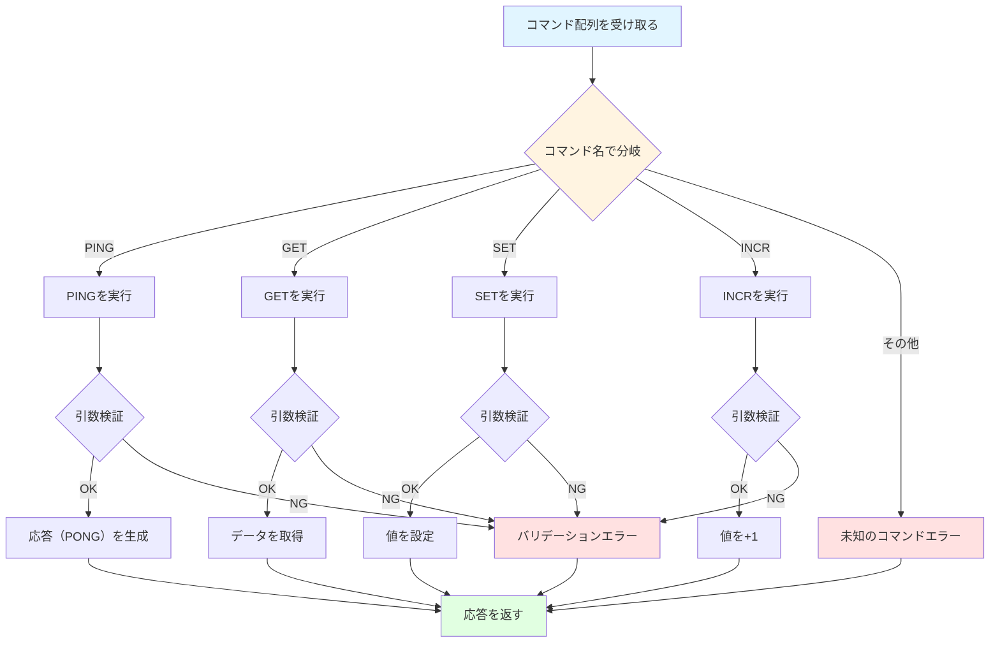

# Redisコマンドの実装

## 学習目標

このセクションでは、コマンド実行部の役割と設計、4つの基本コマンドの仕様と実装（PING, GET, SET, INCR）、エラーハンドリングのパターンとエラーメッセージの形式について学びます。

所要時間: 約20分（理論5分＋実装15分）

## 前提知識

RESPプロトコルのエンコード方法、そしてPythonの例外処理を理解していることを前提としています。

## ストレージ操作（`storage.py`）

まず、値の入出力を行う `DataStore`（`mini_redis/storage.py`）を実装していきましょう。`DataStore`は値の保存と取得、削除といった最小限の責務だけを持つこととします。また、後のセクション（[04-expiry.md](04-expiry.md)）で有効期限管理を実装するために、値とともに有効期限情報も保持できる構造にしておきます。

### DataStore全体の骨格

`DataStore`は内部に`dict[str, StoreEntry]`を持ち、初期化時に空の辞書を生成するだけです。`StoreEntry`は保存された値（`value`）と有効期限（`expiry_at`）を持ちます。コマンド側からは非同期処理の中で呼び出されますが、ストレージ内では同期処理として完結しているため追加のロックやawaitは不要です。

```python
from dataclasses import dataclass, field

@dataclass
class StoreEntry:
    value: str
    expiry_at: int | None = field(default=None)

class DataStore:
    def __init__(self) -> None:
        self._data: dict[str, StoreEntry] = {}

    def get(self, key: str) -> str | None:
        # ...

    def set(self, key: str, value: str) -> None:
        # ...

    def delete(self, key: str) -> bool:
        # ...
```

この3メソッドが揃えば、GET/SET/DELETEに必要な最小のストレージAPIが完成します。以降、コマンドは（必要な場合は）期限チェック→`DataStore`操作→RESP変換という流れで実装していきます。

### get: 値を読み出す
- 目的: キーに紐づく値を取得する  
- 仕様: キーが存在すれば`str`、存在しなければ`None`を返す  
- 実装ポイント: `dict.get()` を利用し、存在しない場合に例外を投げないようにする。エントリが存在する場合だけ`StoreEntry.value`を返す。

```python
def get(self, key: str) -> str | None:
    entry = self._data.get(key)
    return entry.value if entry else None
```

### set: 値を保存する
- 目的: キーに値を設定し、既存の有効期限をリセットする  
- 仕様: 常に新しい`StoreEntry`を作成して保存する  
- 実装ポイント: `StoreEntry`の`expiry_at`はデフォルト`None`。再設定時には古いエントリを丸ごと置き換えることで期限をクリアする。

```python
def set(self, key: str, value: str) -> None:
    self._data[key] = StoreEntry(value=value)
```

### delete: 値を取り除く
- 目的: 指定したキーを削除し、削除できたかどうかを返す  
- 仕様: 削除できれば`True`、キーがなければ`False`  
- 実装ポイント: `dict.pop()`を例外処理付きで使うと戻り値の制御がしやすい。

```python
def delete(self, key: str) -> bool:
    try:
        self._data.pop(key)
        return True
    except KeyError:
        return False
```


## コマンド実行（`commands.py`）

`commands.py` は、パースされたコマンドを受け取り、引数の数や型といった必要な検証を行った後、そのコマンドに対応する処理を実行します。実行結果に応じて、適切なRESPデータ型ラッパー（`SimpleString`、`BulkString`、`Integer`、`RedisError`、`Array`）で返却します。

### コマンド実行のフロー



### 実装例

実装例は以下のとおりです。このセクションでは基本的な4つのコマンド（PING、GET、SET、INCR）のみを実装します。

```python
from mini_redis.protocol import SimpleString, BulkString, Integer, RedisError, Array

class Commands:
    def __init__(self, storage: Storage):
        self._store = storage

    async def execute(self, command: list[str]) -> SimpleString | BulkString | Integer | RedisError | Array:
        """コマンドを実行する"""
        if not command:
            raise CommandError("ERR empty command")

        # コマンド名を大文字に正規化
        cmd_name = command[0].upper()
        args = command[1:]

        # ルーティング
        if cmd_name == "PING":
            return await self.execute_ping(args)
        elif cmd_name == "GET":
            return await self.execute_get(args)
        elif cmd_name == "SET":
            return await self.execute_set(args)
        elif cmd_name == "INCR":
            return await self.execute_incr(args)
        else:
            raise CommandError(f"ERR unknown command '{cmd_name}'")

    async def execute_ping(self, args: list[str]) -> SimpleString | BulkString:
        """PINGコマンドを実行"""
        # 実装...
        pass
```

## 各コマンドの仕様と実装

### 1. PINGコマンド

用途: 接続確認、サーバの応答性テスト

構文:
`PING`は引数なし、または`PING message`でメッセージをエコーバックします。

応答:
引数がない場合は`"PONG"`（Simple String）を返し、引数がある場合は`message`をそのまま返します（Bulk String）。

実装例:

```python
async def execute_ping(self, args: list[str]) -> SimpleString | BulkString:
    """PINGコマンドを実行"""
    if len(args) == 0:
        # 引数なし: PONGを返す（Simple String）
        return SimpleString("PONG")
    elif len(args) == 1:
        # 引数あり: メッセージをエコーバック（Bulk String）
        return BulkString(args[0])
    else:
        # 引数が多すぎる
        raise CommandError("ERR wrong number of arguments for 'ping' command")
```

redis-cliでの実行例:

```bash
> PING
PONG

> PING "hello"
"hello"

> PING "Hello, Redis!"
"Hello, Redis!"
```

[ドキュメント](https://redis.io/docs/latest/commands/ping/)


### 2. GETコマンド

用途: キーの値を取得

構文: `GET key`

応答:
- キーが存在: 値を返す（Bulk String）
- キーが存在しない: `None`（Null Bulk String）

実装例:

```python
async def execute_get(self, args: list[str]) -> BulkString:
    """GETコマンドを実行"""
    # 引数検証
    if len(args) != 1:
        raise CommandError("ERR wrong number of arguments for 'get' command")

    key = args[0]

    # 値を取得（BulkStringでラップ）
    return BulkString(self._store.get(key))
```

redis-cliでの実行例:

```bash
> SET mykey "Hello"
OK

> GET mykey
"Hello"

> GET nonexistent
(nil)
```

[ドキュメント](https://redis.io/docs/latest/commands/get/)


### 3. SETコマンド

用途: キーに値を設定

構文: `SET key value`

応答: `"OK"`（Simple String）

実装:

```python
async def execute_set(self, args: list[str]) -> SimpleString:
    """SETコマンドを実行"""
    # 引数検証
    if len(args) != 2:
        raise CommandError("ERR wrong number of arguments for 'set' command")

    key = args[0]
    value = args[1]

    # 値を設定
    self._store.set(key, value)

    return SimpleString("OK")
```

redis-cliでの実行例:

```bash
> SET name "Alice"
OK

> SET counter "42"
OK

> GET name
"Alice"
```

[ドキュメント](https://redis.io/docs/latest/commands/set/)


### 4. INCRコマンド

用途: 整数値をインクリメント（+1）

構文: `INCR key`

応答:
- インクリメント後の値（Integer）

動作:
- キーが存在しない: 0から開始して1を返す
- キーの値が整数: インクリメントした値を返す
- キーの値が整数でない: エラー

実装例:

```python
async def execute_incr(self, args: list[str]) -> Integer:
    """INCRコマンドを実行"""
    # 引数検証
    if len(args) != 1:
        raise CommandError("ERR wrong number of arguments for 'incr' command")

    key = args[0]

    # 現在の値を取得
    current = self._store.get(key)

    if current is None:
        # キーが存在しない: 0から開始
        self._store.set(key, "1")
        return Integer(1)

    # 整数に変換を試みる
    try:
        value = int(current)
    except ValueError:
        raise CommandError("ERR value is not an integer or out of range")

    # インクリメント
    new_value = value + 1
    self._store.set(key, str(new_value))

    return Integer(new_value)
```

redis-cliでの実行例:

```bash
> INCR counter
(integer) 1

> INCR counter
(integer) 2

> SET mykey "hello"
OK

> INCR mykey
(error) ERR value is not an integer or out of range
```

[ドキュメント](https://redis.io/docs/latest/commands/incr/)

## エラーハンドリング

### CommandErrorの定義

```python
class CommandError(Exception):
    """コマンド実行エラー"""
    pass
```

### エラーメッセージの形式

Redisのエラーメッセージは、以下の形式に従います：

| エラー種別 | 形式 | 例 |
|-----------|------|-----|
| 未知のコマンド | `ERR unknown command '{cmd}'` | 127.0.0.1:6380> UNKNOWN 1 <br/>(error) ERR unknown command 'UNKNOWN', with args beginning with: '1' |
| 引数数エラー | `ERR wrong number of arguments for '{cmd}' command` | 127.0.0.1:6380> SET hoge <br/>(error) ERR wrong number of arguments for 'set' command |
| 型エラー | `ERR value is not an integer or out of range` | 127.0.0.1:6380> EXPIRE key hoge <br/>(error) ERR value is not an integer or out of range |
| 一般エラー | `ERR {message}` |  |

### クライアントハンドラとの統合とエラーハンドリングの実装例

[01-tcp-server.md](01-tcp-server.md) では、server.pyにエコーサーバーを実装しました。クライアントハンドラにコマンド実行とエラーハンドリングを組み込むことで、サービスとして機能させます。

```python
async def handle(self, reader: StreamReader, writer: StreamWriter) -> None:

    addr = writer.get_extra_info("peername")
    logger.info(f"Client connected: {addr}")

    try:
        while True:
            try:                
                # コマンドをパース
                command = await self._protocol.parse_command(reader)

                # コマンドを実行（型ラッパーが返ってくる）
                result = await self._handler.execute(command)

                # 応答をエンコード（型ラッパーに基づいて適切な形式に変換）
                response = self._protocol.encode_response(result)

            except CommandError as e:
                # コマンド実行エラー（RedisErrorでラップしてエンコード）
                response = self._protocol.encode_response(RedisError(str(e)))

            except asyncio.IncompleteReadError:
                # クライアントが接続を切断した
                logger.info(f"Client disconnected: {addr}")
                break

            except ConnectionResetError:
                # 接続がリセットされた
                logger.info(f"Connection reset: {addr}")
                break

            except Exception as e:
                # 予期しないエラー
                logger.exception("Unexpected error")
                response = self._protocol.encode_response(RedisError("ERR internal server error"))

            # 応答を送信
            writer.write(response)
            await writer.drain()

    finally:
        # 必ずクリーンアップ
        writer.close()
        await writer.wait_closed()
        logger.info(f"Connection closed: {addr}")
```

## 実装ガイド（ハンズオン）

ここまで学んだ内容を活かして、ストレージ層とコマンド実行層を実装しましょう！

### パート1: データストレージ層の実装

#### 実装する内容

1. `mini_redis/storage.py` を開く
2. 基本操作を実装
   - `get()`: キーの値を取得
   - `set()`: キーに値を設定
   - `delete()`: キーを削除

#### テストで確認

```bash
pytest tests/step03_commands/test_storage.py -v
```

### パート2: コマンド実行層の実装

#### 実装する内容

1. `mini_redis/commands.py` を開く
2. `execute()` メソッドを実装
   - コマンド名を取得し、対応するメソッドにルーティング
3. 各コマンドを実装
   - `execute_ping()`: "PONG"を返す
   - `execute_get()`: キーの値を取得
   - `execute_set()`: キーに値を設定
   - `execute_incr()`: 値を1増加

#### テストで確認

```bash
pytest tests/step03_commands/test_commands.py -v
```

#### テストで確認

```bash
# コマンドテストを実行
pytest tests/step03_commands/test_commands.py -v

# すべてのテストを実行（ストレージ + コマンド）
pytest tests/step03_commands/ -v

# 特定のコマンドのみ
pytest tests/step03_commands/test_commands.py::TestStep03PingCommand -v
pytest tests/step03_commands/test_commands.py::TestStep03IncrCommand -v
```

### パート3: クライアントハンドラの実装

#### 実装する内容

1. `mini_redis/server.py` を開く
2. `handle()` メソッドを修正
   - コマンドのパース、実行、応答送信の流れを実装
   - `CommandError` をキャッチして適切なエラーメッセージを応答として送信

## 動作確認の手順

### 1. サーバを起動

```bash
python -m mini_redis
```

### 2. redis-cliで接続

```bash
redis-cli -p 6379
```

### 3. 各コマンドをテスト

基本操作:

```bash
> PING
PONG

> SET mykey "Hello, World!"
OK

> GET mykey
"Hello, World!"
```

カウンター:

```bash
> SET counter "0"
OK

> INCR counter
(integer) 1

> INCR counter
(integer) 2

> INCR counter
(integer) 3

> GET counter
"3"
```

エラーケース:

```bash
> GET
(error) ERR wrong number of arguments for 'get' command

> HELLO
(error) ERR unknown command 'HELLO'

> SET text "not a number"
OK

> INCR text
(error) ERR value is not an integer or out of range
```

## 次のステップ

基本コマンドの実装を学びました。次は、有効期限管理の2段階メカニズム（Passive + Active Expiry）を実装します。

👉 次のセクション: [04-expiry.md](04-expiry.md)
