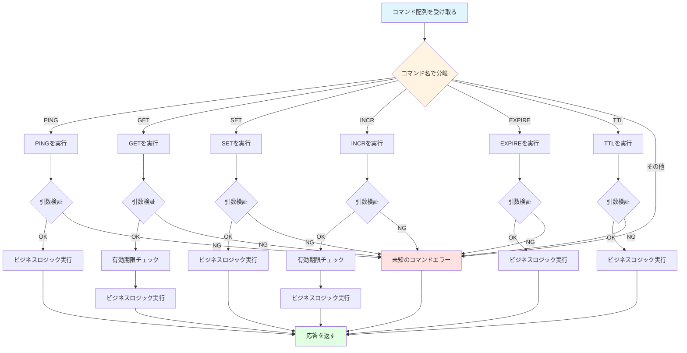
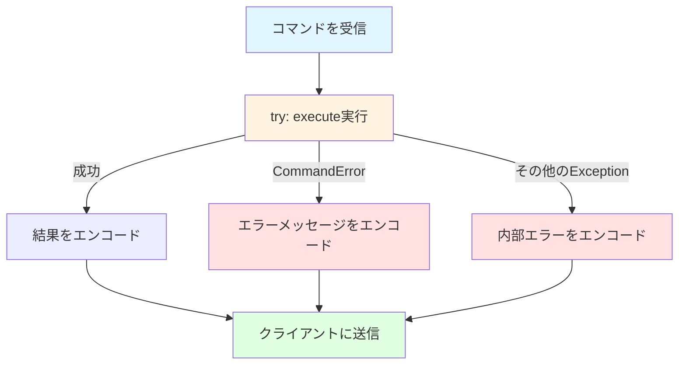

# Redisコマンドの実装

## 学習目標

このセクションでは、以下の内容を学びます：

- コマンド実行層の役割と設計
- 6つの基本コマンドの仕様と実装（PING, GET, SET, INCR, EXPIRE, TTL）
- エラーハンドリングのパターンとエラーメッセージの形式
- Passive Expiryの統合方法
- redis-cliでの動作確認方法

**所要時間**: 約20分（理論5分＋実装15分）

## 前提知識

- Storageレイヤーの基本操作（get/set/delete）
- RESPプロトコルのエンコード方法
- Pythonの例外処理

## コマンド実行層の役割

**コマンド実行層**（`commands.py`）は、パースされたコマンドを受け取り、適切な処理を実行するレイヤーです。

### 主な責務

| 責務 | 説明 | 例 |
|------|------|-----|
| **ルーティング** | コマンド名に応じて適切な処理を呼び出す | "GET" → `_get()`, "SET" → `_set()` |
| **引数検証** | コマンドの引数数・型をチェック | GETは引数1つ必須 |
| **ビジネスロジック** | コマンドの仕様に従った処理を実行 | INCRは値を+1して返す |
| **応答生成** | 実行結果を適切なRESP型で返す | 成功 → `OK`, エラー → `-ERR ...` |

### コマンド実行のフロー



### 基本的な実装パターン

```python
class Commands:
    def __init__(self, storage: Storage, expiry: ExpiryManager):
        self._storage = storage
        self._expiry = expiry

    async def execute(self, command: list[str]) -> str | int | None:
        """コマンドを実行する"""
        if not command:
            raise CommandError("ERR empty command")

        # コマンド名を大文字に正規化
        cmd_name = command[0].upper()

        # ルーティング
        if cmd_name == "PING":
            return await self._ping(command[1:])
        elif cmd_name == "GET":
            return await self._get(command[1:])
        elif cmd_name == "SET":
            return await self._set(command[1:])
        elif cmd_name == "INCR":
            return await self._incr(command[1:])
        elif cmd_name == "EXPIRE":
            return await self._expire(command[1:])
        elif cmd_name == "TTL":
            return await self._ttl(command[1:])
        else:
            raise CommandError(f"ERR unknown command '{cmd_name}'")

    async def _ping(self, args: list[str]) -> str:
        """PINGコマンドを実行"""
        # 実装...
        pass
```

## 各コマンドの仕様と実装

### 1. PINGコマンド

**用途**: 接続確認、サーバの応答性テスト

**構文**:
- `PING`: 引数なし
- `PING message`: メッセージをエコーバック

**応答**:
- 引数なし: `"PONG"`（Simple String）
- 引数あり: `message`をそのまま返す（Bulk String）

**実装**:

```python
async def _ping(self, args: list[str]) -> str:
    """PINGコマンドを実行"""
    if len(args) == 0:
        # 引数なし: PONGを返す
        return "PONG"
    elif len(args) == 1:
        # 引数あり: メッセージをエコーバック
        return args[0]
    else:
        # 引数が多すぎる
        raise CommandError("ERR wrong number of arguments for 'ping' command")
```

**redis-cliでの実行例**:

```bash
> PING
PONG

> PING "hello"
"hello"

> PING "Hello, Redis!"
"Hello, Redis!"
```

### 2. GETコマンド

**用途**: キーの値を取得

**構文**: `GET key`

**応答**:
- キーが存在: 値を返す（Bulk String）
- キーが存在しない: `None`（Null Bulk String）
- キーが期限切れ: `None`（削除してからNull返却）

**実装**:

```python
async def _get(self, args: list[str]) -> str | None:
    """GETコマンドを実行"""
    # 引数検証
    if len(args) != 1:
        raise CommandError("ERR wrong number of arguments for 'get' command")

    key = args[0]

    # Passive Expiry: 期限切れチェック
    if self._expiry.check_and_remove_expired(key):
        # 期限切れなので削除済み
        return None

    # 値を取得
    return self._storage.get(key)
```

**redis-cliでの実行例**:

```bash
> SET mykey "Hello"
OK

> GET mykey
"Hello"

> GET nonexistent
(nil)
```

### 3. SETコマンド

**用途**: キーに値を設定

**構文**: `SET key value`

**応答**: `"OK"`（Simple String）

**実装**:

```python
async def _set(self, args: list[str]) -> str:
    """SETコマンドを実行"""
    # 引数検証
    if len(args) != 2:
        raise CommandError("ERR wrong number of arguments for 'set' command")

    key = args[0]
    value = args[1]

    # 値を設定
    self._storage.set(key, value)

    return "OK"
```

**redis-cliでの実行例**:

```bash
> SET name "Alice"
OK

> SET counter "42"
OK

> GET name
"Alice"
```

### 4. INCRコマンド

**用途**: 整数値をインクリメント（+1）

**構文**: `INCR key`

**応答**:
- インクリメント後の値（Integer）

**動作**:
- キーが存在しない: 0から開始して1を返す
- キーの値が整数: インクリメントした値を返す
- キーの値が整数でない: エラー

**実装**:

```python
async def _incr(self, args: list[str]) -> int:
    """INCRコマンドを実行"""
    # 引数検証
    if len(args) != 1:
        raise CommandError("ERR wrong number of arguments for 'incr' command")

    key = args[0]

    # Passive Expiry: 期限切れチェック
    if self._expiry.check_and_remove_expired(key):
        # 期限切れなので、0から開始
        self._storage.set(key, "1")
        return 1

    # 現在の値を取得
    current = self._storage.get(key)

    if current is None:
        # キーが存在しない: 0から開始
        self._storage.set(key, "1")
        return 1

    # 整数に変換を試みる
    try:
        value = int(current)
    except ValueError:
        raise CommandError("ERR value is not an integer or out of range")

    # インクリメント
    new_value = value + 1
    self._storage.set(key, str(new_value))

    return new_value
```

**redis-cliでの実行例**:

```bash
> INCR counter
(integer) 1

> INCR counter
(integer) 2

> SET mykey "hello"
OK

> INCR mykey
(error) ERR value is not an integer or out of range
```

### 5. EXPIREコマンド

**用途**: キーに有効期限（秒）を設定

**構文**: `EXPIRE key seconds`

**応答**:
- キーが存在し、期限設定成功: `1`（Integer）
- キーが存在しない: `0`（Integer）

**実装**:

```python
async def _expire(self, args: list[str]) -> int:
    """EXPIREコマンドを実行"""
    # 引数検証
    if len(args) != 2:
        raise CommandError("ERR wrong number of arguments for 'expire' command")

    key = args[0]

    # 秒数を整数に変換
    try:
        seconds = int(args[1])
    except ValueError:
        raise CommandError("ERR value is not an integer or out of range")

    # 負の秒数はエラー
    if seconds < 0:
        raise CommandError("ERR invalid expire time in 'expire' command")

    # Passive Expiry: 期限切れチェック
    if self._expiry.check_and_remove_expired(key):
        # 期限切れなので存在しない
        return 0

    # キーが存在するかチェック
    if self._storage.get(key) is None:
        return 0

    # 有効期限を設定
    self._expiry.set_expiry(key, seconds)
    return 1
```

**redis-cliでの実行例**:

```bash
> SET mykey "Hello"
OK

> EXPIRE mykey 60
(integer) 1

> EXPIRE nonexistent 60
(integer) 0

> TTL mykey
(integer) 59
```

### 6. TTLコマンド

**用途**: キーの残り有効期限（秒）を取得

**構文**: `TTL key`

**応答**:
- 有効期限あり: 残り秒数（Integer）
- 有効期限なし: `-1`（Integer）
- キーが存在しない: `-2`（Integer）

**実装**:

```python
async def _ttl(self, args: list[str]) -> int:
    """TTLコマンドを実行"""
    # 引数検証
    if len(args) != 1:
        raise CommandError("ERR wrong number of arguments for 'ttl' command")

    key = args[0]

    # Passive Expiry: 期限切れチェック
    if self._expiry.check_and_remove_expired(key):
        # 期限切れなので存在しない
        return -2

    # キーが存在するかチェック
    if self._storage.get(key) is None:
        return -2

    # 有効期限を取得
    ttl = self._expiry.get_ttl(key)

    if ttl is None:
        # 有効期限が設定されていない
        return -1

    return ttl
```

**redis-cliでの実行例**:

```bash
> SET mykey "Hello"
OK

> EXPIRE mykey 60
(integer) 1

> TTL mykey
(integer) 59

> TTL mykey
(integer) 58

> SET persistent "forever"
OK

> TTL persistent
(integer) -1

> TTL nonexistent
(integer) -2
```

## エラーハンドリング

### CommandErrorの定義

```python
class CommandError(Exception):
    """コマンド実行エラー"""
    pass
```

### エラーメッセージの形式

Redisのエラーメッセージは、以下の形式に従います：

| エラー種別 | 形式 | 例 |
|-----------|------|-----|
| 未知のコマンド | `ERR unknown command '{cmd}'` | `ERR unknown command 'HELLO'` |
| 引数数エラー | `ERR wrong number of arguments for '{cmd}' command` | `ERR wrong number of arguments for 'get' command` |
| 型エラー | `ERR value is not an integer or out of range` | （INCRで非整数値） |
| 一般エラー | `ERR {message}` | `ERR invalid expire time` |

### エラーハンドリングのフロー



### サーバ側の実装例

```python
async def handle_client(reader: StreamReader, writer: StreamWriter) -> None:
    parser = RESPParser()
    commands = Commands(storage, expiry)

    try:
        while True:
            # コマンドをパース
            command = await parser.parse_command(reader)

            try:
                # コマンドを実行
                result = await commands.execute(command)

                # 応答をエンコード
                response = encode_response(result)

            except CommandError as e:
                # コマンド実行エラー
                response = encode_error(str(e))

            except Exception as e:
                # 予期しないエラー
                logger.exception("Unexpected error")
                response = encode_error("ERR internal server error")

            # 応答を送信
            writer.write(response)
            await writer.drain()

    except asyncio.IncompleteReadError:
        # クライアント切断
        pass

    finally:
        writer.close()
        await writer.wait_closed()
```

## Passive Expiryの統合

### Passive Expiryとは

**Passive Expiry**は、コマンド実行時に有効期限をチェックし、期限切れのキーを削除する仕組みです。

### 統合ポイント

以下のコマンドでは、処理の**最初**にPassive Expiryチェックを行います：

| コマンド | チェックタイミング |
|---------|------------------|
| `GET` | キー取得前 |
| `INCR` | 値読み取り前 |
| `EXPIRE` | 期限設定前 |
| `TTL` | TTL取得前 |

**SETコマンドではチェック不要**: 新しい値で上書きされるため。

### 実装パターン

```python
async def _get(self, args: list[str]) -> str | None:
    key = args[0]

    # ✅ Passive Expiryチェック
    if self._expiry.check_and_remove_expired(key):
        # 期限切れで削除済み
        return None

    # 値を取得
    return self._storage.get(key)
```

### check_and_remove_expired()の動作

```python
def check_and_remove_expired(self, key: str) -> bool:
    """
    キーが期限切れかチェックし、期限切れなら削除する

    Returns:
        True: 期限切れで削除した
        False: 期限内または期限未設定
    """
    expiry_time = self._storage.get_expiry(key)

    if expiry_time is None:
        # 有効期限が設定されていない
        return False

    current_time = int(time.time())

    if current_time >= expiry_time:
        # 期限切れ: キーを削除
        self._storage.delete(key)
        return True

    # 期限内
    return False
```

## 動作確認の手順

### 1. サーバを起動

```bash
python -m mini_redis
```

### 2. redis-cliで接続

```bash
redis-cli -p 6379
```

### 3. 各コマンドをテスト

**基本操作**:

```bash
> PING
PONG

> SET mykey "Hello, World!"
OK

> GET mykey
"Hello, World!"
```

**カウンター**:

```bash
> SET counter "0"
OK

> INCR counter
(integer) 1

> INCR counter
(integer) 2

> INCR counter
(integer) 3

> GET counter
"3"
```

**有効期限**:

```bash
> SET temp "temporary data"
OK

> EXPIRE temp 10
(integer) 1

> TTL temp
(integer) 9

> GET temp
"temporary data"

# 10秒後
> GET temp
(nil)

> TTL temp
(integer) -2
```

**エラーケース**:

```bash
> GET
(error) ERR wrong number of arguments for 'get' command

> HELLO
(error) ERR unknown command 'HELLO'

> SET text "not a number"
OK

> INCR text
(error) ERR value is not an integer or out of range
```

## テストの実行

### コマンドのテスト

```bash
# 全コマンドのテスト
pytest tests/test_commands.py -v

# 特定のコマンドのみ
pytest tests/test_commands.py::TestCommands::test_ping -v
pytest tests/test_commands.py::TestCommands::test_get_set -v
pytest tests/test_commands.py::TestCommands::test_incr -v
```

### デバッグのヒント

```python
# コマンド実行のログ
async def execute(self, command: list[str]) -> str | int | None:
    logger.info(f"Executing: {command}")

    try:
        result = await self._process(command)
        logger.info(f"Result: {result}")
        return result
    except CommandError as e:
        logger.error(f"Command error: {e}")
        raise
```

## 次のステップ

基本コマンドの実装を学びました。次は、有効期限管理の2段階メカニズム（Passive + Active Expiry）を実装します。

👉 次のセクション: [04-expiry.md](04-expiry.md)

**実装に進む前に**:
- `mini_redis/commands.py`のTODOコメントを確認
- `mini_redis/storage.py`でストレージ操作を実装
- `tests/test_commands.py`でテストを実行

## 参考資料

- [Redisコマンドリファレンス](https://redis.io/commands/): 各コマンドの詳細仕様
- [Python例外処理](https://docs.python.org/3/tutorial/errors.html): 例外処理のベストプラクティス

## まとめ

- コマンド実行層はルーティング、引数検証、ビジネスロジック、応答生成を担当
- 6つの基本コマンド: PING, GET, SET, INCR, EXPIRE, TTL
- エラーメッセージはRedis互換の形式で返す
- Passive Expiryを統合し、期限切れキーを自動削除
- redis-cliで動作確認とデバッグを行う
- テストで実装の正確性を検証

これらの知識を使って、Mini-Redisのコマンド実行層を実装しましょう！
