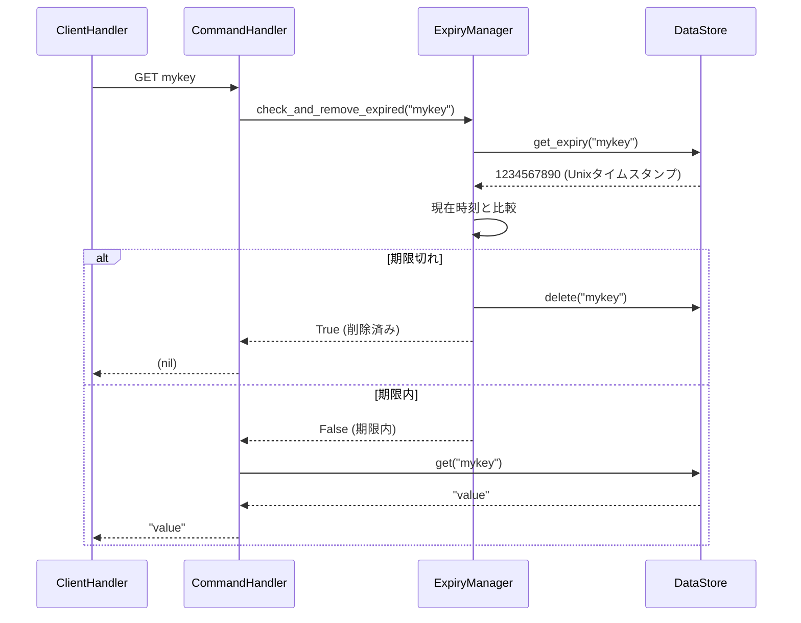
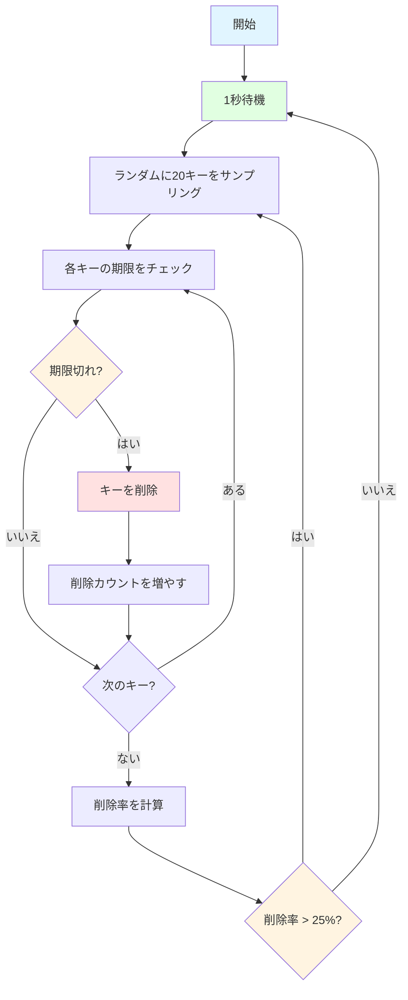

# 有効期限管理（Expiry Management）

## 学習目標

このセクションでは、有効期限管理の必要性とユースケース、Passive Expiryの動作原理と実装、Active Expiryの動作原理とアルゴリズム、EXPIRE/TTLコマンドの実装、asyncioでのバックグラウンドタスクの実装について学びます。

## 前提知識

[Unix time](https://en.wikipedia.org/wiki/Unix_time)の概念、asyncioタスク管理（`create_task()`, `cancel()`）、そしてStorageレイヤーの操作（get/set/delete）を理解していることを前提としています。

## 有効期限管理の必要性

### なぜ有効期限が必要か

インメモリデータベースでは、不要になったデータを自動削除しないと、メモリが枯渇してしまいます。

例えば、以下のように1時間に10,000個のセッションキーが作成されたとしましょう。

```python
# 1時間に10,000個のセッションキーを作成
for i in range(10000):
    redis.set(f"session:{i}", f"data_{i}")
```

時間が経つと、多くのセッションは無効（ユーザーがログアウト済み）になリますが、メモリには残り続けてしまいます。有効期限を設定し、不要なデータが適切に消去されるようにする必要があります。

### ユースケース

| ユースケース | 有効期限 | 理由 |
|------------|---------|------|
| セッション管理 | 30分〜24時間 | ユーザーの非アクティブ期間後に自動削除 |
| キャッシュ | 1分〜1時間 | 古いデータを自動的に無効化 |
| レート制限 | 1分〜1時間 | 時間枠ごとにカウンターをリセット |
| 一時トークン | 数分 | ワンタイムパスワードやトークンの有効期限 |

### Redisの2段階有効期限管理

Redisは、Passive ExpiryとActive Expiryの2つのメカニズムを組み合わせて、効率的にメモリを管理します。本セクションでは、段階的にこれらの機能を実装していきます。

## ステップ1: EXPIREおよびTTLコマンドの実装

まずは、EXPIREとTTLコマンドを実装します。
- EXPIRE: キーに有効期限を設定
- TTL: キーの残り有効期限を取得
この2つのコマンドを実装するためには、有効期限の設定および取得機能が必要です。それらの機能は、`ExpiryManager`クラスに実装します。

### ExpiryManagerの基本構造

有効期限管理を担当する`ExpiryManager`クラスを作成します。まずはEXPIRE/TTLに必要な機能のみを実装します。

```python
import time
from mini_redis.storage import DataStore

class ExpiryManager:
    """有効期限管理を担当するクラス"""

    def __init__(self, store: DataStore):
        self._store = store
```

### 有効期限の設定と取得

EXPIRE/TTLコマンドに必要な2つのメソッドを実装します。

```python
def set_expiry(self, key: str, seconds: int) -> None:
    """
    キーに有効期限を設定する

    Args:
        key: 対象キー
        seconds: 有効期限（秒）
    """
    expiry_time = int(time.time()) + seconds
    self._store.set_expiry(key, expiry_time)

def get_ttl(self, key: str) -> int | None:
    """
    キーの残り有効期限（秒）を取得する

    Args:
        key: 対象キー

    Returns:
        残り秒数、または None（期限未設定）
    """
    expiry_time = self._store.get_expiry(key)

    if expiry_time is None:
        return None

    current_time = int(time.time())
    ttl = expiry_time - current_time

    # 期限切れの場合は0を返す
    return max(0, ttl)
```

### CommandHandlerへの統合

実装した`ExpiryManager`のメソッドは、`CommandHandler`クラスで使用します。`CommandHandler`クラスに`ExpiryManager`を追加しましょう。

```python
class CommandHandler:
    def __init__(self, store: DataStore, expiry: ExpiryManager):
        self._store = store
        self._expiry = expiry
```

### EXPIREコマンドの実装

EXPIREコマンドを実装して、クライアントから有効期限を設定できるようにします。

**用途**: キーに有効期限（秒）を設定

**構文**: `EXPIRE key seconds`

**応答**:
- キーが存在し、期限設定成功: `1`（Integer）
- キーが存在しない: `0`（Integer）

#### 実装

```python
async def execute_expire(self, args: list[str]) -> Integer:
    """EXPIREコマンドを実行"""
    # 引数検証
    if len(args) != 2:
        raise CommandError("ERR wrong number of arguments for 'expire' command")

    key = args[0]

    # 秒数を整数に変換
    try:
        seconds = int(args[1])
    except ValueError:
        raise CommandError("ERR value is not an integer or out of range")

    # 負の秒数はエラー
    if seconds < 0:
        raise CommandError("ERR invalid expire time in 'expire' command")

    # キーが存在するかチェック
    if self._store.get(key) is None:
        return Integer(0)

    # 有効期限を設定
    self._expiry.set_expiry(key, seconds)
    return Integer(1)
```

**参考**: [ドキュメント](https://redis.io/docs/latest/commands/expire/)

### TTLコマンドの実装

TTLコマンドを実装して、キーの残り有効期限を確認できるようにします。

**用途**: キーの残り有効期限（秒）を取得

**構文**: `TTL key`

**応答**:
- 有効期限あり: 残り秒数（Integer）
- 有効期限なし: `-1`（Integer）
- キーが存在しない: `-2`（Integer）

#### 実装

```python
async def execute_ttl(self, args: list[str]) -> Integer:
    """TTLコマンドを実行"""
    # 引数検証
    if len(args) != 1:
        raise CommandError("ERR wrong number of arguments for 'ttl' command")

    key = args[0]

    # キーが存在するかチェック
    if self._store.get(key) is None:
        return Integer(-2)

    # 有効期限を取得
    ttl = self._expiry.get_ttl(key)

    if ttl is None:
        # 有効期限が設定されていない
        return Integer(-1)

    return Integer(ttl)
```

```bash
> SET mykey "Hello"
OK

> EXPIRE mykey 60
(integer) 1

> TTL mykey
(integer) 59

> SET persistent "forever"
OK

> TTL persistent
(integer) -1

> TTL nonexistent
(integer) -2
```

**参考**: [ドキュメント](https://redis.io/docs/latest/commands/ttl/)

### コマンドルーティングへの追加

`CommandHandler`クラスの`execute()`メソッドでは、リクエストされたコマンドに応じて処理を実行していました。ここにEXPIRE/TTLコマンドを追加します。

```python
async def execute(self, command: list[str]) -> SimpleString | BulkString | Integer | RedisError | Array:
    """コマンドを実行する"""
    if not command:
        raise CommandError("ERR empty command")

    cmd_name = command[0].upper()
    args = command[1:]

    # ルーティング（EXPIRE/TTLを追加）
    if cmd_name == "PING":
        return await self.execute_ping(args)
    elif cmd_name == "GET":
        return await self.execute_get(args)
    elif cmd_name == "SET":
        return await self.execute_set(args)
    elif cmd_name == "INCR":
        return await self.execute_incr(args)
    elif cmd_name == "EXPIRE":
        return await self.execute_expire(args)
    elif cmd_name == "TTL":
        return await self.execute_ttl(args)
    else:
        raise CommandError(f"ERR unknown command '{cmd_name}'")
```

これで、EXPIRE/TTLコマンドが動作するようになりました！ただし、まだ有効期限が切れたキーは自動削除されません。次のステップでPassive Expiryを実装します。

## ステップ2: Passive Expiryの実装

Passive Expiryは、キーにアクセスされた時に有効期限をチェックし、期限切れなら削除する仕組みです。

### 動作原理

Passive Expiryの動作フロー:




### ExpiryManagerへのcheck_and_remove_expiredの追加

Passive Expiryを実現するため、`ExpiryManager`に期限切れチェック機能を追加します。

```python
def check_and_remove_expired(self, key: str) -> bool:
    """
    キーが期限切れかチェックし、期限切れなら削除する

    Args:
        key: チェックするキー

    Returns:
        True: 期限切れで削除した
        False: 期限内または期限未設定
    """
    # 有効期限を取得
    expiry_time = self._store.get_expiry(key)

    if expiry_time is None:
        # 有効期限が設定されていない
        return False

    # 現在時刻と比較
    current_time = int(time.time())

    if current_time >= expiry_time:
        # 期限切れ: キーを削除
        self._store.delete(key)
        return True

    # 期限内
    return False
```

### 既存コマンドへのPassive Expiryの追加

GET、INCR、EXPIRE、TTLの各コマンドに、キーにアクセスする前にPassive Expiryチェックを追加します。

#### GETコマンドの更新

```python
async def execute_get(self, args: list[str]) -> BulkString:
    """GETコマンドを実行（Passive Expiry追加）"""
    if len(args) != 1:
        raise CommandError("ERR wrong number of arguments for 'get' command")

    key = args[0]

    # Passive Expiry: 期限切れチェック
    if self._expiry.check_and_remove_expired(key):
        return BulkString(None)

    return BulkString(self._store.get(key))
```

#### INCRコマンドの更新

```python
async def execute_incr(self, args: list[str]) -> Integer:
    """INCRコマンドを実行（Passive Expiry追加）"""
    if len(args) != 1:
        raise CommandError("ERR wrong number of arguments for 'incr' command")

    key = args[0]

    # Passive Expiry: 期限切れチェック
    if self._expiry.check_and_remove_expired(key):
        self._store.set(key, "1")
        return Integer(1)

    current = self._store.get(key)
    if current is None:
        self._store.set(key, "1")
        return Integer(1)

    try:
        value = int(current)
    except ValueError:
        raise CommandError("ERR value is not an integer or out of range")

    new_value = value + 1
    self._store.set(key, str(new_value))
    return Integer(new_value)
```

#### EXPIREコマンドの更新

```python
async def execute_expire(self, args: list[str]) -> Integer:
    """EXPIREコマンドを実行（Passive Expiry追加）"""
    if len(args) != 2:
        raise CommandError("ERR wrong number of arguments for 'expire' command")

    key = args[0]

    try:
        seconds = int(args[1])
    except ValueError:
        raise CommandError("ERR value is not an integer or out of range")

    if seconds < 0:
        raise CommandError("ERR invalid expire time in 'expire' command")

    # Passive Expiry: 期限切れチェック
    if self._expiry.check_and_remove_expired(key):
        return Integer(0)

    if self._store.get(key) is None:
        return Integer(0)

    self._expiry.set_expiry(key, seconds)
    return Integer(1)
```

#### TTLコマンドの更新

```python
async def execute_ttl(self, args: list[str]) -> Integer:
    """TTLコマンドを実行（Passive Expiry追加）"""
    if len(args) != 1:
        raise CommandError("ERR wrong number of arguments for 'ttl' command")

    key = args[0]

    # Passive Expiry: 期限切れチェック
    if self._expiry.check_and_remove_expired(key):
        return Integer(-2)

    if self._store.get(key) is None:
        return Integer(-2)

    ttl = self._expiry.get_ttl(key)

    if ttl is None:
        return Integer(-1)

    return Integer(ttl)
```

### Passive Expiryの利点と欠点

**利点**:
- 実装がシンプルで理解しやすい
- アクセス時にのみチェックするため、CPU負荷が低い
- 期限切れのデータをクライアントに返さない（正確性が高い）

**欠点**:
- アクセスされないキーは期限が切れてもメモリに残り続ける
- 実際の有効期限よりも後に削除される可能性がある

この問題を解決するのが、次のステップで実装するActive Expiryです。

## ステップ3: Active Expiryの実装

Active Expiryは、定期的にバックグラウンドでランダムなキーをサンプリングし、期限切れなら削除する仕組みです。アクセスされないキーも確実に削除できます。

Active Expiryは以下のアルゴリズムで動作します：

1. 1秒ごとにバックグラウンドタスクを起動
2. すべてのキーからランダムに20個をサンプリング
3. 各キーの期限をチェックして期限切れなら削除
4. 削除率が25%を超えた場合は即座に再実行（ステップ2に戻る）
5. 削除率が25%以下なら、次の1秒まで待機

削除率が高い（25%超）ということは、多くのキーが期限切れになっている可能性が高いため、再度サンプリングして削除します。



### ExpiryManagerへのActive Expiry機能の追加

Active Expiryを実現するため、`ExpiryManager`にバックグラウンドタスク関連のメソッドを追加します。

#### 必要なインポートの追加

```python
import time
import asyncio
import random
import logging

# Active expiryの定数
ACTIVE_EXPIRY_SAMPLE_SIZE = 20  # 1サイクルでサンプリングする最大キー数
ACTIVE_EXPIRY_THRESHOLD_PERCENT = 25  # 削除率のしきい値（%）


class ExpiryManager:
    """キーの有効期限管理.

    責務:
    - Passive expiry: キーアクセス時に期限をチェックして削除
    - Active expiry: バックグラウンドタスクで定期的に期限切れキーを削除
    """

    def __init__(self, store) -> None:
        """マネージャを初期化."""
        self._store = store
        self._task: asyncio.Task[None] | None = None
        self._running = False
```

#### Active Expiryの起動・停止メソッド

`start()`と`stop()`メソッドを実装します。これらのメソッドは、Active Expiryのライフサイクルを管理します。

```python
async def start(self) -> None:
    """Active expiryタスクを開始.

    バックグラウンドでactive expiryタスクを起動する。
    stop()が呼ばれるまで実行を継続する。

    Raises:
        RuntimeError: 既に実行中の場合
    """
    if self._running:
        raise RuntimeError("Active expiry is already running")

    logger.info("Starting active expiry task")
    self._running = True
    self._task = asyncio.create_task(self._run_active_expiry())

async def stop(self) -> None:
    """Active expiryタスクを停止.

    実行中のactive expiryタスクを停止し、完了を待つ。
    タスクが実行中でない場合は何もしない。
    """
    if not self._running:
        return

    logger.info("Stopping active expiry task...")
    self._running = False

    if self._task and not self._task.done():
        self._task.cancel()
        try:
            await self._task
        except asyncio.CancelledError:
            logger.info("Active expiry task stopped")

    self._task = None
```

#### Active Expiryのメインループ

`_run_active_expiry()`メソッドは、Active Expiryのメインループです。`_running`フラグがTrueの間、1秒ごとにActive expiryサイクルを実行します。

```python
async def _run_active_expiry(self) -> None:
    """内部: Active expiryのメインループ.

    _runningフラグがTrueの間、1秒ごとにActive expiryサイクルを実行する。
    """
    try:
        logger.info("Active expiry task started")

        while self._running:
            # 1秒待機
            await asyncio.sleep(1)

            # サンプリングと削除を実行
            await self._active_expiry_cycle()

    except asyncio.CancelledError:
        logger.info("Active expiry task cancelled")
        raise

    finally:
        logger.info("Active expiry task finished")
```

#### サンプリングと削除の実装

`_active_expiry_cycle()`メソッドは、1サイクルのActive expiry処理を実行します。

```python
async def _active_expiry_cycle(self) -> None:
    """1サイクルのActive expiry処理.

    最大ACTIVE_EXPIRY_SAMPLE_SIZEキーをランダムサンプリングし、期限切れキーを削除する。
    削除率がACTIVE_EXPIRY_THRESHOLD_PERCENT%を超える場合、即座に次のサンプリングを実行する。
    """
    while True:
        # すべてのキーを取得
        all_keys = self._store.get_all_keys()

        if not all_keys:
            # キーが存在しない
            break

        # ランダムに最大20個サンプリング
        sample_size = min(ACTIVE_EXPIRY_SAMPLE_SIZE, len(all_keys))
        sampled_keys = random.sample(all_keys, sample_size)

        # 期限切れキーを削除
        deleted_count = sum(
            1 for key in sampled_keys if self.check_and_remove_expired(key)
        )

        # 削除率を計算
        deletion_rate = (deleted_count / sample_size) * 100

        # 削除率が25%以下なら終了
        if deletion_rate <= ACTIVE_EXPIRY_THRESHOLD_PERCENT:
            break

        # 削除率が25%超なら再実行（即座に次のサンプリング）
```

### Serverでの起動

`TCPServer`クラスでActive Expiryを起動します。`start()`メソッドで、Active Expiryバックグラウンドタスクを開始してからTCPサーバを起動します。

```python
class TCPServer:
    """Mini-RedisのTCPサーバ."""

    def __init__(
        self,
        host: str = "127.0.0.1",
        port: int = 6379,
        store: "DataStore | None" = None,
        expiry: "ExpiryManager | None" = None,
        client_handler: "ClientHandler | None" = None,
    ) -> None:
        """サーバを初期化.

        Args:
            host: バインドするホスト
            port: バインドするポート
            store: データストア（Noneの場合は新規作成）
            expiry: Expiryマネージャ（Noneの場合は新規作成）
            client_handler: クライアントハンドラ（Noneの場合は新規作成）
        """
        self.host = host
        self.port = port
        self._server: asyncio.Server | None = None
        self._store = store
        self._expiry = expiry
        self._client_handler = client_handler

    async def start(self) -> None:
        """サーバを起動し、接続を待ち受ける.

        Active Expiryバックグラウンドタスクを起動し、TCPサーバを開始する。
        """
        # 依存性の初期化（省略）
        # ...

        # 1. asyncio.start_server()でサーバを起動
        self._server = await asyncio.start_server(
            client_handler.handle, self.host, self.port
        )

        logger.info(f"Mini-Redis server started on {self.host}:{self.port}")

        # 2. Active Expiryを開始（バックグラウンドタスク）
        await expiry.start()

        # 3. サーバを実行（無限ループ）
        async with self._server:
            await self._server.serve_forever()

    async def stop(self) -> None:
        """サーバを停止し、すべての接続をクローズする.

        Active Expiryタスクを停止し、TCPサーバをクローズする。
        """
        logger.info("Stopping Mini-Redis server...")

        # 1. Active Expiryを停止
        if self._expiry is not None:
            await self._expiry.stop()

        # 2. TCPサーバを停止
        if self._server is not None:
            self._server.close()
            await self._server.wait_closed()

        logger.info("Mini-Redis server stopped")
```

### asyncioバックグラウンドタスクの補足

#### タスクのキャンセル処理

`asyncio.Task.cancel()`を呼ぶと、タスク内で`CancelledError`が発生します。必要に応じてキャッチして終了処理を行います。

```python
async def _run_active_expiry(self) -> None:
    """Active Expiryのメインループ"""
    try:
        logger.info("Active expiry task started")

        while self._running:
            await asyncio.sleep(1)
            await self._active_expiry_cycle()

    except asyncio.CancelledError:
        # キャンセルされた: クリーンアップして終了
        logger.info("Active expiry task cancelled")
        raise  # CancelledErrorを再発生

    finally:
        logger.info("Active expiry task finished")
```

#### タスクの状態管理

`_running`フラグを使って、タスクの実行状態を管理します。これにより、`stop()`メソッドでタスクを安全に停止できます。

```python
async def start(self) -> None:
    """Active expiryタスクを開始"""
    if self._running:
        raise RuntimeError("Active expiry is already running")

    self._running = True
    self._task = asyncio.create_task(self._run_active_expiry())

async def stop(self) -> None:
    """Active expiryタスクを停止"""
    if not self._running:
        return

    self._running = False  # ループを停止

    if self._task and not self._task.done():
        self._task.cancel()  # タスクをキャンセル
        try:
            await self._task  # 完了を待つ
        except asyncio.CancelledError:
            pass

    self._task = None
```


## 実装ガイド（ハンズオン）

ここまで学んだ内容を活かして、有効期限管理（Passive + Active Expiry）とEXPIRE/TTLコマンドを実装しましょう！

### パート0: ストレージ層への有効期限メソッド追加

前のセクションでは基本的なストレージ操作（`get()`, `set()`, `delete()`）を実装しました。このセクションでは、有効期限管理のために必要なメソッドを追加します。

#### 実装する内容

1. `mini_redis/storage.py` を開く
2. 有効期限管理メソッドを追加
   - `set_expiry(key: str, expiry_at: int)`: キーの有効期限（Unixタイムスタンプ）を設定
   - `get_expiry(key: str) -> int | None`: キーの有効期限を取得
   - `get_all_keys() -> list[str]`: キー一覧を取得
   - [参考: 有効期限の設定と取得](./04-expiry.md#有効期限の設定と取得)

#### 実装のポイント

```python
def set_expiry(self, key: str, expiry_at: int) -> None:
    """キーに有効期限を設定する"""
    entry = self._data.get(key)
    if entry:
        entry.expiry_at = expiry_at

def get_expiry(self, key: str) -> int | None:
    """キーの有効期限を取得する"""
    entry = self._data.get(key)
    return entry.expiry_at if entry else None

def get_all_keys(self) -> list[str]:
    """全てのキー一覧を取得する"""
    return list(self._data.keys())
```

### パート1: ExpiryManagerの実装

#### 実装する内容

1. `mini_redis/expiry.py` を開く
2. `check_and_remove_expired()` を実装（Passive Expiry）
   - 有効期限をチェック
   - 期限切れの場合はキーを削除
   - [参考: ExpiryManagerへのcheck_and_remove_expiredの追加](./04-expiry.md#expirymanagerへのcheck_and_remove_expiredの追加)
3. `set_expiry()` と `get_ttl()` を実装
   - 有効期限を設定
   - 残り有効期限（TTL）を取得
4. `start()` と `stop()` を実装（Active Expiry）
   - バックグラウンドタスクの起動・停止
5. `_run_active_expiry()` と `_active_expiry_cycle()` を実装
   - 1秒ごとにバックグラウンドタスクを実行
   - ランダムに20キーをサンプリング
   - 期限切れキーを削除
   - 削除率が25%を超える場合は即座に再実行
   - [参考: ExpiryManagerへのActive Expiry機能の追加](./04-expiry.md#expirymanagerへのactive-expiry機能の追加)

### パート2: EXPIRE/TTLコマンドの実装

#### 実装する内容

1. `mini_redis/commands.py` を開く
2. `CommandHandler.__init__()` に `ExpiryManager` を追加
3. EXPIRE/TTLコマンドのルーティングを追加
4. `execute_expire()` と `execute_ttl()` を実装
[参考: CommandHandlerへの統合](./04-expiry.md#commandhandlerへの統合)

### パート3: Passive Expiryのコマンドへの組み込み

#### 実装する内容
1. `mini_redis/commands.py` を開く
2. 既存の `execute_get()`, `execute_incr()`, `execute_expire()`, `execute_ttl()` にPassive Expiryのチェックを追加

[参考: 既存コマンドへのPassive Expiryの追加](./04-expiry.md#既存コマンドへのpassive-expiryの追加)

### パート4: Active Expiryのサーバ起動への組み込み

#### 実装する内容
1. `mini_redis/server.py` を開く
2. `TCPServer.start()` メソッド内でActive Expiryタスクを起動
3. `TCPServer.stop()` メソッド内でActive Expiryタスクを停止

[参考: Serverでの起動](./04-expiry.md#serverでの起動)

### テストで確認

```bash
# ストレージ層の有効期限メソッドをテスト
pytest tests/step04_expiry/test_storage.py -v

# すべてのテストを実行
pytest tests/step04_expiry/ -v

# ExpiryManagerのテスト
pytest tests/step04_expiry/test_expiry.py -v

# EXPIRE/TTLコマンドのテスト
pytest tests/step04_expiry/test_commands.py::TestStep04ExpireCommand -v
pytest tests/step04_expiry/test_commands.py::TestStep04TTLCommand -v

# Passive Expiryが正しく動作するかテスト
pytest tests/step04_expiry/test_commands.py::TestStep04PassiveExpiryIntegration -v
```

## 動作確認

### 有効期限の動作確認

```bash
# ターミナル1: サーバを起動（Active Expiry有効）
python -m mini_redis

# ターミナル2: redis-cliで接続
redis-cli -p 6379

# キーに10秒の期限を設定
> SET temp "data"
OK

> EXPIRE temp 10
(integer) 1

> TTL temp
(integer) 9

# 10秒後（アクセスしない）
> TTL temp
(integer) -2  # Active Expiryで削除された
```

## 次のステップ

有効期限管理の2段階メカニズムを学びました。これで、Mini-Redisの主要機能は全て実装完了です！

👉 次のセクション: [05-summary.md](05-summary.md)
