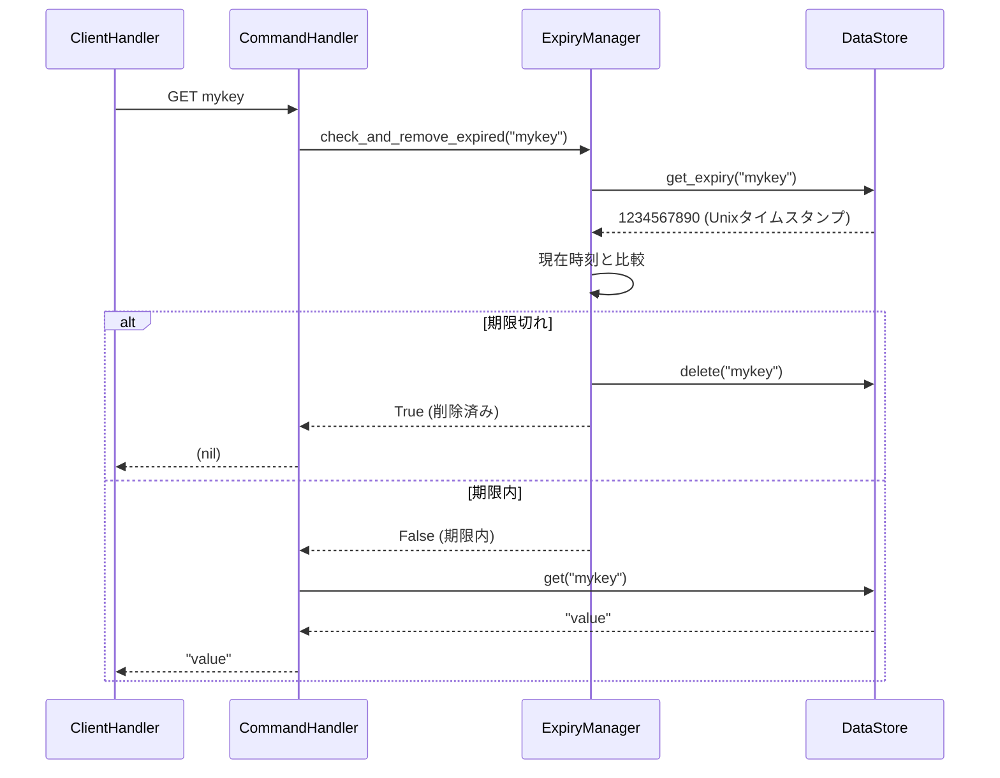
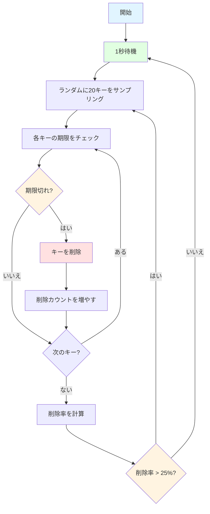

# 有効期限管理（Expiry Management）

## 学習目標

このセクションでは、有効期限管理の必要性とユースケース、Passive Expiryの動作原理と実装、Active Expiryの動作原理とアルゴリズム、EXPIRE/TTLコマンドの実装、asyncioでのバックグラウンドタスクの実装について学びます。

所要時間: 約30分（理論10分＋実装20分）

## 前提知識

[Unix time](https://en.wikipedia.org/wiki/Unix_time)の概念、asyncioタスク管理（`create_task()`, `cancel()`）、そしてStorageレイヤーの操作（get/set/delete）を理解していることを前提としています。

## 有効期限管理の必要性

### なぜ有効期限が必要か

インメモリデータベースでは、不要になったデータを自動削除しないと、メモリが枯渇します。

問題のシナリオ:

```python
# 1時間に10,000個のセッションキーを作成
for i in range(10000):
    redis.set(f"session:{i}", f"data_{i}")

# 時間が経つと、多くのセッションは無効（ユーザーがログアウト済み）になるが、メモリには残り続ける
```

### 主なユースケース

| ユースケース | 有効期限 | 理由 |
|------------|---------|------|
| セッション管理 | 30分〜24時間 | ユーザーの非アクティブ期間後に自動削除 |
| キャッシュ | 1分〜1時間 | 古いデータを自動的に無効化 |
| レート制限 | 1分〜1時間 | 時間枠ごとにカウンターをリセット |
| 一時トークン | 数分 | ワンタイムパスワードやトークンの有効期限 |

### Redisの2段階有効期限管理

Redisは、Passive ExpiryとActive Expiryの2つのメカニズムを組み合わせて、効率的にメモリを管理します。

## Passive Expiry（受動的期限管理）

### 動作原理

Passive Expiryは、キーにアクセスされた時に有効期限をチェックし、期限切れなら削除する仕組みです。

動作フロー:



### 実装例

Passive Expiryの実装には、期限切れかどうかをチェックし、期限切れの場合には削除する処理を実装する必要があります。


```python
import time

class ExpiryManager:
    def __init__(self, storage: Storage):
        self._storage = storage

    def check_and_remove_expired(self, key: str) -> bool:
        """
        キーが期限切れかチェックし、期限切れなら削除する

        Args:
            key: チェックするキー

        Returns:
            True: 期限切れで削除した
            False: 期限内または期限未設定
        """
        # 有効期限を取得
        expiry_time = self._storage.get_expiry(key)

        if expiry_time is None:
            # 有効期限が設定されていない
            return False

        # 現在時刻と比較
        current_time = int(time.time())

        if current_time >= expiry_time:
            # 期限切れ: キーを削除
            self._storage.delete(key)
            return True

        # 期限内
        return False

    def set_expiry(self, key: str, seconds: int) -> None:
        """
        キーに有効期限を設定する

        Args:
            key: 対象キー
            seconds: 有効期限（秒）
        """
        expiry_time = int(time.time()) + seconds
        self._storage.set_expiry(key, expiry_time)

    def get_ttl(self, key: str) -> int | None:
        """
        キーの残り有効期限（秒）を取得する

        Args:
            key: 対象キー

        Returns:
            残り秒数、または None（期限未設定）
        """
        expiry_time = self._storage.get_expiry(key)

        if expiry_time is None:
            return None

        current_time = int(time.time())
        ttl = expiry_time - current_time

        # 期限切れの場合は0を返す（厳密には削除すべき）
        return max(0, ttl)
```

### Passive Expiryの利点

Passive Expiryの最大の利点は、実装がシンプルで理解しやすい点です。アクセス時にのみ有効期限をチェックするため、CPU負荷が低く効率的に動作します。また、キーにアクセスする直前に期限をチェックするため、期限切れのデータをクライアントに返してしまう心配がなく、正確性も高くなっています。

### Passive Expiryの欠点

一方で、Passive Expiryのみでは、実際の有効期限よりも後に削除される可能性があります。アクセスされないキーは期限が切れてもメモリに残り続け、削除が遅延するのです。

この問題を解決するのが、Active Expiryです。Passive Expiryによってアクセスされるキーを効率的に削除し、Active Expiryによってアクセスされないキーも確実に削除します。

## Active Expiry（能動的期限管理）

### 動作原理

Active Expiryは、定期的にランダムなキーをサンプリングし、期限切れなら削除する仕組みです。

### アルゴリズム

Active Expiryにおいては、まず1秒ごとにバックグラウンドタスクを起動し、有効期限が設定されたキーからランダムに20個をサンプリングします。各キーの期限をチェックして期限切れなら削除し、削除率が25%を超えた場合は即座に再実行します（ステップ2に戻る）。削除率が25%以下なら、次の1秒まで待機します。

削除率が高い（25%超）ということは、多くのキーが期限切れになっている可能性が高いと考えられるため、再度サンプリングして削除します。

TODO: これが正しいことを確認



### 実装例

```python
import asyncio
import random

class ExpiryManager:
    def __init__(self, storage: Storage):
        self._storage = storage
        self._active_expiry_task: asyncio.Task | None = None

    def start_active_expiry(self) -> None:
        """Active Expiryバックグラウンドタスクを開始する"""
        if self._active_expiry_task is None:
            self._active_expiry_task = asyncio.create_task(
                self._active_expiry_loop()
            )

    def stop_active_expiry(self) -> None:
        """Active Expiryバックグラウンドタスクを停止する"""
        if self._active_expiry_task is not None:
            self._active_expiry_task.cancel()
            self._active_expiry_task = None

    async def _active_expiry_loop(self) -> None:
        """Active Expiryのメインループ"""
        try:
            while True:
                # 1秒待機
                await asyncio.sleep(1)

                # サンプリングと削除を実行
                await self._sample_and_remove_expired()

        except asyncio.CancelledError:
            # タスクがキャンセルされた
            pass

    async def _sample_and_remove_expired(self) -> None:
        """ランダムサンプリングして期限切れキーを削除"""
        while True:
            # 有効期限が設定されたキー一覧を取得
            keys_with_expiry = self._storage.get_keys_with_expiry()

            if not keys_with_expiry:
                # 有効期限付きキーがない
                break

            # ランダムに最大20個サンプリング
            sample_size = min(20, len(keys_with_expiry))
            sample = random.sample(keys_with_expiry, sample_size)

            # 期限切れキーを削除
            expired_count = 0
            for key in sample:
                if self.check_and_remove_expired(key):
                    expired_count += 1

            # 削除率を計算
            deletion_rate = expired_count / len(sample)

            # 削除率が25%以下なら終了
            if deletion_rate <= 0.25:
                break

            # 削除率が25%超なら再実行（即座に次のサンプリング）
```

### Active Expiryのタイムライン

以下のタイムラインは、Active Expiryがどのように動作するかを示しています：

```
時刻     | 動作
---------|--------------------------------------------------
0秒      | キー作成: 100個（全て10秒後に期限切れ）
1秒      | Active Expiry起動、サンプリング（0個削除、削除率0%）
...      | ...
10秒     | サンプリング（20個中20個削除、削除率100% → 再実行）
10秒+    | サンプリング（20個中20個削除、削除率100% → 再実行）
10秒++   | サンプリング（20個中20個削除、削除率100% → 再実行）
10秒+++  | サンプリング（20個中20個削除、削除率100% → 再実行）
10秒++++ | サンプリング（20個中15個削除、削除率75% → 再実行）
10秒+++  | サンプリング（20個中3個削除、削除率15% → 待機）
11秒     | 1秒待機後、サンプリング...
```

ポイント:
期限切れキーが多い時は連続してサンプリングを実行し、削除率が下がると1秒待機してから次のサンプリングを行います。

### Active Expiryのパラメータ

| パラメータ | 値 | 理由 |
|-----------|-----|------|
| サンプリング間隔 | 1秒 | CPU負荷とメモリ効率のバランス |
| サンプルサイズ | 20個 | 統計的に十分なサンプル数 |
| 削除率閾値 | 25% | 多くの期限切れキーが残っている可能性 |

TODO: これが正しいことを確認

パラメータの調整:

```python
# より積極的に削除したい場合
SAMPLE_INTERVAL = 0.5  # 0.5秒ごと
SAMPLE_SIZE = 50       # 50個サンプリング
THRESHOLD = 0.20       # 20%閾値

# よりCPU効率を重視する場合
SAMPLE_INTERVAL = 5    # 5秒ごと
SAMPLE_SIZE = 10       # 10個サンプリング
THRESHOLD = 0.30       # 30%閾値
```

## EXPIRE/TTLコマンドの実装

有効期限管理のためには、EXPIREとTTLの2つのコマンドが必要です。前のセクションでは基本的な4つのコマンドを実装しましたが、ここではこれらの有効期限関連のコマンドを追加します。

### 1. EXPIREコマンド

用途: キーに有効期限（秒）を設定

構文: `EXPIRE key seconds`

応答:
- キーが存在し、期限設定成功: `1`（Integer）
- キーが存在しない: `0`（Integer）

実装例:

```python
async def execute_expire(self, args: list[str]) -> Integer:
    """EXPIREコマンドを実行"""
    # 引数検証
    if len(args) != 2:
        raise CommandError("ERR wrong number of arguments for 'expire' command")

    key = args[0]

    # 秒数を整数に変換
    try:
        seconds = int(args[1])
    except ValueError:
        raise CommandError("ERR value is not an integer or out of range")

    # 負の秒数はエラー
    if seconds < 0:
        raise CommandError("ERR invalid expire time in 'expire' command")

    # Passive Expiry: 期限切れチェック
    if self._expiry.check_and_remove_expired(key):
        # 期限切れなので存在しない
        return Integer(0)

    # キーが存在するかチェック
    if self._store.get(key) is None:
        return Integer(0)

    # 有効期限を設定
    self._expiry.set_expiry(key, seconds)
    return Integer(1)
```

redis-cliでの実行例:

```bash
> SET mykey "Hello"
OK

> EXPIRE mykey 60
(integer) 1

> EXPIRE nonexistent 60
(integer) 0

> TTL mykey
(integer) 59
```

[ドキュメント](https://redis.io/docs/latest/commands/expire/)

### 2. TTLコマンド

用途: キーの残り有効期限（秒）を取得

構文: `TTL key`

応答:
- 有効期限あり: 残り秒数（Integer）
- 有効期限なし: `-1`（Integer）
- キーが存在しない: `-2`（Integer）

実装:

```python
async def execute_ttl(self, args: list[str]) -> Integer:
    """TTLコマンドを実行"""
    # 引数検証
    if len(args) != 1:
        raise CommandError("ERR wrong number of arguments for 'ttl' command")

    key = args[0]

    # Passive Expiry: 期限切れチェック
    if self._expiry.check_and_remove_expired(key):
        # 期限切れなので存在しない
        return Integer(-2)

    # キーが存在するかチェック
    if self._store.get(key) is None:
        return Integer(-2)

    # 有効期限を取得
    ttl = self._expiry.get_ttl(key)

    if ttl is None:
        # 有効期限が設定されていない
        return Integer(-1)

    return Integer(ttl)
```

redis-cliでの実行例:

```bash
> SET mykey "Hello"
OK

> EXPIRE mykey 60
(integer) 1

> TTL mykey
(integer) 59

> TTL mykey
(integer) 58

> SET persistent "forever"
OK

> TTL persistent
(integer) -1

> TTL nonexistent
(integer) -2
```

[ドキュメント](https://redis.io/docs/latest/commands/ttl/)

### commands.pyへの統合

前のセクションで実装した`Commands`クラスに、EXPIRE/TTLコマンドのルーティングを追加します。また、既存のGET/INCRコマンドにもPassive Expiryのチェックを追加します。

```python
class Commands:
    def __init__(self, storage: Storage, expiry: ExpiryManager):
        self._store = storage
        self._expiry = expiry

    async def execute(self, command: list[str]) -> SimpleString | BulkString | Integer | RedisError | Array:
        """コマンドを実行する"""
        if not command:
            raise CommandError("ERR empty command")

        cmd_name = command[0].upper()
        args = command[1:]

        # ルーティング（EXPIRE/TTLを追加）
        if cmd_name == "PING":
            return await self.execute_ping(args)
        elif cmd_name == "GET":
            return await self.execute_get(args)
        elif cmd_name == "SET":
            return await self.execute_set(args)
        elif cmd_name == "INCR":
            return await self.execute_incr(args)
        elif cmd_name == "EXPIRE":
            return await self.execute_expire(args)
        elif cmd_name == "TTL":
            return await self.execute_ttl(args)
        else:
            raise CommandError(f"ERR unknown command '{cmd_name}'")

    async def execute_get(self, args: list[str]) -> BulkString:
        """GETコマンドを実行（Passive Expiry追加）"""
        if len(args) != 1:
            raise CommandError("ERR wrong number of arguments for 'get' command")

        key = args[0]

        # Passive Expiry: 期限切れチェック
        if self._expiry.check_and_remove_expired(key):
            return BulkString(None)

        return BulkString(self._store.get(key))

    async def execute_incr(self, args: list[str]) -> Integer:
        """INCRコマンドを実行（Passive Expiry追加）"""
        if len(args) != 1:
            raise CommandError("ERR wrong number of arguments for 'incr' command")

        key = args[0]

        # Passive Expiry: 期限切れチェック
        if self._expiry.check_and_remove_expired(key):
            self._store.set(key, "1")
            return Integer(1)

        current = self._store.get(key)
        if current is None:
            self._store.set(key, "1")
            return Integer(1)

        try:
            value = int(current)
        except ValueError:
            raise CommandError("ERR value is not an integer or out of range")

        new_value = value + 1
        self._store.set(key, str(new_value))
        return Integer(new_value)
```

## asyncioバックグラウンドタスク

### タスクの作成と管理

```python
class Server:
    def __init__(self):
        self._expiry = ExpiryManager(storage)
        self._server_task: asyncio.Task | None = None

    async def start(self) -> None:
        """サーバを起動"""
        # Active Expiryを開始
        self._expiry.start_active_expiry()

        # TCPサーバを起動
        server = await asyncio.start_server(
            self.handle_client, '127.0.0.1', 6379
        )

        async with server:
            await server.serve_forever()

    async def shutdown(self) -> None:
        """サーバを停止"""
        # Active Expiryを停止
        self._expiry.stop_active_expiry()
```

### タスクのキャンセル処理

```python
def stop_active_expiry(self) -> None:
    """Active Expiryバックグラウンドタスクを停止する"""
    if self._active_expiry_task is not None:
        # タスクにキャンセルを要求
        self._active_expiry_task.cancel()
        self._active_expiry_task = None

async def _active_expiry_loop(self) -> None:
    """Active Expiryのメインループ"""
    try:
        while True:
            await asyncio.sleep(1)
            await self._sample_and_remove_expired()

    except asyncio.CancelledError:
        # キャンセルされた: クリーンアップして終了
        print("Active expiry task cancelled")
        # 必要に応じてクリーンアップ処理
        raise  # CancelledErrorを再発生させて終了
```


## 実装ガイド（ハンズオン）

ここまで学んだ内容を活かして、有効期限管理（Passive + Active Expiry）とEXPIRE/TTLコマンドを実装しましょう！（目安時間: 35分）

### パート0: ストレージ層への有効期限メソッド追加（5分）

前のセクションでは基本的なストレージ操作（`get()`, `set()`, `delete()`）を実装しました。このセクションでは、有効期限管理のために必要なメソッドを追加します。

#### 実装する内容

1. `mini_redis/storage.py` を開く
2. 有効期限管理メソッドを追加
   - `set_expiry(key: str, expiry_at: int)`: キーの有効期限（Unixタイムスタンプ）を設定
   - `get_expiry(key: str) -> int | None`: キーの有効期限を取得
   - `get_keys_with_expiry() -> list[str]`: 有効期限が設定されたキー一覧を取得

#### 実装のポイント

```python
def set_expiry(self, key: str, expiry_at: int) -> None:
    """キーに有効期限を設定する"""
    entry = self._data.get(key)
    if entry:
        entry.expiry_at = expiry_at

def get_expiry(self, key: str) -> int | None:
    """キーの有効期限を取得する"""
    entry = self._data.get(key)
    return entry.expiry_at if entry else None

def get_keys_with_expiry(self) -> list[str]:
    """有効期限が設定されたキー一覧を取得する"""
    return [key for key, entry in self._data.items() if entry.expiry_at is not None]
```

### パート1: ExpiryManagerの実装（15分）

#### 実装する内容

1. `mini_redis/expiry.py` を開く
2. `check_and_remove_expired()` を実装（Passive Expiry）
   - 有効期限をチェック
   - 期限切れの場合はキーを削除
3. `set_expiry()` と `get_ttl()` を実装
   - 有効期限を設定
   - 残り有効期限（TTL）を取得
4. `start_active_expiry()` と `_active_expiry_loop()` を実装（Active Expiry）
   - 1秒ごとにバックグラウンドタスクを実行
   - ランダムに20キーをサンプリング
   - 期限切れキーを削除
   - 削除率が25%を超える場合は即座に再実行

### パート2: EXPIRE/TTLコマンドの実装（10分）

#### 実装する内容

1. `mini_redis/commands.py` を開く
2. `Commands.__init__()` に `ExpiryManager` を追加
3. EXPIRE/TTLコマンドのルーティングを追加
4. `execute_expire()` と `execute_ttl()` を実装
5. 既存の `execute_get()` と `execute_incr()` にPassive Expiryのチェックを追加

### パート3: Commandsクラスの統合（5分）

#### 実装する内容

1. `mini_redis/commands.py` の `execute()` メソッドにEXPIRE/TTLのルーティングを追加
2. GET/INCRコマンドにPassive Expiryチェックを追加

### 実装のポイント

#### 1. Passive Expiry

```python
def check_and_remove_expired(self, key: str) -> bool:
    """キーが期限切れかチェックし、期限切れなら削除する"""
    # 有効期限を取得
    expiry_time = self._store.get_expiry(key)

    if expiry_time is None:
        # 有効期限が設定されていない
        return False

    # 現在時刻と比較
    current_time = int(time.time())

    if current_time >= expiry_time:
        # 期限切れ: キーを削除
        self._store.delete(key)
        return True

    # 期限内
    return False
```

#### 2. Active Expiry

```python
async def _active_expiry_loop(self) -> None:
    """Active Expiryのメインループ"""
    try:
        while True:
            # 1秒待機
            await asyncio.sleep(1)

            # サンプリングと削除を実行
            await self._sample_and_remove_expired()

    except asyncio.CancelledError:
        # タスクがキャンセルされた
        pass

async def _sample_and_remove_expired(self) -> None:
    """ランダムサンプリングして期限切れキーを削除"""
    while True:
        # 有効期限が設定されたキー一覧を取得
        keys_with_expiry = self._store.get_keys_with_expiry()

        if not keys_with_expiry:
            break

        # ランダムに最大20個サンプリング
        sample_size = min(20, len(keys_with_expiry))
        sample = random.sample(keys_with_expiry, sample_size)

        # 期限切れキーを削除
        expired_count = 0
        for key in sample:
            if self.check_and_remove_expired(key):
                expired_count += 1

        # 削除率を計算
        deletion_rate = expired_count / len(sample)

        # 削除率が25%以下なら終了
        if deletion_rate <= 0.25:
            break

        # 削除率が25%超なら再実行
```

### テストで確認

```bash
# ストレージ層の有効期限メソッドをテスト
pytest tests/step04_expiry/test_storage.py -v

# すべてのテストを実行
pytest tests/step04_expiry/ -v

# ExpiryManagerのテスト
pytest tests/step04_expiry/test_expiry.py -v

# EXPIRE/TTLコマンドのテスト
pytest tests/step04_expiry/test_commands.py::TestStep04ExpireCommand -v
pytest tests/step04_expiry/test_commands.py::TestStep04TTLCommand -v

# Passive Expiryが正しく動作するかテスト
pytest tests/step04_expiry/test_commands.py::TestStep04PassiveExpiryIntegration -v
```

## 動作確認

### 有効期限の動作確認

```bash
# ターミナル1: サーバを起動（Active Expiry有効）
python -m mini_redis

# ターミナル2: redis-cliで接続
redis-cli -p 6379

# キーに10秒の期限を設定
> SET temp "data"
OK

> EXPIRE temp 10
(integer) 1

> TTL temp
(integer) 9

# 10秒後（アクセスしない）
> TTL temp
(integer) -2  # Active Expiryで削除された
```

### Active Expiryの効果を確認

```bash
# 100個のキーに5秒の期限を設定
> SET key:0 "val0"
OK
> EXPIRE key:0 5
(integer) 1

# ... (99回繰り返す)

# 5秒後、ランダムなキーにアクセス
> GET key:42
(nil)  # Active Expiryで削除済み
```

## よくある間違いと対処法

### 1. Passive Expiryの呼び出し忘れ

有効期限関連のコマンド（GET、INCR、EXPIRE、TTL）では、必ず最初にPassive Expiryチェックを行う必要があります。

```python
# ❌ 間違い
async def execute_get(self, args: list[str]) -> BulkString:
    key = args[0]
    return BulkString(self._store.get(key))  # 期限チェックなし

# ✅ 正しい
async def execute_get(self, args: list[str]) -> BulkString:
    key = args[0]
    # Passive Expiry: 期限切れチェック
    if self._expiry.check_and_remove_expired(key):
        return BulkString(None)
    return BulkString(self._store.get(key))
```

### 2. set_expiryとget_ttlの実装順序

`set_expiry()`は秒数を受け取ってUnixタイムスタンプに変換しますが、`get_ttl()`はその逆の処理を行います。

```python
# set_expiry: 秒数 → Unixタイムスタンプ
def set_expiry(self, key: str, seconds: int) -> None:
    expiry_time = int(time.time()) + seconds
    self._storage.set_expiry(key, expiry_time)

# get_ttl: Unixタイムスタンプ → 残り秒数
def get_ttl(self, key: str) -> int | None:
    expiry_time = self._storage.get_expiry(key)
    if expiry_time is None:
        return None
    return max(0, expiry_time - int(time.time()))
```

## テストの実行

```bash
# すべてのテストを実行
pytest tests/step04_expiry/ -v

# ExpiryManagerのテスト
pytest tests/step04_expiry/test_expiry.py -v

# EXPIRE/TTLコマンドのテスト
pytest tests/step04_expiry/test_commands.py -v
```

## 次のステップ

有効期限管理の2段階メカニズムを学びました。これで、Mini-Redisの主要機能は全て実装完了です！

👉 次のセクション: [05-summary.md](05-summary.md)
