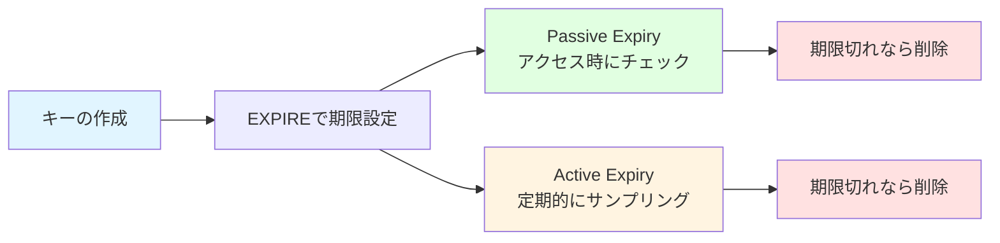
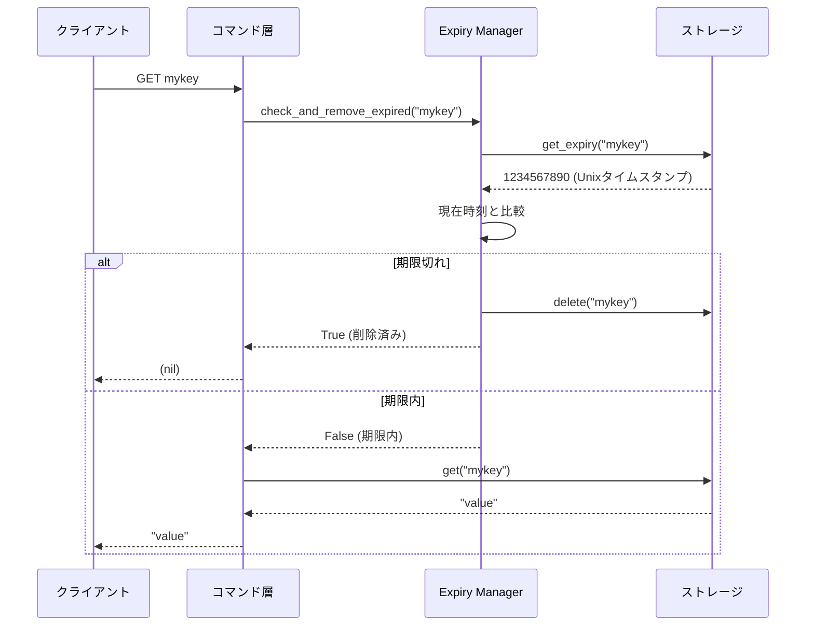
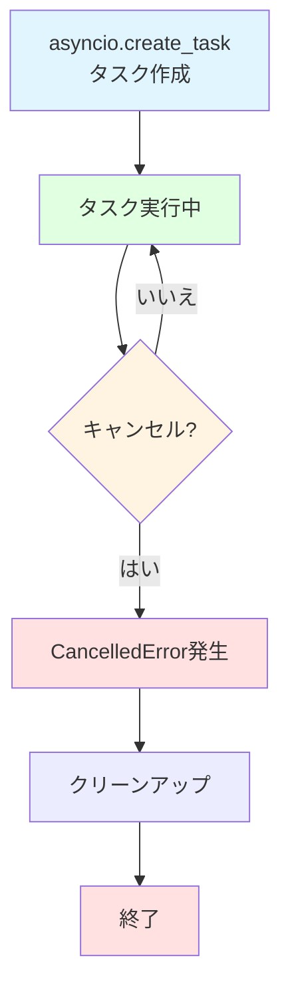
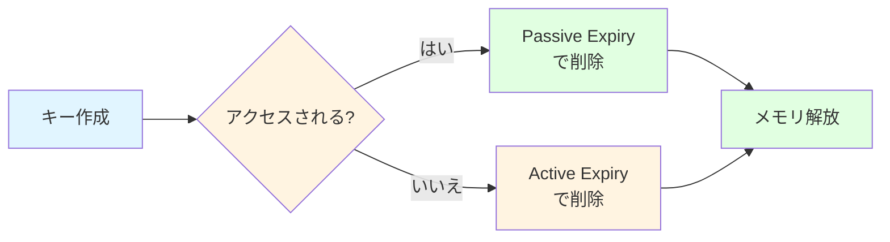

# 有効期限管理（Expiry Management）

## 学習目標

このセクションでは、有効期限管理の必要性とユースケース、Passive Expiryの動作原理と実装、Active Expiryの動作原理とアルゴリズム、asyncioバックグラウンドタスクの実装パターン、そしてパラメータチューニングと最適化の考え方について学びます。

所要時間: 約20分（理論5分＋実装15分）

## 前提知識

Unixタイムスタンプの概念、asyncioタスク管理（`create_task()`, `cancel()`）、そしてStorageレイヤーの操作（get/set/delete）を理解していることを前提としています。

## 有効期限管理の必要性

### なぜ有効期限が必要か

インメモリデータベースでは、不要になったデータを自動削除しないと、メモリが枯渇します。

問題のシナリオ:

```python
# 1時間に10,000個のセッションキーを作成
for i in range(10000):
    redis.set(f"session:{i}", f"data_{i}")

# 時間が経つと...
# - 多くのセッションは無効（ユーザーがログアウト済み）
# - しかしメモリには残り続ける
# - 結果: メモリ使用量が増え続ける
```

### 主なユースケース

| ユースケース | 有効期限 | 理由 |
|------------|---------|------|
| **セッション管理** | 30分〜24時間 | ユーザーの非アクティブ期間後に自動削除 |
| **キャッシュ** | 1分〜1時間 | 古いデータを自動的に無効化 |
| **レート制限** | 1分〜1時間 | 時間枠ごとにカウンターをリセット |
| **一時トークン** | 数分 | ワンタイムパスワードやトークンの有効期限 |

### Redisの2段階有効期限管理

Redisは、**Passive Expiry**と**Active Expiry**の2つのメカニズムを組み合わせて、効率的にメモリを管理します。



## Passive Expiry（受動的期限管理）

### 動作原理

Passive Expiryは、キーにアクセスされた時に有効期限をチェックし、期限切れなら削除する仕組みです。

動作フロー:



### 実装

```python
import time

class ExpiryManager:
    def __init__(self, storage: Storage):
        self._storage = storage

    def check_and_remove_expired(self, key: str) -> bool:
        """
        キーが期限切れかチェックし、期限切れなら削除する

        Args:
            key: チェックするキー

        Returns:
            True: 期限切れで削除した
            False: 期限内または期限未設定
        """
        # 有効期限を取得
        expiry_time = self._storage.get_expiry(key)

        if expiry_time is None:
            # 有効期限が設定されていない
            return False

        # 現在時刻と比較
        current_time = int(time.time())

        if current_time >= expiry_time:
            # 期限切れ: キーを削除
            self._storage.delete(key)
            return True

        # 期限内
        return False

    def set_expiry(self, key: str, seconds: int) -> None:
        """
        キーに有効期限を設定する

        Args:
            key: 対象キー
            seconds: 有効期限（秒）
        """
        expiry_time = int(time.time()) + seconds
        self._storage.set_expiry(key, expiry_time)

    def get_ttl(self, key: str) -> int | None:
        """
        キーの残り有効期限（秒）を取得する

        Args:
            key: 対象キー

        Returns:
            残り秒数、または None（期限未設定）
        """
        expiry_time = self._storage.get_expiry(key)

        if expiry_time is None:
            return None

        current_time = int(time.time())
        ttl = expiry_time - current_time

        # 期限切れの場合は0を返す（厳密には削除すべき）
        return max(0, ttl)
```

### Passive Expiryの利点

| 利点 | 説明 |
|------|------|
| **シンプル** | 実装が容易で理解しやすい |
| **CPU効率** | アクセス時のみチェックするため、CPU負荷が低い |
| **正確** | アクセス直前にチェックするため、期限切れデータを返さない |

### Passive Expiryの欠点

| 欠点 | 説明 |
|------|------|
| **メモリ効率** | アクセスされないキーは残り続ける |
| **遅延削除** | 実際の有効期限より後に削除される可能性 |

**具体例**:

```python
# 100個のキーに10秒の期限を設定
for i in range(100):
    redis.set(f"key:{i}", f"value_{i}")
    redis.expire(f"key:{i}", 10)

# 10秒後...
# - 50個のキーはアクセスされ、削除された（Passive Expiry）
# - 残り50個はアクセスされず、メモリに残っている
# → メモリリーク！
```

この問題を解決するのが、**Active Expiry**です。

## Active Expiry（能動的期限管理）

### 動作原理

Active Expiryは、定期的にランダムなキーをサンプリングし、期限切れなら削除する仕組みです。

### アルゴリズム

Active Expiryは以下の手順で動作します。1秒ごとにバックグラウンドタスクを起動し、有効期限が設定されたキーからランダムに20個をサンプリングします。各キーの期限をチェックして期限切れなら削除し、削除率が25%を超えた場合は即座に再実行します（ステップ2に戻る）。削除率が25%以下なら、次の1秒まで待機します。

なぜ削除率でループするのか:

削除率が高い（25%超）ということは、多くのキーが期限切れになっている可能性が高いため、再度サンプリングして効率的に削除します。

### アルゴリズムのフローチャート


### 実装

```python
import asyncio
import random

class ExpiryManager:
    def __init__(self, storage: Storage):
        self._storage = storage
        self._active_expiry_task: asyncio.Task | None = None

    def start_active_expiry(self) -> None:
        """Active Expiryバックグラウンドタスクを開始する"""
        if self._active_expiry_task is None:
            self._active_expiry_task = asyncio.create_task(
                self._active_expiry_loop()
            )

    def stop_active_expiry(self) -> None:
        """Active Expiryバックグラウンドタスクを停止する"""
        if self._active_expiry_task is not None:
            self._active_expiry_task.cancel()
            self._active_expiry_task = None

    async def _active_expiry_loop(self) -> None:
        """Active Expiryのメインループ"""
        try:
            while True:
                # 1秒待機
                await asyncio.sleep(1)

                # サンプリングと削除を実行
                await self._sample_and_remove_expired()

        except asyncio.CancelledError:
            # タスクがキャンセルされた
            pass

    async def _sample_and_remove_expired(self) -> None:
        """ランダムサンプリングして期限切れキーを削除"""
        while True:
            # 有効期限が設定されたキー一覧を取得
            keys_with_expiry = self._storage.get_keys_with_expiry()

            if not keys_with_expiry:
                # 有効期限付きキーがない
                break

            # ランダムに最大20個サンプリング
            sample_size = min(20, len(keys_with_expiry))
            sample = random.sample(keys_with_expiry, sample_size)

            # 期限切れキーを削除
            expired_count = 0
            for key in sample:
                if self.check_and_remove_expired(key):
                    expired_count += 1

            # 削除率を計算
            deletion_rate = expired_count / len(sample)

            # 削除率が25%以下なら終了
            if deletion_rate <= 0.25:
                break

            # 削除率が25%超なら再実行（即座に次のサンプリング）
```

### Active Expiryのタイムライン

以下のタイムラインは、Active Expiryがどのように動作するかを示しています：

```
時刻     | 動作
---------|--------------------------------------------------
0秒      | キー作成: 100個（全て10秒後に期限切れ）
1秒      | Active Expiry起動、サンプリング（0個削除、削除率0%）
...      | ...
10秒     | サンプリング（20個中20個削除、削除率100% → 再実行）
10秒+    | サンプリング（20個中20個削除、削除率100% → 再実行）
10秒++   | サンプリング（20個中20個削除、削除率100% → 再実行）
10秒+++  | サンプリング（20個中20個削除、削除率100% → 再実行）
10秒++++ | サンプリング（20個中15個削除、削除率75% → 再実行）
10秒+++  | サンプリング（20個中3個削除、削除率15% → 待機）
11秒     | 1秒待機後、サンプリング...
```

ポイント:
期限切れキーが多い時は連続してサンプリングを実行し、削除率が下がると1秒待機してから次のサンプリングを行います。

### Active Expiryのパラメータ

| パラメータ | 値 | 理由 |
|-----------|-----|------|
| サンプリング間隔 | 1秒 | CPU負荷とメモリ効率のバランス |
| サンプルサイズ | 20個 | 統計的に十分なサンプル数 |
| 削除率閾値 | 25% | 多くの期限切れキーが残っている可能性 |

パラメータの調整:

```python
# より積極的に削除したい場合
SAMPLE_INTERVAL = 0.5  # 0.5秒ごと
SAMPLE_SIZE = 50       # 50個サンプリング
THRESHOLD = 0.20       # 20%閾値

# よりCPU効率を重視する場合
SAMPLE_INTERVAL = 5    # 5秒ごと
SAMPLE_SIZE = 10       # 10個サンプリング
THRESHOLD = 0.30       # 30%閾値
```

## asyncioバックグラウンドタスク

### タスクのライフサイクル



### タスクの作成と管理

```python
class Server:
    def __init__(self):
        self._expiry = ExpiryManager(storage)
        self._server_task: asyncio.Task | None = None

    async def start(self) -> None:
        """サーバを起動"""
        # Active Expiryを開始
        self._expiry.start_active_expiry()

        # TCPサーバを起動
        server = await asyncio.start_server(
            self.handle_client, '127.0.0.1', 6379
        )

        async with server:
            await server.serve_forever()

    async def shutdown(self) -> None:
        """サーバを停止"""
        # Active Expiryを停止
        self._expiry.stop_active_expiry()
```

### タスクのキャンセル処理

```python
def stop_active_expiry(self) -> None:
    """Active Expiryバックグラウンドタスクを停止する"""
    if self._active_expiry_task is not None:
        # タスクにキャンセルを要求
        self._active_expiry_task.cancel()
        self._active_expiry_task = None

async def _active_expiry_loop(self) -> None:
    """Active Expiryのメインループ"""
    try:
        while True:
            await asyncio.sleep(1)
            await self._sample_and_remove_expired()

    except asyncio.CancelledError:
        # キャンセルされた: クリーンアップして終了
        print("Active expiry task cancelled")
        # 必要に応じてクリーンアップ処理
        raise  # CancelledErrorを再発生させて終了
```

### デバッグのヒント

```python
async def _active_expiry_loop(self) -> None:
    """Active Expiryのメインループ"""
    iteration = 0

    try:
        while True:
            iteration += 1
            print(f"[Active Expiry] Iteration {iteration}")

            await asyncio.sleep(1)

            deleted = await self._sample_and_remove_expired()
            print(f"[Active Expiry] Deleted {deleted} keys")

    except asyncio.CancelledError:
        print(f"[Active Expiry] Stopped after {iteration} iterations")
        raise
```

## Passive vs Active Expiryの比較

| 観点 | Passive Expiry | Active Expiry |
|------|---------------|--------------|
| **トリガー** | キーアクセス時 | 定期的（1秒ごと） |
| **削除タイミング** | アクセス直前 | バックグラウンド |
| **CPU効率** | 高い（アクセス時のみ） | 低い（定期実行） |
| **メモリ効率** | 低い（未アクセスキーが残る） | 高い（積極的削除） |
| **正確性** | 高い（アクセス前に削除） | 中程度（1秒遅延） |
| **実装複雑度** | 低い | 中程度（バックグラウンドタスク） |

### 2つを組み合わせる理由



- **Passive Expiry**: アクセスされるキーを効率的に削除
- **Active Expiry**: アクセスされないキーも確実に削除

## 動作確認

### 有効期限の動作確認

```bash
# ターミナル1: サーバを起動（Active Expiry有効）
python -m mini_redis

# ターミナル2: redis-cliで接続
redis-cli -p 6379

# キーに10秒の期限を設定
> SET temp "data"
OK

> EXPIRE temp 10
(integer) 1

> TTL temp
(integer) 9

# 10秒後（アクセスしない）
> TTL temp
(integer) -2  # Active Expiryで削除された
```

### Active Expiryの効果を確認

```bash
# 100個のキーに5秒の期限を設定
> SET key:0 "val0"
OK
> EXPIRE key:0 5
(integer) 1

# ... (99回繰り返す)

# 5秒後、ランダムなキーにアクセス
> GET key:42
(nil)  # Active Expiryで削除済み
```

## テストの実行

```bash
# 有効期限管理のテスト
pytest tests/test_expiry.py -v

# Passive Expiryのテスト
pytest tests/test_expiry.py::TestPassiveExpiry -v

# Active Expiryのテスト
pytest tests/test_expiry.py::TestActiveExpiry -v
```

## 次のステップ

有効期限管理の2段階メカニズムを学びました。これで、Mini-Redisの主要機能は全て実装完了です！

👉 次のセクション: [05-summary.md](05-summary.md)

**実装に進む前に**:
- `mini_redis/expiry.py`のTODOコメントを確認
- Passive ExpiryとActive Expiryの両方を実装
- テストで動作を検証

## 参考資料

- [Redisの有効期限管理（公式）](https://redis.io/commands/expire/): EXPIREコマンドの詳細
- [Python asyncio Tasks](https://docs.python.org/3/library/asyncio-task.html): バックグラウンドタスクの管理
- [Redis内部実装解説](https://redis.io/docs/reference/internals/): Redisの内部メカニズム

## まとめ

有効期限管理は、メモリ効率とデータ鮮度維持に不可欠です。Passive Expiryはアクセス時に期限をチェックすることでCPU効率を重視し、Active Expiryは定期的にランダムサンプリングすることでメモリ効率を重視しています。この2つを組み合わせることで、効率的かつ確実な期限管理を実現できます。asyncioバックグラウンドタスクで定期実行を実装し、パラメータ（間隔、サンプルサイズ、閾値）で動作を調整することも可能です。

これらの知識を使って、Mini-Redisの有効期限管理を実装しましょう！
