```mermaid
sequenceDiagram
    participant Client as ClientHandler
    participant Command as CommandHandler
    participant Expiry as ExpiryManager
    participant Storage as DataStore

    Client->>Command: GET mykey
    Command->>Expiry: check_and_remove_expired("mykey")
    Expiry->>Storage: get_expiry("mykey")
    Storage-->>Expiry: 1234567890 (Unixタイムスタンプ)
    Expiry->>Expiry: 現在時刻と比較

    alt 期限切れ
        Expiry->>Storage: delete("mykey")
        Expiry-->>Command: True (削除済み)
        Command-->>Client: (nil)
    else 期限内
        Expiry-->>Command: False (期限内)
        Command->>Storage: get("mykey")
        Storage-->>Command: "value"
        Command-->>Client: "value"
    end
```

# 有効期限管理（Expiry Management）

## 学習目標

このセクションでは、有効期限管理の必要性とユースケース、Passive Expiryの動作原理と実装、Active Expiryの動作原理とアルゴリズム、asyncioバックグラウンドタスクの実装パターン、そしてパラメータチューニングと最適化の考え方について学びます。

所要時間: 約20分（理論5分＋実装15分）

## 前提知識

Unixタイムスタンプの概念、asyncioタスク管理（`create_task()`, `cancel()`）、そしてStorageレイヤーの操作（get/set/delete）を理解していることを前提としています。

## 有効期限管理の必要性

### なぜ有効期限が必要か

インメモリデータベースでは、不要になったデータを自動削除しないと、メモリが枯渇します。

問題のシナリオ:

```python
# 1時間に10,000個のセッションキーを作成
for i in range(10000):
    redis.set(f"session:{i}", f"data_{i}")

# 時間が経つと...
# - 多くのセッションは無効（ユーザーがログアウト済み）
# - しかしメモリには残り続ける
# - 結果: メモリ使用量が増え続ける
```

### 主なユースケース

| ユースケース | 有効期限 | 理由 |
|------------|---------|------|
| セッション管理 | 30分〜24時間 | ユーザーの非アクティブ期間後に自動削除 |
| キャッシュ | 1分〜1時間 | 古いデータを自動的に無効化 |
| レート制限 | 1分〜1時間 | 時間枠ごとにカウンターをリセット |
| 一時トークン | 数分 | ワンタイムパスワードやトークンの有効期限 |

### Redisの2段階有効期限管理

Redisは、Passive ExpiryとActive Expiryの2つのメカニズムを組み合わせて、効率的にメモリを管理します。

## Passive Expiry（受動的期限管理）

### 動作原理

Passive Expiryは、キーにアクセスされた時に有効期限をチェックし、期限切れなら削除する仕組みです。

動作フロー:



### 実装

```python
import time

class ExpiryManager:
    def __init__(self, storage: Storage):
        self._storage = storage

    def check_and_remove_expired(self, key: str) -> bool:
        """
        キーが期限切れかチェックし、期限切れなら削除する

        Args:
            key: チェックするキー

        Returns:
            True: 期限切れで削除した
            False: 期限内または期限未設定
        """
        # 有効期限を取得
        expiry_time = self._storage.get_expiry(key)

        if expiry_time is None:
            # 有効期限が設定されていない
            return False

        # 現在時刻と比較
        current_time = int(time.time())

        if current_time >= expiry_time:
            # 期限切れ: キーを削除
            self._storage.delete(key)
            return True

        # 期限内
        return False

    def set_expiry(self, key: str, seconds: int) -> None:
        """
        キーに有効期限を設定する

        Args:
            key: 対象キー
            seconds: 有効期限（秒）
        """
        expiry_time = int(time.time()) + seconds
        self._storage.set_expiry(key, expiry_time)

    def get_ttl(self, key: str) -> int | None:
        """
        キーの残り有効期限（秒）を取得する

        Args:
            key: 対象キー

        Returns:
            残り秒数、または None（期限未設定）
        """
        expiry_time = self._storage.get_expiry(key)

        if expiry_time is None:
            return None

        current_time = int(time.time())
        ttl = expiry_time - current_time

        # 期限切れの場合は0を返す（厳密には削除すべき）
        return max(0, ttl)
```

### Passive Expiryの利点

Passive Expiryの最大の利点は、実装がシンプルで理解しやすい点です。アクセス時にのみ有効期限をチェックするため、CPU負荷が低く効率的に動作します。また、キーにアクセスする直前に期限をチェックするため、期限切れのデータをクライアントに返してしまう心配がなく、正確性も高くなっています。

### Passive Expiryの欠点

一方で、Passive Expiryのみでは、実際の有効期限よりも後に削除される可能性があります。そのため、アクセスされないキーは期限が切れてもメモリに残り続け、削除が遅延することもあります。

この問題を解決するのが、Active Expiryです。Passive Expiryによってアクセスされるキーを効率的に削除し、Active Expiryによってアクセスされないキーも確実に削除します。

## Active Expiry（能動的期限管理）

### 動作原理

Active Expiryは、定期的にランダムなキーをサンプリングし、期限切れなら削除する仕組みです。

### アルゴリズム

Active Expiryにおいては、まず1秒ごとにバックグラウンドタスクを起動し、有効期限が設定されたキーからランダムに20個をサンプリングします。各キーの期限をチェックして期限切れなら削除し、削除率が25%を超えた場合は即座に再実行します（ステップ2に戻る）。削除率が25%以下なら、次の1秒まで待機します。

削除率が高い（25%超）ということは、多くのキーが期限切れになっている可能性が高いと考えられるため、再度サンプリングして削除するのです。

TODO: これが正しいことを確認



```mermaid
graph TB
    START[開始] --> SLEEP[1秒待機]
    SLEEP --> SAMPLE[ランダムに20キーをサンプリング]
    SAMPLE --> CHECK[各キーの期限をチェック]
    CHECK --> DELETE{期限切れ?}

    DELETE -->|はい| REMOVE[キーを削除]
    DELETE -->|いいえ| NEXT{次のキー?}

    REMOVE --> COUNT[削除カウントを増やす]
    COUNT --> NEXT

    NEXT -->|ある| CHECK
    NEXT -->|ない| CALC[削除率を計算]

    CALC --> RATE{削除率 > 25%?}
    RATE -->|はい| SAMPLE
    RATE -->|いいえ| SLEEP

    style START fill:#e1f5ff
    style DELETE fill:#fff4e1
    style RATE fill:#fff4e1
    style REMOVE fill:#ffe1e1
    style SLEEP fill:#e1ffe1
```

### 実装例

```python
import asyncio
import random

class ExpiryManager:
    def __init__(self, storage: Storage):
        self._storage = storage
        self._active_expiry_task: asyncio.Task | None = None

    def start_active_expiry(self) -> None:
        """Active Expiryバックグラウンドタスクを開始する"""
        if self._active_expiry_task is None:
            self._active_expiry_task = asyncio.create_task(
                self._active_expiry_loop()
            )

    def stop_active_expiry(self) -> None:
        """Active Expiryバックグラウンドタスクを停止する"""
        if self._active_expiry_task is not None:
            self._active_expiry_task.cancel()
            self._active_expiry_task = None

    async def _active_expiry_loop(self) -> None:
        """Active Expiryのメインループ"""
        try:
            while True:
                # 1秒待機
                await asyncio.sleep(1)

                # サンプリングと削除を実行
                await self._sample_and_remove_expired()

        except asyncio.CancelledError:
            # タスクがキャンセルされた
            pass

    async def _sample_and_remove_expired(self) -> None:
        """ランダムサンプリングして期限切れキーを削除"""
        while True:
            # 有効期限が設定されたキー一覧を取得
            keys_with_expiry = self._storage.get_keys_with_expiry()

            if not keys_with_expiry:
                # 有効期限付きキーがない
                break

            # ランダムに最大20個サンプリング
            sample_size = min(20, len(keys_with_expiry))
            sample = random.sample(keys_with_expiry, sample_size)

            # 期限切れキーを削除
            expired_count = 0
            for key in sample:
                if self.check_and_remove_expired(key):
                    expired_count += 1

            # 削除率を計算
            deletion_rate = expired_count / len(sample)

            # 削除率が25%以下なら終了
            if deletion_rate <= 0.25:
                break

            # 削除率が25%超なら再実行（即座に次のサンプリング）
```

### Active Expiryのタイムライン

以下のタイムラインは、Active Expiryがどのように動作するかを示しています：

```
時刻     | 動作
---------|--------------------------------------------------
0秒      | キー作成: 100個（全て10秒後に期限切れ）
1秒      | Active Expiry起動、サンプリング（0個削除、削除率0%）
...      | ...
10秒     | サンプリング（20個中20個削除、削除率100% → 再実行）
10秒+    | サンプリング（20個中20個削除、削除率100% → 再実行）
10秒++   | サンプリング（20個中20個削除、削除率100% → 再実行）
10秒+++  | サンプリング（20個中20個削除、削除率100% → 再実行）
10秒++++ | サンプリング（20個中15個削除、削除率75% → 再実行）
10秒+++  | サンプリング（20個中3個削除、削除率15% → 待機）
11秒     | 1秒待機後、サンプリング...
```

ポイント:
期限切れキーが多い時は連続してサンプリングを実行し、削除率が下がると1秒待機してから次のサンプリングを行います。

### Active Expiryのパラメータ

| パラメータ | 値 | 理由 |
|-----------|-----|------|
| サンプリング間隔 | 1秒 | CPU負荷とメモリ効率のバランス |
| サンプルサイズ | 20個 | 統計的に十分なサンプル数 |
| 削除率閾値 | 25% | 多くの期限切れキーが残っている可能性 |

TODO: これが正しいことを確認

パラメータの調整:

```python
# より積極的に削除したい場合
SAMPLE_INTERVAL = 0.5  # 0.5秒ごと
SAMPLE_SIZE = 50       # 50個サンプリング
THRESHOLD = 0.20       # 20%閾値

# よりCPU効率を重視する場合
SAMPLE_INTERVAL = 5    # 5秒ごと
SAMPLE_SIZE = 10       # 10個サンプリング
THRESHOLD = 0.30       # 30%閾値
```

## asyncioバックグラウンドタスク

### タスクの作成と管理

```python
class Server:
    def __init__(self):
        self._expiry = ExpiryManager(storage)
        self._server_task: asyncio.Task | None = None

    async def start(self) -> None:
        """サーバを起動"""
        # Active Expiryを開始
        self._expiry.start_active_expiry()

        # TCPサーバを起動
        server = await asyncio.start_server(
            self.handle_client, '127.0.0.1', 6379
        )

        async with server:
            await server.serve_forever()

    async def shutdown(self) -> None:
        """サーバを停止"""
        # Active Expiryを停止
        self._expiry.stop_active_expiry()
```

### タスクのキャンセル処理

```python
def stop_active_expiry(self) -> None:
    """Active Expiryバックグラウンドタスクを停止する"""
    if self._active_expiry_task is not None:
        # タスクにキャンセルを要求
        self._active_expiry_task.cancel()
        self._active_expiry_task = None

async def _active_expiry_loop(self) -> None:
    """Active Expiryのメインループ"""
    try:
        while True:
            await asyncio.sleep(1)
            await self._sample_and_remove_expired()

    except asyncio.CancelledError:
        # キャンセルされた: クリーンアップして終了
        print("Active expiry task cancelled")
        # 必要に応じてクリーンアップ処理
        raise  # CancelledErrorを再発生させて終了
```


## 動作確認

### 有効期限の動作確認

```bash
# ターミナル1: サーバを起動（Active Expiry有効）
python -m mini_redis

# ターミナル2: redis-cliで接続
redis-cli -p 6379

# キーに10秒の期限を設定
> SET temp "data"
OK

> EXPIRE temp 10
(integer) 1

> TTL temp
(integer) 9

# 10秒後（アクセスしない）
> TTL temp
(integer) -2  # Active Expiryで削除された
```

### Active Expiryの効果を確認

```bash
# 100個のキーに5秒の期限を設定
> SET key:0 "val0"
OK
> EXPIRE key:0 5
(integer) 1

# ... (99回繰り返す)

# 5秒後、ランダムなキーにアクセス
> GET key:42
(nil)  # Active Expiryで削除済み
```

## テストの実行

```bash
# 有効期限管理のテスト
pytest tests/test_expiry.py -v

# Passive Expiryのテスト
pytest tests/test_expiry.py::TestPassiveExpiry -v

# Active Expiryのテスト
pytest tests/test_expiry.py::TestActiveExpiry -v
```

## 次のステップ

有効期限管理の2段階メカニズムを学びました。これで、Mini-Redisの主要機能は全て実装完了です！

👉 次のセクション: [05-summary.md](05-summary.md)

## 参考資料

- [Redisの有効期限管理（公式）](https://redis.io/commands/expire/): EXPIREコマンドの詳細
- [Python asyncio Tasks](https://docs.python.org/3/library/asyncio-task.html): バックグラウンドタスクの管理
- [Redis内部実装解説](https://redis.io/docs/reference/internals/): Redisの内部メカニズム

